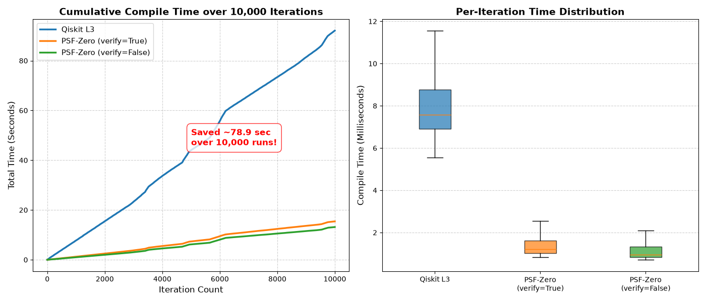
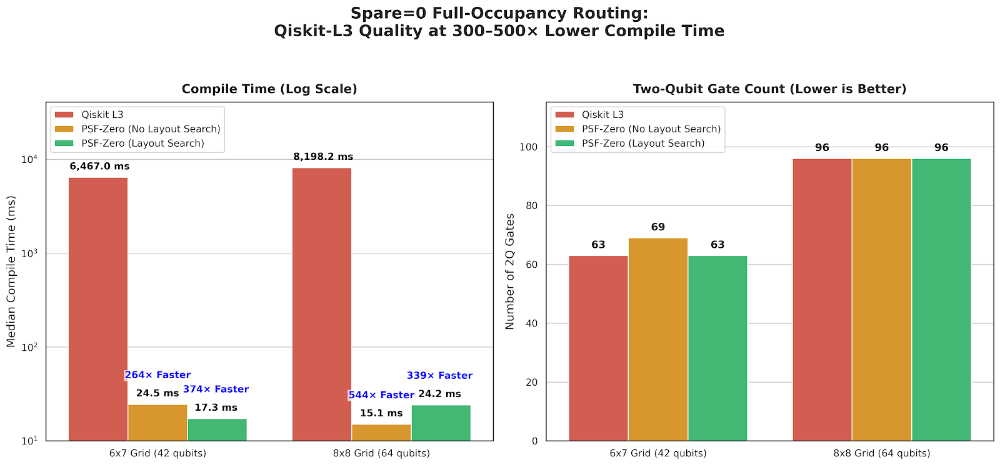
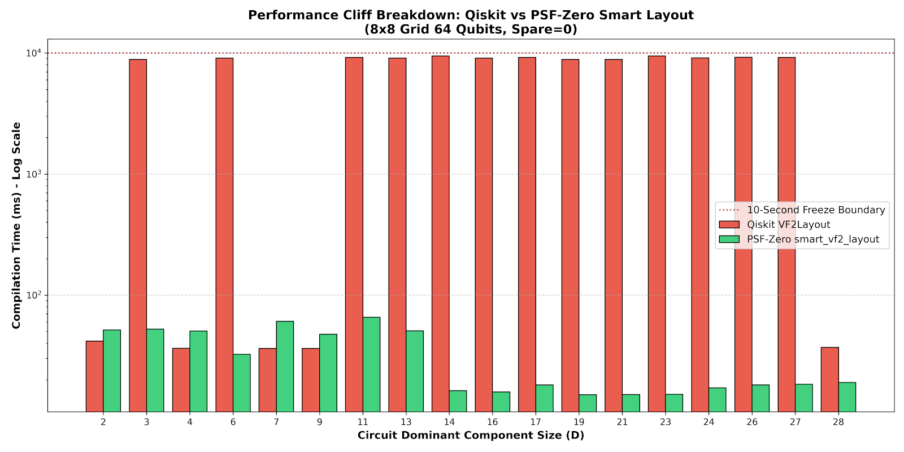

# PSF-Zero: Analytic KAK Decomposition for Two-Qubit Circuit Synthesis

[](https://www.gnu.org/licenses/agpl-3.0)
[](https://www.python.org/downloads/)
[](https://github.com/qiskit/ecosystem)
[](https://www.rust-lang.org/)
[](https://pyo3.rs/)

A Qiskit transpiler pass that replaces heuristic 2-qubit unitary synthesis with an
**exact, closed-form Cartan (KAK) decomposition**, implemented in a small Rust core
via PyO3. Because the decomposition is analytic rather than search-based, it runs in
constant time per block and returns **the same circuit every time** for the same
input unitary.

```python
from qiskit import QuantumCircuit
from qiskit.circuit.library import UnitaryGate
from qiskit.quantum_info import random_unitary
from psf_compile import compile as psf_compile

qc = QuantumCircuit(2)
qc.append(UnitaryGate(random_unitary(4)), [0, 1])
optimized = psf_compile(qc)          # add verify=False for the fastest path
```

Install: `git clone … && cd psf-zero && pip install -e .`
(needs `numpy`, `scipy`, `qiskit`; the Rust core builds via `maturin`/`pyo3`.)

Source: [`psf_compile.py`](psf_compile.py) — the pass itself, and the one place the
current compiler lives. Its `VERSION:` line names the revision; that line is bumped
in place, so there is never a second, differently-named copy to pick between ·
[`lib.rs`](lib.rs) — the Rust core (`psf_zero_core`) it calls into ·
[`psf_smart_layout.py`](benchmarks/psf_smart_layout.py) — the layout-search prototype,
repaired 2026-09-20 (four defects found and fixed, verified end-to-end; see below).

> **Two papers and a short technical overview, for anyone evaluating this from
> outside the project:**
>
> - [**Paper 1 — Ordering Sensitivity in Subgraph-Isomorphism Layout Search**](docs/papers/vf2_cliff_paper.pdf)
>   ([Word](docs/papers/vf2_cliff_paper.docx),
>   [DOI: 10.5281/zenodo.22869976](https://doi.org/10.5281/zenodo.22869976)):
>   characterizes Qiskit's own `VF2Layout` failure region (271x slower before
>   reporting "no solution" on instances that provably have one) and the
>   ordering mechanism behind it.
> - [**Paper 2 — PSF-Zero: An Analytic Two-Qubit Gate Synthesizer Combined with
>   a Verified, Ordering-Aware Layout Search**](docs/papers/psf_zero_paper.pdf)
>   ([Word](docs/papers/psf_zero_paper.docx),
>   [DOI: 10.5281/zenodo.22870141](https://doi.org/10.5281/zenodo.22870141)):
>   the system built on Paper 1's finding, verified end-to-end (26/26 layouts
>   found, 0 coupling-map violations, unitary equivalence to machine
>   precision).
> - [**Technical overview slides**](docs/papers/psf_zero_technical_overview.pptx)
>   (8 slides) — the fastest way to see what changed and why it can be trusted,
>   without reading either paper in full.
>
> Both papers are pre-registered, self-audited (each corrects at least one of
> this project's own earlier claims in place), and cite the same raw data
> linked throughout this README.

---

## The trade-off, stated up front

- **Faster than Qiskit** `optimization_level=3` on circuits it is designed for —
  roughly **2.5x–5x**, largest at small circuits (see the table below and its caveats).
- **Much faster than TKET** — **150x–270x**, flat across 10–160 qubits.
- **Deterministic** — 300 random SU(4) unitaries produced 300 identical circuits.
  There is no seed to control for.
- **But TKET finds a shallower circuit**: depth 7 against PSF-Zero's 9, on every
  sample we measured. That gap is the price of not searching, and we are not aware
  of a way to close it without giving up the determinism.

PSF-Zero only helps on circuits that actually contain deep, same-qubit-pair 2-qubit
chains — Trotterized Hamiltonian simulation, QAOA-style layered entanglers, circuits
built from arbitrary SU(4) blocks. On a generic `random_circuit()` it correctly
reports `0/0 blocks` and passes the circuit through unchanged.

## Results

**Compile time vs. Qiskit `optimization_level=3`**, dense-pair-block circuits,
`verify=False`, 10 seeds per point, warm-up outside the timer, `spawn`:

| | 15q | 50q | 100q | 156q | 300q | 500q | 1000q |
| :--- | :---: | :---: | :---: | :---: | :---: | :---: | :---: |
| **Qiskit ÷ PSF-Zero** | **5.15x** | **3.98x** | **3.45x** | **2.86x** | **3.02x** | **2.78x** | **2.54x** |

<sub>`phase1.py` (15–156q) and `phase2.py` (156–1000q), Windows,
`AMD64 Family 25 Model 80`, Python 3.10.11, Qiskit 2.5.2. Raw data in
[`data/archive/`](data/archive/).</sub>

**Over 10,000 back-to-back iterations at 15 qubits**, warm-up outside the loop,
correctness checked (fidelity 1.000000000000 for all three arms on a 6-qubit
version before the full sweep):

| | Qiskit L3 | PSF-Zero (`verify=True`) | PSF-Zero (`verify=False`) |
| :--- | :---: | :---: | :---: |
| Median | 7.570 ms | 1.211 ms | 0.950 ms |
| Mean | 9.207 ms | 1.543 ms | 1.314 ms |
| Stdev | 6.143 ms | 0.900 ms | 0.901 ms |
| **Cumulative speed-up** | — | **5.97x** | **7.00x** |



<sub>`test_cumulative_compile_scale.py`, same machine as above. Right panel:
box shows the interquartile range, whiskers the min/max over all 10,000
iterations. Speed-up figures are cumulative-total-based (5.97x/7.00x); the
median-based figures are 6.25x/7.97x — reported here since the standard
deviation is close in magnitude to the median on both arms, indicating a
long tail (max 130.6 ms on Qiskit, 20.2 ms on PSF-Zero) rather than a tight
distribution. **Qiskit's cumulative-time curve (left panel) shows two visible
slope changes, around iteration 4700 and 6000, not present on either
PSF-Zero curve; the cause is unconfirmed** (background load, an internal
Qiskit effect, and measurement variance of the kind found in
[`docs/findings/spare-qubit-cliff-combined.md`](docs/findings/spare-qubit-cliff-combined.md)
are all candidates, none checked). Raw per-iteration timings:
`cumulative_compile_times_10000.npz`.</sub>

**With the default safety check on** (`verify=True`, a cheap Rust-core check since
2026-09-09), measured over a 50,000-iteration compile loop at 15 qubits:
**4.79x** on one machine and **5.54x** (median) on another; `verify=False` gives
**9.12x** / **6.84x** on the same two runs. The check costs **1.2x–1.9x depending
on the machine** — not a single number.

**Output quality is matched, not traded away.** At 156 qubits, PSF-Zero and Qiskit
`optimization_level=3` emit the *same* 234 two-qubit gates; depth is **9**
(`entangling_basis="canonical"`), **13** (`"cx"`, hardware-comparable) and **16**
(Qiskit). Equivalence checked at every point (< 4.5e-15).

#### At the coupling-map cliff (spare=0)

The gate-count parity above holds away from any coupling-map saturation. At the
cliff point described in
[the finding below](#a-finding-that-is-not-about-psf-zero) — where the coupling
map is fully saturated and Qiskit's own `optimization_level` 2/3 slows down by
orders of magnitude — the same comparison was repeated on two grid sizes, under a
specific, deliberate PSF-Zero configuration:

| | Qiskit `optimization_level=3` | PSF-Zero, `layout_search=False` | PSF-Zero, `layout_search=True` |
| :--- | :---: | :---: | :---: |
| 6x7 grid (42q) | 63 gates, depth 16, 6.38s (279x) | 69 gates, depth 44, 22.9ms | 63 gates, depth 23, 16.9ms (379x) |
| 8x8 grid (64q) | 96 gates, depth 16, 8.20s (544x) | 96 gates, depth 23, 15.1ms | 96 gates, depth 23, 24.2ms (339x) |

<sub>`gate_count_vs_routing_level.py`, `routing_optimization_level=1`,
`entangling_basis="cx"`, `seed_transpiler=42`, spare=0 (the fully-saturated,
worst case for Qiskit's own layout search). Medians over 3 seeds x 3 repeats
(6x7: 3 seeds x 5 independent process launches); gate count and depth were
*identical* across every seed and repeat at both grid sizes (zero spread) —
only compile time varied. Time ranges: 6x7 Qiskit 6.34–6.44s (one 17.8s
cold-start launch excluded as a warm-up artifact), PSF-Zero 21.8–32.3ms
(`layout_search=False`) / 16.1–20.1ms (`=True`); 8x8 Qiskit 8.17–8.29s,
PSF-Zero 13.4–21.8ms / 22.1–27.7ms. Speed-up figures in parentheses are
median-based. Windows, `Intel64 Family 6 Model 181 Stepping 0, GenuineIntel`,
Python 3.11.9, Qiskit 2.5.2. Correctness: a small-scale (n=6) exact `Operator`
equivalence check passed before every sweep; every routed output at full
scale was checked for coupling-map validity (0 violations across all rows).
Full-scale unitary equivalence is not computed — infeasible at this qubit
count, per this project's established practice elsewhere in this
document.</sub>



**`entangling_basis="cx"` is not the default** — `"canonical"` is (see
[`entangling-basis.md`](docs/findings/entangling-basis.md)) — and under the
default, PSF-Zero's own gate count at this same 6x7 cliff point is roughly
**2x** Qiskit's, not roughly equal. The near-parity shown above is what `"cx"`
buys specifically for CX/ECR-native hardware, not PSF-Zero's out-of-the-box
behavior on a general target. The depth cost is real regardless of which
`entangling_basis` is used: `layout_search=False` pays depth 44 against
Qiskit's 16 at 6x7; `layout_search=True` matches Qiskit's gate count exactly
at both grid sizes but is still deeper (23 vs. 16).




> **Update (2026-09-19): Qiskit's `VF2Layout` does not use the public `rustworkx.vf2_mapping()` -- confirmed directly from its current Rust source -- and a separate, independent implementation of VF2-family search avoids the cliff on every tested case. The causal mechanism inside Qiskit's own implementation is partially, not fully, understood.**
>
> Reading `qiskit_circuit::vf2` directly (not inferred) confirms `VF2Layout`/`VF2PostLayout` use a custom Rust implementation with a hardcoded ordering strategy (`Vf2ppSorter`, "VF2++"), unconditionally, with no exposed toggle to disable it. Simulating that ordering on this project's own saturated, disjoint-pair-heavy circuits confirms it processes larger chain-like structures before the many symmetric bare-edge pairs -- a demonstrated mechanism. **Why this specific ordering leads to the multi-second failures on some configurations and not others is not yet established**: two graphs with identical abstract structure (differing only in which physical qubits host which piece) can receive parallel-shaped VF2++ orderings yet produce opposite outcomes, so the ordering alone does not fully explain the divergence -- the remaining explanation likely lies in the backtracking search itself, not simulated here.
>
> **A separate, independent tool avoids the cliff on every case tested -- this is not a setting inside Qiskit.** A bare call to `rustworkx.vf2_mapping(..., id_order=True)` -- the public library, called directly, with none of Qiskit's own code involved -- finds a valid layout for **26/26** of the previously-failing saturated configurations, every one in under 0.0001 seconds. Qiskit's own implementation has no `id_order` parameter or equivalent switch; this is a comparison between two different pieces of software that happen to share some underlying graph data structures, not a flag Qiskit itself could flip.
>
> **PSF-Zero's own `smart_vf2_layout` also succeeds on all 26/26 -- but a controlled comparison found this is fully explained by that same bare `id_order=True` call, not by PSF-Zero's own multi-stage ordering-diversity strategy.** The bare call matches PSF-Zero's own success rate exactly while running 100-600x faster; PSF-Zero's own additional machinery (BFS-based relabeling, multiple starting orderings, a two-stage fallback) added no benefit on this dataset and is, on this evidence, worth simplifying. Generalization beyond this specific grid size and circuit family is untested -- PSF-Zero's own prior diagnostics found this same ordering strategy fails on other physical topologies (`brick`). The complete record -- pre-registrations, the isomorphic-pair puzzle that preceded this finding, the corrected attribution, and what remains open -- is in `docs/findings/spare-qubit-cliff-combined.md` Parts 5-6 (Addenda 51-107), particularly Addenda 83-95 for the fixes themselves and Addenda 101-103 for their end-to-end and correctness verification.


**The `layout_search=False` gate-count gap over the zero-swap baseline (69 vs.
63 at 6x7) disappeared entirely at 8x8 (96 vs. 96), for a reason that is
proposed but not yet confirmed**: a candidate mechanism is grid *column
parity* — whether the circuit's fixed adjacent-logical-qubit-pair structure
ever straddles a row boundary under the grid's row-major physical numbering
(6x7 has three such straddling pairs; 8x8, with an even column count, has
none) — rather than grid size as such. This has not been tested independently
of grid size. Full data, the pre-registered predictions, and the reasoning
behind the parity hypothesis: `spare-qubit-cliff-combined.md`, addenda 29–32.

**vs. TKET** (`FullPeepholeOptimise`), same circuit family:

| | 10q | 20q | 40q | 80q | 160q |
| :--- | :---: | :---: | :---: | :---: | :---: |
| TKET | 1.06s | 2.14s | 4.19s | 8.24s | 16.84s |
| PSF-Zero | 0.007s | 0.009s | 0.016s | 0.032s | 0.062s |
| **Speed-up** | **152x** | **237x** | **262x** | **258x** | **272x** |
| Depth (TKET / PSF-Zero) | 7 / 9 | 7 / 9 | 7 / 9 | 7 / 9 | 7 / 9 |

**On real IBM hardware** (15 qubits, 10 job submissions across `ibm_marrakesh` and
`ibm_fez`): fidelity is **indistinguishable** from Qiskit L3 (0.0919 ± 0.0016 vs
0.0925 ± 0.0016, paired t = −0.78, n.s.); compile time was 14–16x faster in every
one of the 10 runs.

### Numerical accuracy of the core

The decomposition is closed-form, so the thing that can go wrong is not search
quality but numerical stability — around the CNOT/SWAP degeneracies, and in the
agreement between the Rust core's 4×4 reconstruction and Qiskit's `Operator(qc)`.
[`benchmarks/verify_core_infidelity.py`](benchmarks/verify_core_infidelity.py) locks
both, measured 2026-09-12:

| Suite | Samples | Worst infidelity (core) | Worst infidelity (strict circuit) | Fallbacks |
| :--- | :---: | :---: | :---: | :---: |
| Haar-random SU(4) | 500 | 1.11e-15 | 6.66e-16 | **0 / 500** |
| Near-CNOT (ε = 1e-7) | 200 | 2.63e-14 | (covered by the strict loop) | **0 / 200** |

Across the Haar space the worst case sits near machine epsilon with no fallback
exceptions. Near the codimension-2 CNOT singularity — where a naive single-route
diagonalisation is least stable — scored candidate selection plus a Givens sweep
holds infidelity well below the 1e-12 tolerance, with zero rejections. (An earlier
run reported 1.68e-13 here; the perturbation that generates the near-CNOT samples
had a global-phase bug that put the test points at distance ~0.765 from CNOT
regardless of ε, not ~ε as intended — fixed and re-run, see
[`docs/findings/core-verification.md`](docs/findings/core-verification.md).) The
`strict` tier is what rules out endian mismatches and ZYZ phase/sign drift between
the two sides.

Raw data: [`data/core_verification_2026-09-12.csv`](data/core_verification_2026-09-12.csv).
Reproduce with `maturin develop --release && python benchmarks/verify_core_infidelity.py`.
Full account: [`docs/findings/core-verification.md`](docs/findings/core-verification.md).

## What this is not

- **Not a full transpiler.** PSF-Zero targets the 2-qubit synthesis step. Routing,
  layout and multi-qubit decomposition stay with Qiskit; PSF-Zero composes with them.
- **Not faster with `verify="strict"`.** That option restores the old
  `Operator()`-reconstruction check and costs **5.1x–6.6x** the current default,
  which makes PSF-Zero *slower* than Qiskit above 15 qubits. It is there for people
  who want it, not as a recommended setting.
- **Not yet tested under real routing pressure.** The coupling-map benchmarks place
  blocks on adjacent logical pairs, which land on adjacent physical qubits under a
  row-major grid — so the router had almost nothing to route. Genuine SWAP-insertion
  cost is unmeasured.
- **Not run through Benchpress.** IBM's suite is far broader than ours; integration
  is in progress, not done.

## A finding that is not about PSF-Zero

While benchmarking against coupling maps we found, and then confirmed with a
controlled experiment, that **Qiskit's `optimization_level` 2 and 3 slow down by
40x–420x when the circuit nearly fills the coupling map.** Holding the map fixed and
varying only how many qubits the circuit occupies: on one unchanged 42-qubit grid, a
42-qubit circuit takes 6.8 s at `opt=3` while a 38-qubit circuit takes 28 ms. A
*smaller* circuit on a saturated grid runs ~200x slower than a *larger* one with
spare qubits.

Reproduced in three independent environments (Linux sandbox, and two Windows
machines with different CPUs), across many independent runs, and present in every
Qiskit release from **1.4.6 through 2.5.2** unchanged. Two further controls narrow
it: the effect needs the dense adjacent-pair circuit structure as well as the
saturated map (a gate-count-matched `random_circuit()` workload shows no cliff at
all), and Qiskit 2.1 made the *unsaturated* case ~93x faster while the saturated case
has not improved since 1.4.6.

**The mechanism: `VF2Layout` fails once, and the preset pipeline falls back to
`SabreLayout`.** Qiskit's preset pipeline tries `VF2Layout` exactly once, with
shuffling explicitly disabled (`seed=-1`, hardcoded, not controlled by
`seed_transpiler`); on a saturated map that one attempt reports
`NO_SOLUTION_FOUND`, and the pipeline falls back entirely to a different algorithm,
`SabreLayout`. **The layout it reports as absent does exist** — supplying a
different `shuffle_seed` directly to `VF2Layout` finds it in 4 of 30 seeds — but the
preset never gets to try, because shuffling is off by design in that code path,
confirmed by reading Qiskit's own source. At `optimization_level=3`, a second cost
layer sits on top: once Sabre's imperfect layout is chosen, the routing and
optimization passes that follow can end up doing substantially more work, in one
measured case (`brick` topology) roughly 3x the layout-search cost itself. Padding
the coupling map with a few spare qubits removes the effect entirely.

> **Update (2026-09-17): the "falls back to SabreLayout" description above is
> superseded by a direct per-pass timing measurement.** A finer sweep (spare 0
> through 24, in steps of 1 near the cliff) instrumented every pass in
> `transpile()` directly via its own `callback` hook, on the identical dense-pair
> circuit family. Result: `SabreLayout`'s own measured time is **0.0 ms in all
> 234 timed calls**, at every spare value and both `optimization_level` 1 and 3 —
> on this circuit family, the fallback described above either does not run
> measurably or is not where the cost lands. The actual cost breakdown at
> spare=0, `optimization_level=3` (median of 9 runs): `VF2Layout` **8,450.8 ms**,
> then **`VF2PostLayout`** (which runs afterward to check whether a better final
> layout exists) **6,712.3 ms** — two separate, expensive VF2-family searches,
> not one search plus a cheap deterministic fallback. This does not change the
> qualitative finding below (a single class of bounded search failing near full
> saturation, on an instance a perfect matching proves is solvable) or the fact
> that padding with spare qubits removes the effect — it changes which pass
> absorbs the cost. The same sweep pinpointed the cliff to a single step (spare
> 0→1, a 193x drop at `optimization_level=3`) that coincides exactly with
> `VF2Layout`'s own `stop_reason` flipping from "no solution found" to "solution
> found," and an independently-computed (`networkx`, no Qiskit layout code
> involved) perfect matching confirms a valid, zero-SWAP embedding **provably
> exists** at spare=0 — so the "no solution" verdict there is the search giving
> up inside its own budget, not the instance being unsolvable. Full data and
> every pre-registered prediction: `spare-qubit-cliff-combined.md`, Addendum 34.

**A layout-search prototype recovers most of this, and the recovery holds through
PSF-Zero's own pipeline, not just bare `transpile()`.** Trying several cheap
node orderings and, if needed, a fallback heuristic search — a few
milliseconds to a few hundred milliseconds of extra work — finds a valid layout on
several topologies the preset misses, winning by **27x–420x** depending on
optimization level and topology when it succeeds. Where the search itself fails
(some topologies are genuinely hard, no ordering rescues them), the loss is close to
exactly the time spent searching, not more; tuning the search's own retry budget
based on measured data cut that loss margin roughly in half with no cost to the
winning cases. This has been confirmed as a standalone prototype and, separately, by
routing its output into `compile_for_hardware()` via a new `initial_layout`
parameter — the size of the win is consistent across both.

**Is this a Qiskit bug, or a property of the technique? Both — direction generalizes, severity does not.**
A cross-compiler comparison at the same saturation point (2026-09-17) ran the
identical circuits and coupling map through TKET's `GraphPlacement`, which is
structurally the same idea as `VF2Layout` (a budgeted subgraph-isomorphism-style
search for an embedding), but bounded by a wall-clock timeout in addition to a
call count. **TKET's placement stage does slow down at full saturation** —
direction confirmed, ~4x from spare=4 to spare=0, narrowly under a 5x
pre-registered threshold — so the underlying degradation is not unique to
Qiskit's implementation. **But the magnitude is nowhere close**: at spare=0,
TKET's total placement-plus-routing time was 210 ms; Qiskit
`optimization_level=3` at the identical point was 11,416 ms — a **~54x** gap
between the two tools at the exact spot where Qiskit is at its worst, and
Qiskit's own spare0/spare16 ratio (**353x**) against TKET's (**~4-6x**) makes the
severity gap explicit. The most defensible framing given both results: bounded
subgraph-isomorphism placement is not saturation-proof in general, but
implementations differ enormously in how badly they cope, and Qiskit's preset
pipeline currently sits at the catastrophic end of that range while TKET does
not. Not yet established: whether TKET's relative immunity comes specifically
from its wall-clock timeout (it was not observed straining against that timeout
at this problem size — 151 ms median against a 1000 ms cap — so this remains
plausible, not demonstrated), from a smaller default search budget, or simply
from this grid not yet being hard enough to expose a TKET-side cliff. Full data
and every pre-registered prediction: `spare-qubit-cliff-combined.md`, Addendum 35.

**Still open**: whether a same-condition run-to-run variance found at
`optimization_level=3` (up to ~3x on one measurement) reflects `VF2Layout`'s own
non-determinism or drift in the measurement environment; the actual `call_limit`
(or other budget parameter) values Qiskit's preset pass managers use at each
optimization level — the ~1,500x gap between `VF2Layout`'s own L1 and L3 failing-search
times (5.4 ms vs. 8,450.8 ms on an identical, budget-exhausted instance) is strong
indirect evidence the presets configure very different budgets, but this has not
been read directly from source; whether the ordering effects behind the
layout-search prototype hold inside Qiskit's own compiled VF2 implementation
(`qiskit._accelerate.vf2_layout`) — direct introspection of its parameters
(`VF2PassConfiguration`) confirms it exposes no `id_order`-equivalent knob at all,
so this specific question cannot currently be tested through any public interface;
whether TKET's placement time approaches its own timeout at a larger, more
saturated grid than 6x7; and whether the original report that Qiskit calls
`rustworkx.vf2_mapping()` (rejected upstream) was ever true of the code as it
stood — it turned out to describe a code path Qiskit had already removed a year
earlier, in a commit whose own message called shuffling "in general, not a good
idea," which lines up with what was independently measured here.

Experiments:
[`phase3_v5_spare_qubits.py`](benchmarks/phase3_v5_spare_qubits.py),
[`phase3_v6_workload_control.py`](benchmarks/phase3_v6_workload_control.py),
[`verify_vf2_seed.py`](benchmarks/verify_vf2_seed.py),
[`verify_vf2_max_trials.py`](benchmarks/verify_vf2_max_trials.py),
[`verify_preset_stop_reason.py`](benchmarks/verify_preset_stop_reason.py),
[`verify_vf2_pipeline_trace.py`](benchmarks/verify_vf2_pipeline_trace.py),
[`psf_smart_layout.py`](benchmarks/psf_smart_layout.py) (as of 2026-09-20, this is the repaired version -- addenda 88-92, 95: natural-ordering-first, the feasibility-guard correctness fix, a per-device matching cache, lazy ordering generation, and their combined verification -- installed in place of the prototype the rest of this README's own findings were measured against; [`psf_smart_layout_patched.py`](benchmarks/psf_smart_layout_patched.py) is kept alongside it as the pre-installation, individually-reviewed copy the hash-checked install script verified before replacing the file in place),
[`benchmark_smart_layout_vs_default.py`](benchmarks/benchmark_smart_layout_vs_default.py),
[`occupancy_sweep.py`](benchmarks/occupancy_sweep.py) (fine-grained spare-qubit
sweep with `VF2Layout_stop_reason` and independent feasibility instrumentation,
no PSF-Zero dependency),
[`cross_compiler_cliff.py`](benchmarks/cross_compiler_cliff.py) (Qiskit vs. TKET
at the same saturation point, no PSF-Zero dependency).
Full account, source reading, every pre-registered prediction, and raw data (18
rounds, 2026-09-13 through 2026-09-15):
[`docs/findings/spare-qubit-cliff.md`](docs/findings/spare-qubit-cliff.md) (summary)
and [`docs/findings/spare-qubit-cliff-combined.md`](docs/findings/spare-qubit-cliff-combined.md)
(full record, unedited).

## How these numbers were produced

Warm-up call outside the timer for **both** engines; repeated timed calls per point;
multiple independent seeds; `spawn` start method; `seed_transpiler` pinned wherever
Qiskit's randomised layout/routing search is involved; unitary equivalence checked
alongside every timing; every harness records `platform.processor()`, Python and
Qiskit versions **into its output CSV**. Medians, not means, on shared hardware.
Ranges, not peaks.

**Three earlier headline claims in this README were retracted after re-measurement**
— a "200x" that turned out to be a no-op `transpile()` call, a "615x–867x" produced
by circuits that never triggered the pass, and a decay-with-iteration-count effect
that turned out to be background load on one machine. Two hypotheses this project
proposed were later **refuted by their own pre-registered criteria**. A third — a
mechanism proposed for the finding above — was rejected upstream for naming a code
path Qiskit does not use; the drafts and the outcome are in the log. The complete
record, including every retraction and the raw data behind it, is kept verbatim in
[`docs/log/`](docs/log/) rather than quietly edited away.

## Where everything is

**Findings** — one settled topic each, self-contained, ~5 minutes:

| | |
| :--- | :--- |
| [`docs/findings/compile-time.md`](docs/findings/compile-time.md) | The full compile-time arc: three retractions, the `verify` split, and what survives |
| [`docs/findings/spare-qubit-cliff.md`](docs/findings/spare-qubit-cliff.md) | The Qiskit coupling-map result above — controlled experiment, three environments |
| [`docs/findings/core-verification.md`](docs/findings/core-verification.md) | The three-tier infidelity harness: Haar space, CNOT singularities, Rust↔Python agreement |
| [`docs/findings/entangling-basis.md`](docs/findings/entangling-basis.md) | Why `RXX/RYY/RZZ` costs 2x the native gates of `CX`, and the `entangling_basis="cx"` fix |
| [`docs/findings/real-hardware.md`](docs/findings/real-hardware.md) | IBM hardware runs, job IDs, and the noisy-simulator comparison |

**The unedited record** — [`docs/log/`](docs/log/README.md), 2,973 lines kept verbatim,
including a [chronology of every claim this project got wrong](docs/log/README.md#chronology-of-things-this-project-got-wrong):

[`01` intro & methodology](docs/log/01-intro-and-methodology.md) ·
[`02` synthesis vs. TKET](docs/log/02-synthesis-vs-tket.md) ·
[`03` compile-time scaling](docs/log/03-compile-time-scaling.md) ·
[`04` real-device topology](docs/log/04-real-device-topology.md) ·
[`05` fidelity](docs/log/05-fidelity.md)

(`06` open questions & roadmap: not yet split out of the original file.)

**Data** — [`data/`](data/) holds every CSV behind a published number;
[`data/archive/`](data/archive/) holds the superseded and retracted runs, so the
retractions can be re-checked. (A file-by-file provenance map for the archive is
planned but not yet written.)

**Benchmarks** — the harnesses, in the order the story needs them:
[`phase1_v2.py`](benchmarks/phase1_v2.py) /
[`phase2_v2.py`](benchmarks/phase2_v2.py) (scaling sweeps) ·
[`test1_v3.py`](benchmarks/test1_v3.py) (methodology-corrected harness) and its
[`verify="strict"` wrapper](benchmarks/test1_v3_verify_strict.py) ·
[`test_cumulative_compile_time.py`](benchmarks/test_cumulative_compile_time.py)
(50,000-iteration loop) ·
[`verify_core_infidelity.py`](benchmarks/verify_core_infidelity.py) (core accuracy) ·
[`phase3_v4_dense_pair_blocks.py`](benchmarks/phase3_v4_dense_pair_blocks.py) and
[`phase3_v5_spare_qubits.py`](benchmarks/phase3_v5_spare_qubits.py) /
[`phase3_v6_workload_control.py`](benchmarks/phase3_v6_workload_control.py) (coupling maps) ·
[`gate_count_vs_routing_level.py`](benchmarks/gate_count_vs_routing_level.py) (gate
count at the coupling-map cliff, `entangling_basis="cx"`) ·
[`occupancy_sweep.py`](benchmarks/occupancy_sweep.py) (fine-grained spare-qubit
sweep, `VF2Layout_stop_reason` and independent feasibility check, no PSF-Zero
dependency) ·
[`cross_compiler_cliff.py`](benchmarks/cross_compiler_cliff.py) (Qiskit vs. TKET
at the same saturation point, no PSF-Zero dependency) ·
[`test_psf_vs_tket.py`](benchmarks/test_psf_vs_tket.py) /
[`test_scale_explosion_war2.py`](benchmarks/test_scale_explosion_war2.py) (TKET) ·
[`test_real_hardware_fidelity.py`](benchmarks/test_real_hardware_fidelity.py) and
[`real_device_15q_fidelity_v2`](benchmarks/real_device_15q_fidelity_v2) (fidelity).

**Rules** — [`record-keeping.md`](record-keeping.md): the conventions this project
follows when publishing a measurement, most of them adopted after being burned by
their absence.

## Open questions

- What causes the ~3x same-condition run-to-run variance found at
  `optimization_level=3` — `VF2Layout`'s own `seed=-1` shuffle behaving
  inconsistently, or drift in the measurement environment. An experiment to
  distinguish the two is designed but not yet run.
- ~~Whether the ordering effects behind the layout-search prototype hold inside
  Qiskit's own compiled VF2 implementation.~~ **RESOLVED (2026-09-19), see the
  Update block above**: reading `qiskit_circuit::vf2` directly confirms
  `VF2Layout`/`VF2PostLayout` use a custom implementation with a hardcoded
  `Vf2ppSorter` ("VF2++") ordering, unconditionally — not the public
  `rustworkx` package, and with no exposed toggle. The prior "confirmed
  untestable" note (2026-09-17) was a dead end from probing the wrong layer
  (`VF2PassConfiguration`); reading the actual Rust source directly is what
  resolved it.
- Whether the prototype's search-retry budget (recently tuned down based on a
  six-point sweep) can go lower still — the sweep's smallest tested value already
  misses one topology outright, and no finer step was tried near that boundary.
- Whether the compile-time advantage reduces real-hardware calibration-drift
  exposure in a variational loop. Plausible, untested, and not planned without a
  reason to spend QPU time.
- A routing benchmark on non-adjacent logical pairs, so SWAP insertion is actually
  exercised.
- Whether the `layout_search=False` two-qubit-gate-count gap over the
  zero-swap baseline at the coupling-map cliff (present at a 6x7 grid, absent at
  8x8) is caused by grid column parity or by something else — proposed but not
  tested independently of grid size. **Partially deepened (2026-09-20)**: a
  separate end-to-end measurement found `layout_search=False` at 6x7
  specifically shows real seed-dependent spread in this same gate count
  (63–69) and in timing (nearly 4x), absent at 8x8 and absent from
  `layout_search=True` on identical circuits — consistent with, but not
  confirmed as, `VF2Layout`'s own reduced search budget at
  `routing_optimization_level=1` (see the `call_limit` item below). See
  [`spare-qubit-cliff-combined-27.md`](docs/findings/spare-qubit-cliff-combined-27.md),
  addenda 29–32, and
  [`spare-qubit-cliff-combined-88.md`](docs/findings/spare-qubit-cliff-combined-88.md),
  Addendum 102 Section 3.
- The actual `call_limit` (or other budget) values Qiskit's preset pass
  managers use for `VF2Layout` at each `optimization_level` — inferred only
  indirectly so far, from the size of the gap between a failing search's L1 and
  L3 timings, not read from source. See
  [`spare-qubit-cliff-combined-27.md`](docs/findings/spare-qubit-cliff-combined-27.md),
  Addendum 34, Section 3.
- Whether `VF2PostLayout` exposes a stop-reason-equivalent property in
  its own `property_set` — not yet instrumented, so its cost is currently
  inferred only from `slowest_pass`, not confirmed as its own budget-exhaustion
  event the way `VF2Layout`'s is.
- Whether TKET's `GraphPlacement` placement time approaches its own
  wall-clock timeout at a larger, more saturated grid than the 6x7 tested so
  far — at 6x7 it was not observed straining against its budget (151 ms median
  vs. a 1000 ms default timeout), so the "the timeout is what protects TKET"
  explanation is plausible but not yet demonstrated. See
  [`spare-qubit-cliff-combined-27.md`](docs/findings/spare-qubit-cliff-combined-27.md),
  Addendum 35.
- ~~Whether BQSKit's or Cirq's placement/layout stages show the same
  saturation-degradation pattern.~~ **PARTIALLY RESOLVED for Cirq (2026-09-20,
  Paper 1 Section 4.3)**: Cirq's own placement search exceeds a 10-second
  budget across `spare=0` through `8` on a 6x7 grid — a *wider* difficult
  region than Qiskit's own `spare=0`-only failure. The comparison is qualitative
  (Cirq's own runs are right-censored at the 10s budget, not fully measured),
  but confirms the pattern is not unique to Qiskit. **BQSKit remains untested.**
- Benchpress integration ([issue #114](https://github.com/Qiskit/benchpress/issues/114))
  and parallel per-block synthesis — both unbuilt.
- **NEW (2026-09-20).** Why `psf_compile()`'s own gate-synthesis timing
  variance dropped 34–54x between a 4-day-old archive and the current code —
  confirmed real and reproducible (Levene's test, three independent runs), and
  investigated with the actual source diff between both versions, but the
  cause was not found: every traceable candidate (a caching-policy change, a
  redundant-verification-removal change, the compiled Rust core itself) was
  ruled out directly. Two untested candidates remain outside what a source
  diff can resolve: dependency-version drift (not tracked at the time) and
  machine/environment factors. See
  [`spare-qubit-cliff-combined-88.md`](docs/findings/spare-qubit-cliff-combined-88.md),
  Addenda 93, 96–99.
- **NEW (2026-09-20).** A PennyLane transform (`r0_psf_zero_transform.py`)
  applying this project's same compiled core to variational/QML circuits —
  early-stage, not verified. Its own math (the `su2_to_euler` reconstruction
  formula, the Ising-gate sign convention) has been checked independently and
  is correct; the actual connection to `psf_zero_core.batch_decompose` and
  gradient correctness through a full torch forward/backward pass have not
  been. Development history for this file shows more than one regression
  cycle; treat any number quoted from its own docstring as unverified until
  it has been re-run and checked the way every number elsewhere in this
  README has been.

## Working with us

This is AGPL-licensed research code, not a supported product. If you're
evaluating PSF-Zero against your own circuits and want a second opinion
before investing further: send a representative circuit (or a sanitized
equivalent) to `love.os.architect@proton.me` — under NDA first, if the
circuit itself is sensitive — and we'll run it and report results directly.
No commitment implied on either side; the goal at that stage is reproducing
a result, not a sales conversation.

## Citation

```bibtex
@software{psf_zero_2026,
  author = {The Architect},
  title  = {PSF-Zero: Analytic KAK Decomposition for Two-Qubit Circuit Synthesis},
  year   = {2026},
  url    = {https://github.com/TN-Holdings-LLC/psf-zero},
  license = {AGPL-3.0}
}
```

The two papers linked at the top of this README are preprints, archived on
Zenodo with a citable DOI (not yet submitted to arXiv):

```bibtex
@misc{vf2_cliff_2026,
  author = {{TN Holdings}},
  title  = {Ordering Sensitivity in Subgraph-Isomorphism Layout Search:
            A Characterization of Catastrophic Failure Regions in
            Quantum Circuit Transpilation},
  year   = {2026},
  doi    = {10.5281/zenodo.22869976},
  url    = {https://doi.org/10.5281/zenodo.22869976},
  note   = {Preprint}
}

@misc{psf_zero_paper_2026,
  author = {{TN Holdings}},
  title  = {PSF-Zero: An Analytic Two-Qubit Gate Synthesizer Combined
            with a Verified, Ordering-Aware Layout Search for Quantum
            Circuit Transpilation},
  year   = {2026},
  doi    = {10.5281/zenodo.22870141},
  url    = {https://doi.org/10.5281/zenodo.22870141},
  note   = {Preprint}
}
```

AGPL v3. See `LICENSE`. **Evaluating this for potential commercial use?** AGPL's
copyleft terms may not fit a closed-source integration — see
[Working with us](#working-with-us) below before assuming the license as
published is the final word.

[Previous repository.](https://github.com/TN-Holdings-LLC/psf-zero/blob/main/Previous_repository.md)
