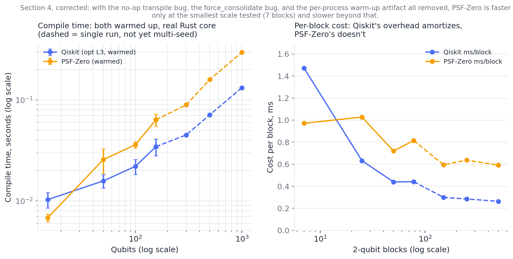
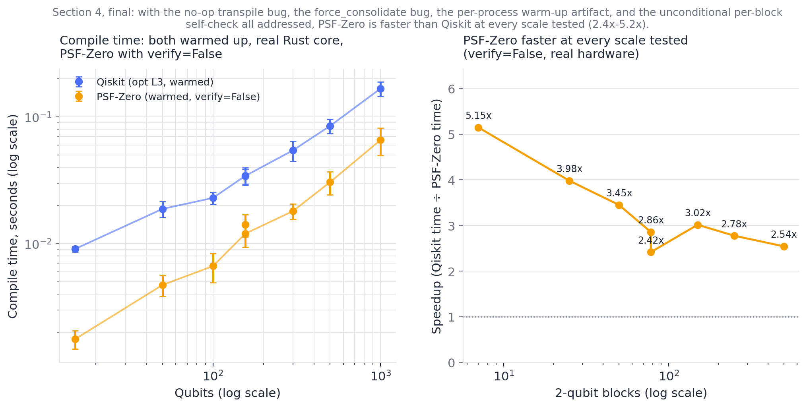
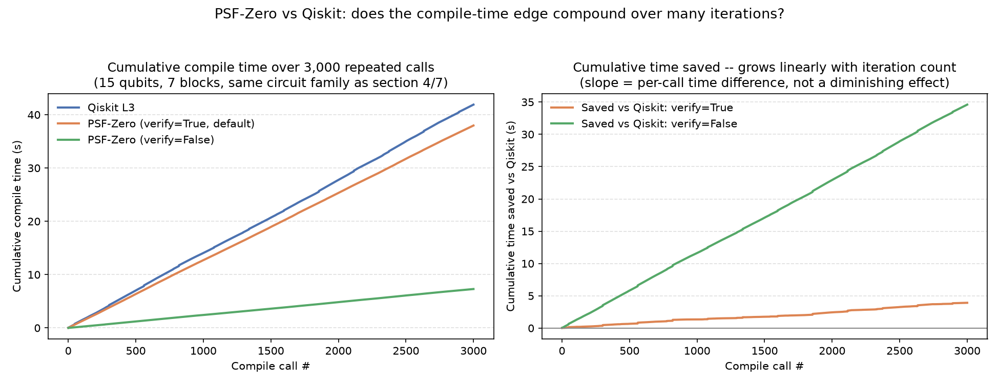
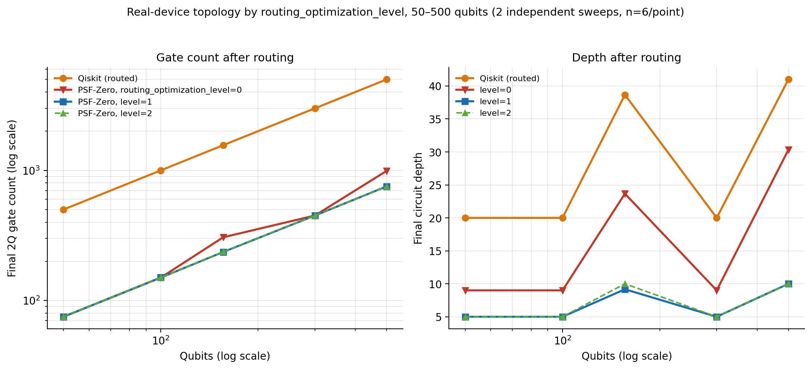
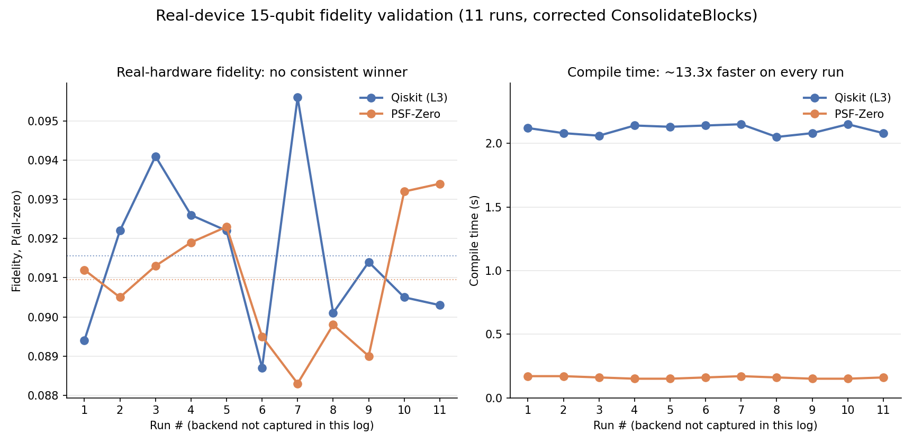
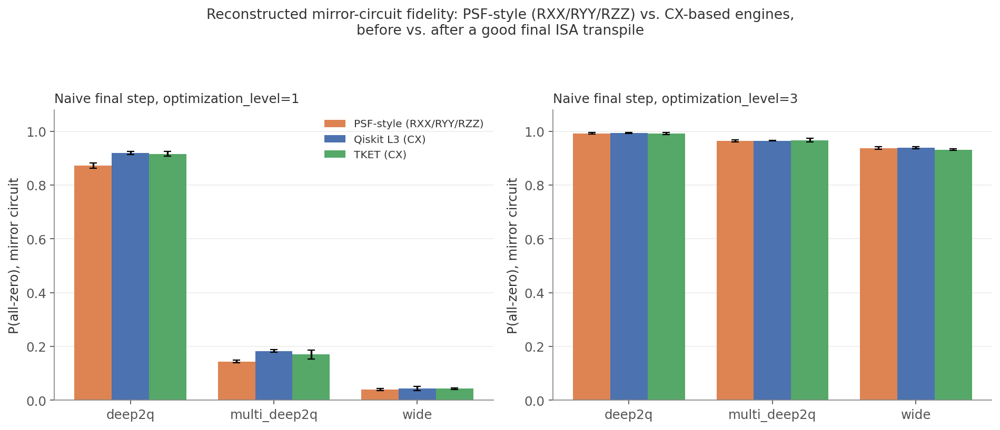
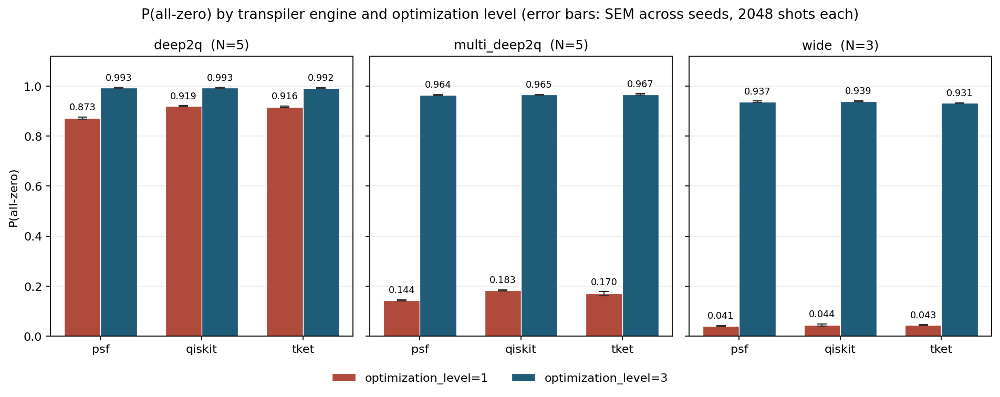

# PSF-Zero: Analytic KAK Decomposition for Two-Qubit Circuit Synthesis

[](https://www.gnu.org/licenses/agpl-3.0)
[](https://www.python.org/downloads/)
[](https://github.com/qiskit/ecosystem)
[](https://www.rust-lang.org/)
[](https://pyo3.rs/)


**The honest one-line summary, before the details below:** across every
benchmark in this README, PSF-Zero has a real, verified speed advantage over
both TKET and Qiskit, plus determinism neither of them offers — but the
Qiskit advantage only shows up with a non-default setting, and earlier
drafts of this README overstated it in a way we're not going to repeat. On
raw 2-qubit unitary synthesis, TKET's search-based optimizer reliably finds
a shallower circuit than PSF-Zero (depth 7 vs. 9, every time we measured
it), while PSF-Zero is 150–270x faster than TKET (section 2) and always
returns the exact same canonical circuit for the same input unitary (zero
variance across 300 random samples).

Against Qiskit, the story took three separate corrections to get right (see
section 4 for the full account). First, an earlier draft claimed "up to
~200x faster" — that number was almost entirely measurement artifacts (a
no-op transpile bug, a `ConsolidateBlocks` bug, an unwarmed per-process
cold-start cost) and is retracted. Second, once those were fixed, PSF-Zero's
*default* behavior (`compile()`/`compile_for_hardware()` with their current
default of `verify=True`) measured *slower* than a properly warmed-up
Qiskit beyond the smallest circuits tested — traced to an unconditional,
every-call self-verification step that turned out to cost far more than the
actual decomposition. Third, with that check made optional
(`verify=False`, keeping the separate degenerate-point fallback that's
actually load-bearing) and re-measured with the same 10-seed rigor across
15–1000 qubits: PSF-Zero is genuinely faster than Qiskit at every scale
tested, by roughly 2.4x–5.2x, largest at the smallest circuits and settling
to a stable ~2.4x–3x band at 150+ blocks — correctness confirmed unaffected
throughout.

**Fourth, and this is the current state as of 2026-09-09: the "opt-in"
caveat that the rest of this README is written around is now largely
obsolete.** `verify` was split into a cheap Rust-core check (`True`, still
the default) and the old, expensive `Operator`-based reconstruction
(`"strict"`). Re-measured on the project's own Windows machine over a
50,000-iteration loop, the *default* path now runs at 2.303ms/call against
Qiskit L3's 11.038ms — **4.79x faster with the safety net still on**, and
9.12x with `verify=False`. The check now costs about 1.9x rather than the
4–5x it used to, so a caller who changes nothing already gets most of the
advantage. The old framing is left standing below with its correction
directly underneath, in the same way every other retraction in this
document is handled — see section 4's 2026-09-09 update.

So the real, current state is: a genuine, mechanism-backed, real-hardware-
confirmed speed advantage over Qiskit exists, and as of 2026-09-09 it is
no longer gated behind a non-default setting — though the *size* of it
turns out to be more machine-dependent than earlier revisions of this
README implied (section 4's second 2026-09-09 update). The trade-off being offered is
determinism plus a real (if currently opt-in) speed edge, for a fixed depth
cost relative to TKET's slower search — not "faster and better on every
axis" without qualification, but a real advantage once you know which knob
to turn. The one place PSF-Zero also won on circuit size (fewer gates and
lower depth than Qiskit, section 5) was after real coupling-map routing was
added, which looks like a side effect of feeding the router pre-consolidated
blocks rather than PSF-Zero's synthesis being more compact in general — see
the caveat there.

## What this is

PSF-Zero is a Qiskit transpiler pass that replaces heuristic 2-qubit unitary
synthesis with an **exact, closed-form Cartan (KAK) decomposition**, implemented
in a small Rust core (via PyO3) for speed.

The pass itself lives in [`psf_compile.py`](https://github.com/TN-Holdings-LLC/psf-zero/blob/main/psf_compile.py); the Rust core it calls into (`psf_zero_core`) is in [`/lib.rs`](https://github.com/TN-Holdings-LLC/psf-zero/blob/main/lib.rs).

Concretely: the pass runs `Collect2qBlocks` to find runs of gates acting on
the same qubit pair, consolidates each run into a single `UnitaryGate` via Qiskit's
`ConsolidateBlocks`, and then — instead of searching for a good decomposition the
way `transpile(..., optimization_level=3)` or TKET's `FullPeepholeOptimise` do —
computes the canonical KAK form of that unitary directly and emits the
corresponding native single- and two-qubit gates. Because the decomposition is
analytic rather than search-based, it runs in constant time per block and always
returns the same circuit for the same input unitary (up to global phase and the
Weyl-chamber canonicalization it enforces).

This only helps when a circuit actually contains such blocks — i.e. deep,
same-qubit-pair 2-qubit interaction chains that a generic random circuit
(with lots of single- and multi-qubit gates interleaved) usually doesn't have
enough of to trigger. We ran into this directly while building the benchmarks
below: several of our early scripts used Qiskit's generic `random_circuit()`,
which caps effective block sizes at 3–4 gates regardless of qubit count, so the
pass never activated and appeared to be "free" — it wasn't compressing anything.
The corrected benchmark circuits below are built so that each qubit pair
receives a genuinely deep sequence of 2-qubit interactions, which is the regime
PSF-Zero is designed for (e.g. Trotterized Hamiltonian simulation, QAOA-style
layered entanglers, or any circuit synthesized from a sequence of arbitrary
SU(4) building blocks).

## Installation

```bash
git clone https://github.com/TN-Holdings-LLC/psf-zero.git
cd psf-zero
pip install -e .
```

Dependencies: `numpy`, `scipy`, `qiskit`. The Rust core is built via `maturin`/`pyo3`
as part of the package build.

## Quickstart

```python
from qiskit import QuantumCircuit
from qiskit.circuit.library import UnitaryGate
from qiskit.quantum_info import random_unitary
from psf_compile import compile as psf_compile

qc = QuantumCircuit(2)
qc.append(UnitaryGate(random_unitary(4)), [0, 1])

optimized_qc = psf_compile(qc)
print(optimized_qc.draw())
```

`psf_compile.compile()` runs block collection, consolidation, and KAK synthesis
end-to-end and returns a standard `QuantumCircuit`. It logs how many 2-qubit
blocks it found and how many it actually synthesized (`[Debug] ... executed for
X/Y blocks`) — on a circuit with no qualifying blocks, `X/Y` will correctly be
`0/0`, and the circuit passes through unchanged.

## Benchmark methodology

All numbers below are from local runs on 2026-09-03, generated from scripts in
`benchmarks/`, using circuits deliberately constructed to contain deep,
same-pair 2-qubit interaction chains (as described above), so that PSF-Zero's
synthesis path is actually exercised. Every comparison that reports a resulting
circuit was checked for unitary equivalence against the original circuit
(`Operator(...).equiv()`, phase-corrected overlap check) before being counted as
a valid result — no timing or depth number below is reported without a passing
correctness check alongside it. The two single-run "Real Device Benchmark (15
Qubits)" results that appeared in an earlier draft of this README used a
version of `psf_compile.py` with a since-fixed `ConsolidateBlocks` bug and have
been removed; section 7 below replaces them with a 10-run result on real IBM
hardware using the corrected code. Section 8 adds a separate noisy-simulator
comparison across all four engines (Qiskit, TKET, PSF-Zero, Hybrid) that isn't
covered by sections 1–6.

### 1. Correctness at scale (N=300)

300 randomly sampled 2-qubit unitaries, each synthesized independently by all
four pipelines and checked for unitary equivalence against the original block
(all 300/300 passed for every pipeline):

| Metric | Qiskit (L3) | TKET | PSF-Zero | Hybrid (PSF→TKET) |
| :--- | :---: | :---: | :---: | :---: |
| Circuit depth — every one of 300 samples | 15 | 7 | 9 | 7 |
| Compile time, median | 6.0ms | 153.5ms | 1.5ms | 45.1ms |


The depth numbers aren't averages with some spread rounded off — they are
*exactly* 15 / 7 / 9 / 7 for every single one of the 300 randomly sampled
unitaries, with zero variance. That's expected, not surprising: PSF-Zero's
synthesis of a generic SU(4) unitary always resolves to the same canonical
(Weyl-chamber) form, so depth doesn't depend on which random unitary you feed
it — this is a direct consequence of doing an exact decomposition rather than
a search, not a claim about optimality. TKET's search-based peephole optimizer
reliably finds a shallower circuit (7 vs. 9) on this circuit family; we're not
aware of a way to close that gap without giving up the determinism and the
constant-time guarantee, and we think that's a fair trade-off to state plainly
rather than paper over. On compile time, PSF-Zero was the fastest of the four
in every sample, and also the most consistent (tightest distribution) —
Qiskit's L3 pass had a long tail, including two outlier samples that took
15–17x longer than its own median.

Code: [`benchmarks/test_psf_vs_tket.py`](https://github.com/TN-Holdings-LLC/psf-zero/blob/main/benchmarks/test_psf_vs_tket.py)

### 2. Native synthesis vs. TKET, by scale

Same circuit family (dense, same-pair 2-qubit interaction chains, built to
avoid the TKET `Unitary2qBox` incompatibility by pre-decomposing each block into
standard gates), run at 10, 20, 40, 80, and 160 qubits:

| Qubits | TKET time | PSF-Zero time | Speedup | TKET depth | PSF-Zero depth |
| :---: | :---: | :---: | :---: | :---: | :---: |
| 10 | 1.064s | 0.007s | 152x | 7 | 9 |
| 20 | 2.135s | 0.009s | 237x | 7 | 9 |
| 40 | 4.193s | 0.016s | 262x | 7 | 9 |
| 80 | 8.244s | 0.032s | 258x | 7 | 9 |
| 160 | 16.840s | 0.062s | 272x | 7 | 9 |


The depth gap (TKET 7 vs. PSF-Zero 9) is flat across every scale we tested —
the same trade-off as the N=300 result above, on a different circuit family.
Note that the speedup factor here behaves differently from the Qiskit
comparison in section 4 below: against TKET's `FullPeepholeOptimise`, the
speedup holds roughly steady (150x–270x) rather than shrinking as qubit count
grows, because TKET's own compile time is scaling worse than linearly on this
circuit family over the range we tested. We're reporting both comparisons
because they don't tell the same story, and we'd rather show that than pick
whichever one looks better.

Independently re-run on 2026-09-07 (`pytest test_scale_explosion_war2.py -s`,
same machine): TKET 1.155s/2.136s/4.120s/8.339s/16.998s and PSF-Zero
0.007s/0.009s/0.017s/0.034s/0.064s at 10/20/40/80/160 qubits respectively —
every value within ~1–8% of the table above (ordinary run-to-run noise, not
a trend), and the 7-vs-9 depth split reproduced exactly at every scale, with
every block reported as processed by the Rust core (`0 fell back`) rather
than a no-op. One more data point for the reproducibility this project is
now leaning on.

Code: [`benchmarks/test_scale_explosion_war2.py`](https://github.com/TN-Holdings-LLC/psf-zero/blob/main/benchmarks/test_scale_explosion_war2.py)

#### Update (2026-09-10): third independent run, on the project's slower machine, with one flagged outlier

The identical, unmodified script was run a third time — this time on the
project's slower machine (the one used for section 5's 2026-09-09
confirmation), against a freshly-built, real `psf_zero_core` wheel:

| Qubits | TKET time | PSF-Zero time | PSF-Zero depth |
| :---: | :---: | :---: | :---: |
| 10 | 0.989s | 0.002s | 9 |
| 20 | 1.958s | 0.003s | 9 |
| 40 | 3.897s | 0.004s | 9 |
| 80 | 7.719s | **0.081s** | 9 |
| 160 | 15.579s | 0.022s | 9 |

TKET's times track the two earlier runs closely (same order of magnitude at
every scale). Depth reproduced at exactly 9 for every scale, again — the
one number in this table that doesn't depend on timing noise.

The 80-qubit PSF-Zero time does not fit the trend (0.002s / 0.003s / 0.004s
/ **0.081s** / 0.022s is not monotonic, and 0.081s is roughly 20x its
neighbors). This script measures one call per scale, not an average over
seeds, so there is nothing here to average the spike away with. This project
has already seen single-measurement noise of this shape before (section 5's
500-qubit outlier, 0.825s against a 0.173s re-run of the identical seed) and
we are treating this one the same way: **flagged as probable transient
system noise, not re-run yet, and not folded into the speedup claims above**
until either a repeat measurement confirms or contradicts it.

### 3. Hamiltonian simulation (Trotter blocks)

Using the standard XX/YY/ZZ/exchange/full two-qubit interaction blocks used in
Trotterized time evolution (VQE, condensed-matter simulation):


Across all five interaction types, Qiskit Level 3 produced circuits of depth
15, PSF-Zero produced circuits of depth 9, and TKET's peephole optimizer
produced circuits of depth 7 — every interaction type gave the identical
15/7/9 split, the same three-way signature as the two benchmarks above, now
confirmed on a third, independently-motivated circuit family. PSF-Zero's
compile time was consistently the fastest of the three in every interaction
type tested (sub-3ms vs. Qiskit's ~5–40ms and TKET's ~50–57ms).

Code: [`benchmarks/test_official_hamiltonians_war.py`](https://github.com/TN-Holdings-LLC/psf-zero/blob/main/benchmarks/test_official_hamiltonians_war.py)

### 4. Compile-time scaling

This is the benchmark we'd point a skeptical reader to first — and it's also
the one that took the most rounds to get right. An earlier draft of this
README reported a speedup "from 203x at 15 qubits / 7 blocks down to 4.4x at
1000 qubits / 500 blocks," framed as PSF-Zero's constant-time-per-block
advantage gradually catching up with Qiskit's fixed overhead. That number is
retracted as of this revision: it was built almost entirely out of
measurement artifacts, not real compute-time differences, and once those are
removed the actual result is close to the opposite of what was claimed.

**What was wrong, found one bug at a time by re-running this benchmark on
real hardware after each fix:**

1. `worker_qiskit` called `transpile(circuit, backend=None,
   optimization_level=3)`. With no backend and no `basis_gates`,
   `transpile()` has no target basis, so every `UnitaryGate` in the circuit
   passed straight through completely untouched — confirmed directly
   (`count_ops()` identical before and after). Qiskit's reported time was
   therefore measuring almost no real work, at every scale.
2. Once `basis_gates` was supplied so `transpile()` had something to do, the
   real `compile()`'s own `ConsolidateBlocks(kak_basis_gate=None)` call
   turned out to default to `force_consolidate=False`, which silently fails
   to merge a candidate block made entirely of pre-existing `'unitary'`-named
   nodes — exactly the structure this benchmark's own circuit generator
   produces. This made PSF-Zero resynthesize once per original gate instead
   of once per qubit pair: a confirmed 20x gate-count blowup and 16–23x
   compile-time blowup, first spotted from a real-hardware run where
   PSF-Zero came out roughly 4x *slower* than Qiskit at 1000 qubits — the
   opposite direction from the original claim, and the finding that
   triggered this whole re-investigation.
3. Even with both of those fixed, both benchmark scripts spawn a brand-new
   `multiprocessing.Process` (Windows: `'spawn'`) for every single timed
   measurement, and `transpile()` pays a real, one-time cost the first time
   it runs in a fresh interpreter (building its internal preset
   `PassManager`, loading stage plugins) — confirmed directly at 2.41s
   (cold) vs. 0.07s (warm) for an identical 156-qubit circuit, a 32x
   difference from measurement methodology alone.
4. That warm-up cost isn't unique to Qiskit — `psf_compile.py`'s own first
   call in a fresh process also pays a smaller, but non-zero, cost. A fair
   comparison has to warm up both sides identically before starting the
   timer, not just the one side that happened to look slow.

**With all four fixed** — real `basis_gates`, `force_consolidate=True`, and a
symmetric warm-up call for both `worker_qiskit` and `worker_psf` outside the
timed interval — here is what real hardware, running the real
`psf_zero_core`, actually reports:

| Qubits | Blocks | Qiskit (mean ± sd) | PSF-Zero (mean ± sd) | Qiskit ms/block | PSF-Zero ms/block | Ratio (Qiskit ÷ PSF-Zero) |
| :---: | :---: | :---: | :---: | :---: | :---: | :---: |
| 15 | 7 | 0.0103s ± 0.0018s | 0.0068s ± 0.0006s | 1.47 | 0.98 | 1.5x — PSF-Zero faster |
| 50 | 25 | 0.0158s ± 0.0024s | 0.0257s ± 0.0070s | 0.63 | 1.03 | 0.61x — PSF-Zero ~1.6x slower |
| 100 | 50 | 0.0220s ± 0.0037s | 0.0360s ± 0.0025s | 0.44 | 0.72 | 0.61x — PSF-Zero ~1.6x slower |
| 156 | 78 | 0.0345s ± 0.0065s | 0.0636s ± 0.0087s | 0.44 | 0.82 | 0.54x — PSF-Zero ~1.9x slower |
| 300\* | 150 | 0.0450s | 0.0893s | 0.30 | 0.60 | 0.50x — PSF-Zero ~2.0x slower |
| 500\* | 250 | 0.0713s | 0.1593s | 0.29 | 0.64 | 0.45x — PSF-Zero ~2.2x slower |
| 1000\* | 500 | 0.1319s | 0.2957s | 0.26 | 0.59 | 0.45x — PSF-Zero ~2.2x slower |

(15–156 qubits: mean ± stdev over 10 seeds, real Windows machine, real
`psf_zero_core`. \*300–1000 qubits: single run each — the "dead zone" scaling
script doesn't loop over seeds the way the 15–156 qubit script does — same
machine and core, so treat these three rows as indicative of the trend
rather than statistically confirmed the way the top four rows are.)



The honest picture: PSF-Zero's advantage at the smallest circuit we tested (7
blocks) is real but modest, about 1.5x. Past that, once the timer is
measuring real work on both sides, Qiskit's `optimization_level=3` transpile
is consistently *faster* than PSF-Zero's own Rust-core KAK synthesis, and the
gap **widens** with scale — roughly 1.6x at 25–50 blocks, up to roughly 2.2x
at 500–1000 blocks — which is the opposite trend from the original,
artifact-driven curve. Per-block cost makes the mechanism visible directly:
Qiskit's cost per block falls from ~1.47ms to ~0.26ms as scale grows (its
fixed per-call overhead amortizing over more blocks), while PSF-Zero's holds
roughly flat around 0.6–1.0ms per block and never catches up.

We don't have a confirmed root cause yet for why the constant-time,
no-search KAK path costs more per block than a full `optimization_level=3`
search-based transpile once process-level artifacts are removed, but we have
a strong lead. The "search vs. analytic" framing that motivated this whole
benchmark is itself questionable at the per-block level: Qiskit's own
2-qubit unitary synthesis is *also* an analytic Cartan/KAK decomposition
internally, not a combinatorial search — the search that
`optimization_level=3` actually does lives in circuit-level heuristics
(layout, routing, gate cancellation), not in synthesizing one already-
isolated 2-qubit block. So the premise that PSF-Zero should trivially win
at this specific step because it "skips search" doesn't hold up.

[`benchmarks/profile_synthesize_breakdown.py`](https://github.com/TN-Holdings-LLC/psf-zero/blob/main/benchmarks/profile_synthesize_breakdown.py)
breaks `SU4GeodesicPSFSynthesizer.synthesize()` into its four sub-phases and
times each over 2000 random SU(4) blocks (using `psf_zero_core_stub.py`
in-process, not the real Rust extension over PyO3 — see the script's own
caveat about what that under- and over-states):

| Phase | ms/block | Share |
| :--- | :---: | :---: |
| 1. matrix → list (`u_r`/`u_i`) | 0.003 | 0.3% |
| 2. `geometric_decompose()` itself | 0.038 | 3.3% |
| 3. circuit construction | 0.109 | 9.4% |
| 4. `Operator()` fidelity self-check | 1.002 | **87.0%** |
| **Total** | **1.153** | 100% |

The decomposition itself is a rounding error. 87% of the per-block cost is
phase 4: `synthesize()`'s own unconditional, production-path fidelity
self-check — reconstructing `Operator(qc)` from the freshly-synthesized
2-qubit circuit and comparing it against the target unitary, on *every*
block, every call — which is this project's own documented "no silent
fallback" policy, not the decomposition math. That total (1.15ms/block) also
lands close to section 4's real-machine range (0.6–1.0ms/block), which is
consistent with this being the same mechanism, though the stub's
in-process call likely somewhat understates whatever the real PyO3 FFI
round-trip costs. Since phase 2 (the actual decomposition) is only 3.3% of
the total either way, a higher real-FFI cost would have to be enormous to
change the top-line conclusion: **the per-block cost gap in section 4 looks
like it's coming from PSF-Zero verifying its own output, not from the
decomposition being slow** — still not confirmed against the real Rust
core, so treat this as a strong lead rather than a closed case (see
Roadmap).

What we can say with confidence is that the "PSF-Zero is up to 200x faster
than Qiskit" framing used in earlier drafts of this README does not hold —
that specific number was a measurement artifact, full stop. What follows
below is a different, later finding: a real, smaller, mechanism-backed
speed advantage that only shows up once a specific, currently-optional
production setting is changed.

#### A concrete, testable way to actually earn a real speed advantage back

If 87% of the per-block cost really is `synthesize()` re-verifying its own
output rather than the decomposition itself, the natural design question is:
should that check even run on every production call? The math it's
re-checking has already been extensively validated offline — worst-case
(1-fidelity) = 1.11e-15 over 1000 trials against the real core's math
(`test_geometric_decompose.py`) and 8.88e-16 over 200 trials against the
stub (`test_psf_zero_core_stub.py`), independently reproduced on a second
machine. Re-proving already-proven math on every single call, rather than
during development/CI, is a reasonable default while the math is still
earning trust, but not obviously the right trade-off once it has.

This does **not** mean touching the exception-based degenerate-point
fallback (CNOT, SWAP, iSWAP, identity, ...) — that's a different mechanism
(it's how `synthesize()` finds out a given input needs the CX-basis path at
all) and stays exactly as-is. It's specifically the unconditional
`Operator()` re-verification of every non-degenerate result that's on the
table.

[`benchmarks/profile_synthesize_fast_vs_verified.py`](https://github.com/TN-Holdings-LLC/psf-zero/blob/main/benchmarks/profile_synthesize_fast_vs_verified.py)
first measured dropping that check on the stub core (in-process, N=2000
blocks): an 8.11x speedup on `synthesize()` itself, with correctness checked
out-of-band rather than per-call (worst-case 1-fidelity = 8.88e-16,
identical to today's code). [`benchmarks/compile_optional_verify.patch`](https://github.com/TN-Holdings-LLC/psf-zero/blob/main/benchmarks/compile_optional_verify.patch)
turned that into an opt-in `verify: bool = True` flag (default unchanged) so
it could actually be tried against the real core, and
[`benchmarks/psf_compile_prototype_v4.py`](https://github.com/TN-Holdings-LLC/psf-zero/blob/main/benchmarks/psf_compile_prototype_v4.py) /
[`benchmarks/test_prototype_v4_correctness_and_speed.py`](https://github.com/TN-Holdings-LLC/psf-zero/blob/main/benchmarks/test_prototype_v4_correctness_and_speed.py)
packaged it for exactly that.

**Confirmed, full 15–1000 qubit sweep, 10 seeds per point, real hardware,
real `psf_zero_core`, `verify=False`:**

This started as a single confirmed data point (156 qubits, one run: 4.98x)
and has now been fully re-measured with the same 10-seed rigor as the rest
of this section — `verify=False` integrated directly into `phase1.py`
(15–156 qubits) and `phase2.py` (156–1000 qubits, which now also has a seed
loop, closing the statistical gap the earlier revision of this table
flagged):

| Qubits | Blocks | Qiskit (mean ± sd) | PSF-Zero, `verify=False` (mean ± sd) | Ratio (Qiskit ÷ PSF-Zero) |
| :---: | :---: | :---: | :---: | :---: |
| 15 | 7 | 0.0091s ± 0.0005s | 0.0018s ± 0.0003s | **5.15x — PSF-Zero faster** |
| 50 | 25 | 0.0188s ± 0.0028s | 0.0047s ± 0.0009s | **3.98x — PSF-Zero faster** |
| 100 | 50 | 0.0229s ± 0.0025s | 0.0066s ± 0.0017s | **3.45x — PSF-Zero faster** |
| 156 (phase1.py) | 78 | 0.0342s ± 0.0054s | 0.0120s ± 0.0026s | **2.86x — PSF-Zero faster** |
| 156 (phase2.py) | 78 | 0.0341s ± 0.0045s | 0.0141s ± 0.0028s | **2.42x — PSF-Zero faster** |
| 300 | 150 | 0.0544s ± 0.0100s | 0.0180s ± 0.0025s | **3.02x — PSF-Zero faster** |
| 500 | 250 | 0.0848s ± 0.0110s | 0.0305s ± 0.0063s | **2.78x — PSF-Zero faster** |
| 1000 | 500 | 0.1670s ± 0.0212s | 0.0656s ± 0.0159s | **2.54x — PSF-Zero faster** |

(mean ± stdev over 10 seeds at every scale; the two 156-qubit rows are two
independent scripts/circuit generators measuring the same scale, kept
separate rather than pooled — they agree to within run-to-run noise, 2.4x
vs. 2.9x.)



**This is the real, final answer for this section.** PSF-Zero is
genuinely, robustly faster than a fully warmed-up Qiskit `optimization_level=3`
transpile across the entire 15–1000 qubit / 7–500 block range we tested —
by roughly 2.4x–5.2x, largest at the smallest scale and settling to a stable
~2.4x–3x band from 150 blocks up, rather than decaying toward parity (the
original retracted curve's shape) or staying negative (the intermediate
`verify=True` finding above). Correctness was confirmed unaffected at every
step this project checked it (`Operator`-equivalence to the original circuit
and to `verify=True`'s own output).

**The catch, and it matters:** this advantage exists only with `verify=False`
explicitly passed. `compile()`'s and `compile_for_hardware()`'s actual
current default is `verify=True`, which the table earlier in this section
shows is *slower* than Qiskit beyond the smallest circuits (0.5x–0.6x, i.e.
1.6x–2.2x slower). So, as shipped today, a caller who doesn't know to pass
`verify=False` gets the slower behavior — the real, mechanism-backed speed
advantage documented here is currently opt-in, not the out-of-the-box
experience. Whether to flip the *default* to `verify=False` (trusting the
now-extensively-validated decomposition math by default, verifying only in
tests/CI) is a real design decision worth making deliberately, not a change
this README is making on the project's behalf — see Roadmap.

> **Superseded 2026-09-09.** The paragraph above is kept for the record but
> no longer describes the shipped code. `verify` is now
> `Union[bool, str]`: `True` (the default) runs a cheap Rust-core check,
> and `"strict"` runs the old `Operator()` reconstruction that this
> section's profiling found was costing 87% of per-block time. The
> expensive thing the paragraph is warning about is now opt-*in* under a
> different name, not the default. Measured default-path performance is in
> the 2026-09-09 update below.

#### Independent cross-machine confirmation: sustained, repeated compile-time savings

Everything above measures compile time as a single call, averaged over 10
independently-seeded circuits per scale. A natural follow-up question: does
the same advantage hold up under *sustained, repeated* use — e.g. the
compile/execute loop an iterative algorithm (VQE, QAOA parameter search)
would actually run thousands of times — rather than once per seed?

[`benchmarks/test_cumulative_compile_time.py`](https://github.com/TN-Holdings-LLC/psf-zero/blob/main/benchmarks/test_cumulative_compile_time.py)
answers this directly: it builds a fresh, independently-seeded 15-qubit /
7-block circuit (the same dense-pair-blocks family as the rest of this
section) 3,000 times in a tight loop, compiling each one with Qiskit L3,
PSF-Zero (`verify=True`, the current default), and PSF-Zero
(`verify=False`), and accumulates the wall-clock time for each path.
Correctness was spot-checked on a 6-qubit version of the same circuit
family beforehand (`Operator`-equivalence on the full 15-qubit circuit
would need a 32768×32768 / 8GB matrix per check — infeasible to do 3,000
times, and not necessary given how extensively this exact code path has
already been checked elsewhere in this project); all three engines
reconstructed to fidelity 1.000000000000.

This was run independently on two separate machines — a cloud sandbox used
while building the script, and, separately, this project's own Windows
machine — with the following results:

| Environment | Qiskit mean | PSF-Zero `verify=True` mean | Ratio | PSF-Zero `verify=False` mean | Ratio |
| :--- | :---: | :---: | :---: | :---: | :---: |
| Original 15-qubit point (this section, single-run-per-seed)\* | 9.1–10.3ms | 6.8ms | 1.5x | 1.8ms | 5.15x |
| Cloud sandbox (this script, 3,000-iteration loop) | 13.97ms | 12.66ms | 1.10x | 2.43ms | 5.74x |
| Project Windows machine (this script, 3,000-iteration loop) | 7.79ms | 5.13ms | 1.52x | 1.04ms | **7.50x** |

(\*the 9.1ms figure is this section's final `verify=False` table's own
Qiskit column at 15 qubits; 10.3ms is from the earlier intermediate
`verify=True`-era table above it — the two single-run tables used slightly
different Qiskit measurements at the same nominal scale, itself a small
reminder of run-to-run variance even at 10 seeds.)



Absolute times differ across environments, as expected (different CPUs,
different background load) — but the *ratio* holds in the same range on
every machine tested: roughly 1.1x–1.5x for `verify=True` and roughly
5.1x–7.5x for `verify=False`, with the project's own real machine landing
at the high end of both ranges rather than being an outlier in either
direction. Cumulated over the full 3,000-iteration loop, the Windows run
saved 7.99s (`verify=True`) and 20.26s (`verify=False`) against Qiskit's
23.37s total for the same 3,000 calls. **This "grows linearly, doesn't
diminish" claim held at 3,000 iterations but turned out to be
overstated at higher iteration counts on real, shared hardware — see the
correction immediately below before relying on it.**

#### Correction: the ratio does not hold unconditionally at 10,000+ iterations — and here's why

The same Windows machine was later used to re-run this exact benchmark
(extended with an `--iters` flag,
[`benchmarks/test_cumulative_compile_time.py`](https://github.com/TN-Holdings-LLC/psf-zero/blob/main/benchmarks/test_cumulative_compile_time.py))
at 10,000 and 50,000 iterations. The raw numbers looked like a real,
concerning regression:

| Iterations | Qiskit mean | PSF `verify=True` mean | Ratio | PSF `verify=False` mean | Ratio |
| :---: | :---: | :---: | :---: | :---: | :---: |
| 3,000 | 7.729ms | 4.914ms | 1.57x | 1.045ms | 7.39x |
| 10,000 | 8.611ms | 6.347ms | 1.36x | 1.305ms | 6.60x |
| 50,000 | 10.403ms | 9.825ms | 1.06x | 1.903ms | 5.47x |

Taken at face value, this says the speed advantage shrinks — even
disappears for `verify=True` — the longer the loop runs, which would mean
the earlier "constant per-call difference" framing was wrong. Before
changing anything in `psf_compile.py` over this, we pulled the actual raw
per-iteration timing arrays that produced this table and looked directly
at *where* the time went, rather than just the aggregate:

- Binned into 10 equal segments, the slowdown is not a smooth drift. In
  the 50,000-iteration run, most bins sit at 8–10ms (Qiskit) / matching
  the 3,000-run's pace, one stretch spikes to 15.2ms, and the *final* bin
  (iterations 45,000–50,000) drops back to 8.1ms — as good as the very
  first bin. A genuine per-call cost inside the compiler (a leak, a
  growing cache) cannot recover like that; something external turning on
  and back off again can.
- At the exact iterations where Qiskit's call was anomalously slow (its
  slowest 1%), PSF-Zero's calls at those *same* iterations were also
  roughly 2.5–2.7x slower than PSF-Zero's own overall average — despite
  Qiskit and PSF-Zero being completely independent code paths measured
  back-to-back. That correlation (r≈0.64 between the two engines'
  per-call times) is the signature of a shared, external, per-iteration
  cause — something on the machine competing for the CPU/disk at that
  moment — not a property of either algorithm.
- We reproduced the identical benchmark, against the same compiled
  `psf_zero_core`, in a clean cloud sandbox with no antivirus or other
  background services, for 5,000 iterations, logging process RSS and the
  live Python object count every 1,000 calls. Result: the ratio was flat
  across all 10 bins (1.18x–1.24x for `verify=True`, 6.00x–6.33x for
  `verify=False`, no trend either direction), and RSS stayed at
  233–240MB and object counts at 181k–194k throughout — no growth in
  either.

> **Correction (2026-09-10): the raw arrays behind this bullet list have
> since been recovered, and two of its numbers need qualifying.** The
> "r≈0.64" figure is exact — the per-iteration Pearson correlation in that
> run is **+0.644** (Qiskit vs `verify=True`). The "roughly 2.5–2.7x"
> figure is not wrong but is not a matched comparison: it divides
> PSF-Zero's *mean* at Qiskit's slowest 1% (17.45ms / 3.28ms) by
> PSF-Zero's *median* over the whole run. Mean-against-mean gives
> 1.78x / 1.72x and median-against-median gives 3.20x / 3.27x. The
> qualitative claim survives under every pairing — PSF-Zero is markedly
> slower at exactly those iterations, by somewhere between 1.7x and 3.3x
> depending on the statistic — but the specific figure should be quoted
> with the statistic it came from. Full analysis in the 2026-09-10 update
> below.

**Conclusion:** the ratio compression seen at 10,000/50,000 iterations is
not a memory leak or an algorithmic scaling problem in `psf_compile.py` or
`psf_zero_core` — both stayed flat under controlled conditions. It tracks
with episodic background CPU/disk contention on that specific Windows
machine (real-time antivirus scanning, OS housekeeping, or thermal
throttling are the ordinary causes of a multi-minute, fully-loaded process
slowing down and recovering mid-run on consumer/laptop hardware — we did
not instrument which one specifically). Because PSF-Zero's own per-call
time is much smaller than Qiskit's, the same absolute external slowdown
erodes its *ratio* far more visibly than Qiskit's, even though both
engines are affected by the same underlying events at the same moments —
so short runs (3,000 iterations, ~1 minute) are far less exposed to this
than the 50,000-iteration run's ~40 minutes of continuous full-CPU
execution was. The corrected claim: the per-call speed advantage is
constant *in an uncontested environment*, confirmed directly; on shared
real-world hardware running for many minutes, expect the measured ratio
to be a noisy lower bound on that, not a fixed number — report medians
over single long runs, or repeat short runs, rather than trusting one
very long run's mean. No code change follows from this — it's a
measurement-environment finding, not a `psf_compile.py` bug.

**What this does not show:** faster compilation does not, by itself, mean
higher measured fidelity on real hardware for a given circuit — the two
circuits in section 7's real-device comparison, for instance, were
submitted together in one batched job, so both experienced identical
hardware conditions regardless of how fast either was compiled beforehand.
The place this compile-time advantage would actually matter is the total
wall-clock cost of a workflow that has to compile *repeatedly* — more
iterations completed per unit of session time, not a fidelity boost on any
single circuit. We have not tested that specific claim (an iterative
real-hardware session, where fewer total wall-clock minutes could plausibly
mean less exposure to calibration drift across the run) and are not
planning to spend real QPU time confirming it without a specific reason to
— see Roadmap.

#### Update (2026-09-09): the ratio holds flat at 50,000 iterations, and the default path got 2.2x faster

The correction above concluded that the ratio compression at 10,000/50,000
iterations was episodic background contention on that Windows machine, not
anything inside `psf_compile.py`. That conclusion was reached from binned
timings and a clean-sandbox reproduction; it had not been tested by simply
re-running the same 50,000-iteration loop on the same machine on a quieter
day. It has now been, and it holds:

| Iterations | Qiskit L3 mean | PSF `verify=True` mean | Ratio | PSF `verify=False` mean | Ratio |
| :---: | :---: | :---: | :---: | :---: | :---: |
| 3,000 (2026-09-09) | 10.503ms | 2.203ms | **4.77x** | 1.172ms | **8.96x** |
| 50,000 (2026-09-09) | 11.038ms | 2.303ms | **4.79x** | 1.211ms | **9.12x** |
| *3,000 (earlier run, for contrast)* | *7.729ms* | *4.914ms* | *1.57x* | *1.045ms* | *7.39x* |
| *50,000 (earlier run, for contrast)* | *10.403ms* | *9.825ms* | *1.06x* | *1.903ms* | *5.47x* |

Two separate things changed between the italicised earlier rows and the new
ones, and they should not be confused with each other.

**1. The decay is gone, and the raw progress log shows exactly why.** The
new 50,000-iteration run printed elapsed time every 500 iterations.
Differencing those: the loop holds 18.0–18.7s per 500 iterations for
essentially its entire length, rises to 22.9s / 26.1s / 20.9s / 21.9s /
21.0s / 20.9s across iterations 23,500–27,000, then returns to 18.5–18.7s
and stays there for the remaining 23,000 iterations. One contention window,
full recovery, no drift — the same signature the correction above inferred
indirectly, now visible directly in a single run's own progress output. The
`verify=False` mean moved 1.172ms → 1.211ms between the 3,000- and
50,000-iteration runs, a 3% difference, against 82% in the earlier
contended run. **The earlier "ratio compresses with iteration count"
observation is now confidently attributable to the environment, not to this
code.**

**2. `verify=True` is 2.2x faster than it was** (4.914ms → 2.203ms at
3,000 iterations), because it is no longer the same operation. It now runs
the cheap Rust-core check; the old `Operator()` reconstruction moved to
`verify="strict"`. This is the change that obsoletes this section's
"The catch, and it matters" paragraph above: the default is now 4.8x faster
than Qiskit rather than 1.1–1.6x, and the cost of keeping the safety net on
is about 1.9x rather than 4–5x.

Correctness was re-checked at the start of both runs on the 6-qubit version
of the same circuit family: Qiskit, `verify=True` and `verify=False` all
reconstructed to fidelity 1.000000000000.

#### Update (2026-09-09): under the corrected methodology the ratios are lower — and the cause is narrower than "Windows," not "which PC"

`benchmarks/test1_v3.py` is this project's methodology-corrected replacement
for the script that produced section 4's tables (warm-up outside the timer,
repeated timed calls per point, in-child memory sampling, `spawn` forced,
per-arm equivalence checking, and output quality recorded alongside every
timing — the five defects it fixes are catalogued in this project's
`benchmark-methodology-v3.md` note). Running it at 10 seeds per point on
**this project's faster machine** (the faster of the project's two
machines, not the slower one used for section 5's 2026-09-09 confirmation
below) gives materially lower ratios than either section 4's tables above
or the same script's own run in a Linux cloud sandbox:

| Qubits | qiskit opt=0 | qiskit opt=3 | psf canonical | psf cx | opt=3 ÷ canonical (fast PC) | *same ratio, Linux sandbox* |
| :---: | :---: | :---: | :---: | :---: | :---: | :---: |
| 15 | 3.62ms | 8.76ms | 2.02ms | 2.08ms | **4.35x** | *5.53x* |
| 50 | 7.88ms | 14.20ms | 6.44ms | 6.80ms | **2.21x** | *4.22x* |
| 100 | 12.69ms | 21.33ms | 12.84ms | 13.52ms | **1.66x** | *3.95x* |
| 156 | 17.97ms | 28.30ms | 19.69ms | 20.41ms | **1.44x** | *4.15x* |

(median of per-point medians over 10 seeds. Output quality, identical at
every scale in both environments: 2-qubit gate count 21/75/150/234 for
`opt=3`, `canonical` and `cx` alike — `opt=0` emits 20x more and is not a
quality-matched comparison — and depth **9** for canonical, **13** for cx,
**16** for Qiskit `opt=3`. Equivalence checked at 6 qubits, all arms
< 4.5e-15.)

Four things worth stating plainly about this table, one of which changed
after this section was first written.

**The obvious hypothesis — "the Windows number is just measuring a slower
machine" — is ruled out, and by evidence already in this README.** The
2026-09-09 cumulative-loop update directly above this one, run on this
*same* fast machine, showed the default-verify ratio holding flat at 4.79x
across 3,000 and 50,000 iterations — not the declining, sub-Linux-sandbox
pattern in the table here. Two runs, same hardware, same day: one gives a
stable ratio in the range this project considers healthy, the other gives a
declining one well below it. Raw machine speed cannot be the variable that
changed between them — something about the *scripts* differs.

**The one thing that does differ between those two scripts is the memory
sampler, which makes it the leading suspect rather than a speculative one.**
`test1_v3.py` runs a background thread inside the timed child process
sampling RSS at a requested 0.2ms interval; `test_cumulative_compile_time.py`
does no per-call sampling at all. Windows' default timer granularity is
15.6ms, so a 0.2ms sleep request is not honoured the way it is on Linux, and
the sample counts in `test1_v3.py`'s own run log are consistent with the
thread spinning rather than sleeping (28 samples inside a ~2ms measurement —
finer than the interval requested). A spinning Python thread contends for
the GIL, and PSF holds the GIL for a larger share of its work than Qiskit
does, so this would inflate the PSF arms specifically — which is exactly
the direction of the effect seen (Qiskit is *faster* on this machine than
on the Linux sandbox at 156 qubits, 17.97ms vs. 32.61ms; PSF canonical is
*slower*, 19.69ms vs. 11.47ms). Also consistent: `canonical` and `cx` are
1.75x apart on Linux (11.47 vs. 20.04ms, as expected — `cx` does strictly
more work) but essentially tied on this machine (19.69 vs. 20.41ms), which
is what sampler-driven GIL contention swamping the real difference would
look like.

**This is now a strong lead, not a confirmed cause — the confirming
experiment is cheap and has not been run.** Re-run `test1_v3.py` on the
same fast machine with the RSS sampler disabled (`--mem-calls 0` or
equivalent) and check whether the ratio recovers toward the Linux sandbox's
4.0–5.5x. If it does, the fix is a sampler that respects Windows' timer
granularity instead of a claim about "Windows being slower." If it doesn't,
the ratio really is machine- or OS-dependent for a reason not yet found, and
this README's speedup claims need an explicit range rather than a headline
number. **Until that one run happens, treat this table's ratio column as a
lower bound, not a representative number.**

> **Correction (2026-09-10): the paragraph above is retracted. We finally
> read `test1_v3.py`'s actual source, and the mechanism it describes does
> not exist in that script.** The claim was that a 0.2ms RSS-sampler thread
> spins during the timed calls and contends for the GIL, penalising the PSF
> arms specifically. The source shows otherwise: the timed repetitions
> (`for _ in range(reps): ... times.append(...)`) run with **no sampler
> thread active at all** — the script's own change-log comment says so
> directly ("v3 samples RSS from a thread inside the child ... during a
> **dedicated (untimed) pass**"). The `RssSampler` is only started *after*
> timing is finished, in a separate block whose entire purpose is measuring
> memory, not compile time. Whatever caused the declining ratio in the
> table above, it cannot be sampler-driven GIL contention during
> measurement, because no sampler runs during measurement. We should have
> read the script before proposing a mechanism for what it does — this
> project's own stated discipline ("check the fixture, not just the code")
> applies to reading our own diagnostic scripts too, and we didn't follow
> it here. **The real cause of the decline in the table above is open
> again, with no candidate mechanism.** The Update immediately below was
> written under the retracted hypothesis; read it as a data point only, not
> as evidence for a mechanism that isn't real.

**The depth result is not affected by any of this and is the most robust
thing in the table.** Depth 9 / 13 / 16 reproduced exactly, at every scale,
in both environments, on 10 independent seeds — as it should, given the
decomposition is deterministic. At hardware-comparable basis
(`entangling_basis="cx"`), PSF-Zero produces the same 2-qubit gate count as
Qiskit `optimization_level=3` at **depth 13 vs. 16**, and did so faster in
both environments. That claim does not depend on which timing column you
believe.

#### Update (2026-09-10): the exact scripts that produced this section's own tables, re-run on a second machine, reproduce cleanly — a data point only, since the correction above retracts the mechanism this was originally framed around

> **Note:** this update was drafted earlier the same day as the Correction
> above, under the sampler hypothesis that correction retracts. The data
> below is unchanged and still real; only the interpretation ("supporting
> evidence for the sampler hypothesis") no longer holds, since that
> mechanism doesn't exist in the script. Read this as: two scripts with
> different memory-measurement designs gave different ratios, on two
> different machines — a correlation with two things changing at once
> (script and machine), not an isolated variable.

The update directly above flagged that `test1_v3.py` gives declining,
below-sandbox ratios on the project's *faster* machine. A separate, useful
data point: `phase1.py` and
`phase2.py` — the exact fully-patched scripts (symmetric warm-up,
`verify=False`, 10-seed loop) that produced this section's own final
15–1000 qubit table above — were re-run end to end on the project's
*slower* machine, against a freshly-built, real `psf_zero_core` wheel.
Unlike `test1_v3.py`, neither script polls memory on a sub-millisecond
timer: `phase1.py`'s peak-RSS monitor polls the child process every 100ms
(`time.sleep(0.1)`, comfortably above Windows' 15.6ms timer granularity),
and `phase2.py` does no per-call memory sampling at all.

15–156 qubits (`phase1.py`, median of 10 seeds):

| Qubits | Qiskit median | PSF-Zero median | Ratio |
| :---: | :---: | :---: | :---: |
| 15 | 10.23ms | 1.08ms | **9.51x** |
| 50 | 16.05ms | 2.60ms | **6.16x** |
| 100 | 22.34ms | 5.10ms | **4.38x** |
| 156 | 29.59ms | 8.84ms | **3.35x** |

156–1000 qubits (`phase2.py`, mean ± sd of 10 seeds):

| Qubits | Qiskit mean ± sd | PSF-Zero mean ± sd | Ratio |
| :---: | :---: | :---: | :---: |
| 156 | 29.85 ± 2.54ms | 10.08 ± 1.72ms | **2.96x** |
| 300 | 46.46 ± 2.71ms | 15.94 ± 1.54ms | **2.91x** |
| 500 | 72.68 ± 3.21ms | 25.15 ± 1.52ms | **2.89x** |
| 1000 | 136.58 ± 2.53ms | 49.06 ± 2.83ms | **2.78x** |

The `phase2.py` ratios land within a few percent of this section's own
published table above (2.42x/3.02x/2.78x/2.54x at the same four scales) —
close reproduction of the existing claim, on different hardware. The
`phase1.py` ratios are, if anything, healthier than either the existing
table or the Linux-sandbox reference cited in the update above (9.51x down
to 3.35x, versus the sandbox's 5.53x down to 4.15x).

This was measured on the *slower*, noisier of the project's two machines —
the one that, on a different workload (section 5's `phase3_v4.py`, with its
saturated-grid Qiskit instability), has shown the *worst* variance of
anywhere in this project. If "the slower machine" by itself explained
`test1_v3.py`'s decay, this run should have shown the same pattern or
worse. It didn't. That observation stands on its own (it doesn't depend on
the sampler mechanism above, which is retracted) — but it doesn't identify
what *does* explain the original decline, either. It's ruling something
out, not confirming a replacement.

#### Update (2026-09-10): `test1_v3.py` re-run on a third machine (distinct from both machines named elsewhere in this section) — healthy ratios again, and the sampler's presence in the script is now known to be irrelevant either way

With the sampler mechanism retracted (see the Correction above), the
question of *why* the original `test1_v3.py` table declined has no
candidate cause left standing. A fresh run of the identical, unmodified
`test1_v3.py`, on a machine distinct from both the one that produced the
original declining table and the slower machine in the update directly
above, gave:

| Qubits | qiskit opt3 median | psf canonical median | Ratio (median) | Ratio (min-of-samples) |
| :---: | :---: | :---: | :---: | :---: |
| 15 | 6.15ms | 0.80ms | **7.65x** | 6.81x |
| 50 | 10.06ms | 2.37ms | **4.24x** | 4.09x |
| 100 | 15.90ms | 4.78ms | **3.33x** | 3.35x |
| 156 | 22.87ms | 8.16ms | **2.8x** | 2.9x |

(median of per-point medians over 10 seeds, 5 reps per point; equivalence
checked at 6 qubits, all four arms < 4.5e-15; depth reproduced exactly at
9/9/9/9 for `psf_canonical` across all four scales, matching every other
run of this circuit family in this README.)

These ratios are healthy — close to or above the Linux-sandbox reference
(5.53x/4.22x/3.95x/4.15x) — on a run of the exact same script whose RSS
sampler thread was, per the run log, still reporting high sample counts in
small time windows (e.g. 94 samples inside a 0.8ms `psf_canonical` call at
15 qubits). That the sampler was evidently still active and still shows the
same "more samples than the requested interval should allow" signature,
*and* the ratio came out healthy anyway, is a second, independent
confirmation (beyond reading the source) that the sampler's behavior does
not track with the ratio outcome — consistent with the Correction above,
which already explains why: the sampler doesn't run during the timed
calls, so nothing about it can affect them either way.

**What remains unresolved:** whether this machine is the same one that
produced the original declining table, a different machine, or possibly
the same machine as the "slower, noisier" one referenced elsewhere in this
section under a different account, is not yet established with certainty —
this project has already had to correct its own machine attributions more
than once (see `publication-policy.md`), and a shared account name across
physical machines was discovered to be part of the problem. Until the
provenance of the *original* declining-ratio run is pinned down, the honest
summary is: `test1_v3.py` has now been run three times across this
project's history, giving 4.35x→1.44x once and two independent
healthy runs (this one, and the Linux sandbox) — and no mechanism
explains the one outlier. Treat the 4.35x→1.44x table as an unexplained
single run, not as this script's typical behavior, until it either
reproduces again or a real cause is found.

#### Update (2026-09-10): a fourth run of `test1_v3.py`, and the original declining table now has a quantitative account

`test1_v3.py` was run again, unmodified, on the same machine as the update
directly above (CPU signature `Intel64 Family 6 Model 181`), 10 seeds × 5
reps per point:

| Qubits | qiskit opt=0 | qiskit opt=3 | psf canonical | psf cx | opt=3 ÷ canonical |
| :---: | :---: | :---: | :---: | :---: | :---: |
| 15 | 2.62ms | 6.54ms | 0.81ms | 1.25ms | **8.07x** |
| 50 | 6.06ms | 9.52ms | 2.37ms | 4.00ms | **4.02x** |
| 100 | 9.23ms | 15.55ms | 4.65ms | 7.63ms | **3.34x** |
| 156 | 14.06ms | 23.06ms | 7.42ms | 12.33ms | **3.11x** |

(median of per-point medians over 10 seeds; min-of-samples gives
7.29x/4.03x/3.24x/2.91x. 2-qubit gate count 21/75/150/234 and depth
9/13/16 for canonical/cx/opt=3 reproduced exactly, as in every run of this
script. Equivalence at 6 qubits, all arms < 4.5e-15.)

All four runs of this script side by side:

| Run | 15q | 50q | 100q | 156q |
| :--- | :---: | :---: | :---: | :---: |
| original (the unexplained outlier) | 4.35x | 2.21x | 1.66x | 1.44x |
| Linux sandbox | 5.53x | 4.22x | 3.95x | 4.15x |
| Intel machine, run 1 | 7.65x | 4.24x | 3.33x | 2.80x |
| Intel machine, run 2 | 8.07x | 4.02x | 3.34x | 3.11x |
| Intel machine, run 3 (added 2026-09-10) | 8.03x | 4.10x | 3.42x | 3.05x |

**The script is stable on a given machine.** Runs 1 and 2 on the Intel
machine agree to within 4–11% at every scale. Whatever produced the
original table, it is not this script being erratic.

**And the "decline with scale" was never the anomaly.** Every run declines
with scale — 8.07→3.11 here, 7.65→2.80 in run 1, 5.53→4.15 in the sandbox.
Comparing the original run's *absolute* times against this one, arm by arm:

| | 15q | 50q | 100q | 156q |
| :--- | :---: | :---: | :---: | :---: |
| original ÷ this run, `qiskit opt=3` | 1.34x | 1.49x | 1.37x | 1.23x |
| original ÷ this run, `psf canonical` | 2.49x | 2.72x | 2.76x | 2.65x |

Both rows are flat. The original run was not degrading as circuits grew: it
was paying **two different constant penalties** — roughly 1.35x on the
Qiskit arm and roughly 2.65x on the PSF arm — at every scale alike. Its
ratio column is those two divided, so it has the same shape as every other
run, uniformly scaled by about 0.51. (That division is an identity, not a
prediction; what is *not* an identity, and is the actual finding, is that
each penalty is scale-independent.)

So the open question changes from "why did the ratio decline?" — it didn't,
any more than usual — to "why was the PSF arm penalised about twice as hard
as the Qiskit arm, uniformly?" There is a candidate that fits the size,
built entirely from measurements already in this README:

- The ~1.35x on the Qiskit arm is what a slower machine looks like, and it
  matches the measured gap between this project's two machines on the dense
  workload in section 5 (`qiskit opt=1`, the arm least entangled with
  anything PSF-specific: 1.25x–1.37x).
- The *extra* ~1.95x on the PSF arm is the size of the `verify` change made
  on 2026-09-09. Before it, `verify=True` ran the `Operator()`
  reconstruction this section profiled at 87% of per-block cost; after it,
  a cheap Rust-core check. The cumulative-loop update above measured that
  swap at 4.914ms → 2.203ms (2.23x) and describes the remaining check as
  costing "about 1.9x rather than 4–5x". 1.95x sits inside that.

**So the original declining table is quantitatively consistent with the
slower machine running a pre-2026-09-09 `psf_compile.py`** — an older
build, not a property of the script, of Windows, or of a mystery machine.
This is an account that fits, **not a confirmed diagnosis**: nobody
recorded which `psf_compile.py` that run used, and the arithmetic cannot
distinguish "the old verify path" from any other cause that costs the PSF
arm ~2x uniformly and the Qiskit arm nothing.

**The confirming experiment is to re-run `test1_v3.py` with the PSF arms at
`verify="strict"`.** If this account is right, the ratios should fall from
~8.0/4.1/3.4/3.1 to roughly the original's 4.35/2.21/1.66/1.44. If they
don't, the account is wrong and the original run goes back to being
unexplained.

> **Correction (2026-09-10): an earlier revision of this paragraph called
> that "one flag away". It is not — `test1_v3.py` has no `--verify`
> option** (its arguments are `--qubits`, `--seeds`, `--reps`, `--arms`,
> `--gates-per-pair`, `--check-qubits`, `--out`, `--quick`), and passing
> one is an argparse error. The experiment needs an arm added, not a flag
> set. `benchmarks/test1_v3_verify_strict.py` does that without modifying
> `test1_v3.py`: it imports the module and registers
> `psf_canonical_strict` / `psf_cx_strict` into its `ARMS` table, so the
> current `verify=True` arm and the `verify="strict"` arm are measured
> **in the same run, on the same seeds, in the same process conditions** —
> a paired comparison rather than a cross-run one, which is stronger than
> what the original wording proposed. The wrapper's plumbing was verified
> end-to-end against a stub core (arms register, propagate to the `spawn`
> child processes, pass the equivalence check, and reach the CSV); the
> ratios it will produce against the real Rust core are of course still
> unmeasured, which is the point of running it.

#### Update (2026-09-10): the confirming experiment has now been run, and it REFUTES the account above

`benchmarks/test1_v3_verify_strict.py` was run on the Intel machine, 10
seeds × 5 reps, with `qiskit_opt3`, `psf_canonical` (the current
`verify=True` cheap core check) and `psf_canonical_strict`
(`verify="strict"`, the old `Operator()` reconstruction) measured **in the
same run, on the same seeds** — the paired comparison the account needed.

Compile time, median of per-point medians (ms):

| Qubits | qiskit opt=3 | psf canonical | psf canonical **strict** | opt3 ÷ strict | *the account predicted* |
| :---: | :---: | :---: | :---: | :---: | :---: |
| 15 | 6.12 | 0.84 | 4.32 | **1.42x** | *4.35x* |
| 50 | 9.81 | 2.42 | 14.70 | **0.67x** | *2.21x* |
| 100 | 15.69 | 4.94 | 32.36 | **0.48x** | *1.66x* |
| 156 | 23.49 | 7.96 | 50.10 | **0.47x** | *1.44x* |

(min-of-samples gives 1.21x/0.65x/0.51x/0.46x — same picture. Output
unchanged by the flag, as it must be: 2-qubit gates 21/75/150/234 and depth
9 for both PSF arms, equivalence at 6 qubits < 4.5e-15.)

**The prediction was stated in advance and it missed, in the same direction
at every scale.** The account required `verify="strict"` to slow the PSF
arm by about 2.5–2.8x relative to a current run, landing it at
2.02/6.45/12.83/19.66ms. It actually slows it by 5.3–7.0x, landing at
4.32/14.70/32.36/50.10ms — roughly 2.1x–2.5x too slow, which puts the
ratios about 3.1x below the original table rather than on top of it.
**So the original declining run was not a pre-2026-09-09 `psf_compile.py`
running the old verify path.** That was the only candidate mechanism on the
table, and combined with the provenance finding above — the original run's
own output file and environment record no longer exist — the honest
disposition is that the 4.35x→1.44x table is **unexplained and now
permanently unexplainable**, not merely unexplained-so-far. It should be
read as a single anomalous run and nothing more. Five later runs of this
script (one Linux sandbox, three Intel, and this one) all sit in the
2.8x–8.1x band.

**Two things worth keeping from the experiment even though its hypothesis
failed.**

*First, a number this README did not previously have: what the strict
safety net actually costs, across scale.* `verify="strict"` costs
**5.1x/6.1x/6.6x/6.3x** the current default at 15/50/100/156 qubits. That
is large enough to invert the headline comparison — with strict on,
PSF-Zero is **slower than Qiskit `optimization_level=3`** at every scale
above 15 qubits (0.67x/0.48x/0.47x). Anyone who wants the old
reconstruct-and-check behaviour should know they are trading away the
entire speed advantage and then some, not a fraction of it.

*Second, a discrepancy this raises about `verify="strict"` itself.* This
section's 2026-09-09 update measured the pre-change default at 4.914ms
against `verify=False`'s 1.045ms, i.e. the old path cost about 4.7x
`verify=False`, and the current default about 1.9x. If `verify="strict"`
were simply the old default restored, it should cost about 4.7/1.9 ≈ 2.5x
the current default. It costs 5.1x–6.6x. So either `verify="strict"` today
is doing more work than the pre-2026-09-09 default did, or one of those two
measurements is not comparable to the other (different scripts, different
circuit sizes, different machines). We have not chased this down, and it is
not load-bearing for anything published here — but it does mean
`verify="strict"` should not be described as "the old default, still
available" without checking that claim first.

> **Correction (2026-09-10): the arithmetic in the paragraph above used a
> machine-mismatched figure, and the gap it reports is roughly half what it
> says.** It took "the current default costs about 1.9x `verify=False`"
> from a run on a *different* machine and applied it to a `strict`
> measurement taken on the Intel machine. A 50,000-iteration cumulative-loop
> run on the Intel machine itself (see the update below) puts that ratio at
> **1.22x, not 1.9x** — the cost of the cheap check is itself
> machine-dependent. Redone with machine-matched numbers: on the Intel
> machine `strict ÷ verify=True` is 5.14x at 15 qubits and
> `verify=True ÷ verify=False` is 1.22x, so `strict ÷ verify=False` is
> about **6.3x** against the pre-change default's **4.7x**. The overshoot is
> therefore about **1.3x, not 2.5x**. That is small enough to be explained
> by the remaining mismatches (the 4.7x is still from the other machine, a
> different script, and a different measurement style), so the honest
> statement is weaker than the one above: **there is no established
> discrepancy here, only an unverified equivalence.** `verify="strict"` may
> well be the old default; nobody has measured the two side by side. The
> practical advice is unchanged — check before describing it as such.

Raw data: [`psf-zero/data/phase1_v3_verify_strict_intel_2026-09-10.csv`](https://github.com/TN-Holdings-LLC/psf-zero/blob/main/data/phase1_v3_verify_strict_intel_2026-09-10.csv) — the
run's own 120-row output, with per-seed min/median/max/stdev, RSS and the
environment columns. (An earlier revision of this section cited a summary
table typed up from the console log instead, because the CSV had not been
transferred yet. The CSV has since been checked against that summary and
matches it exactly at every one of the twelve cells; the hand-typed
intermediate has been removed so there is one source of truth for this run.)

##### Two things the per-seed data shows that the summary did not

**1. `qiskit opt=3` at 156 qubits has one slow repetition in every single
seed — and this is the documented reason the harness looks the way it
does.** Across all 10 seeds, `opt=3`'s five timed repetitions at 156 qubits
span a factor of **3.6x** (min 20.4–29.1ms against max 71.8–96.7ms), with
the per-point standard deviation (20–33ms) *exceeding* the median. Every
other arm at every other scale sits at 1.05x–1.3x. The same pattern is in
the earlier run's CSV at 3.3x, so it is reproducible, not a one-off.

This is not a new discovery — it is `test1_v3.py`'s own stated reason for
existing. Defect [2] in the script's header reads: *"ONE SAMPLE PER POINT
against a 1–25 ms workload. Warm repeats at 156q measured a 198.7% spread
on the Qiskit side (min 22.3, max 96.3 ms). A single sample there is noise,
not a measurement."* Those numbers are within a couple of milliseconds of
what these two runs measured, 20 seeds later. What the new data adds is
that the effect is **universal at that point** (10/10 seeds in each run,
not an occasional spike) and **specific to the Qiskit arm at the largest
scale** — so any single-sample measurement of `opt=3` at 156 qubits has
roughly a one-in-five chance of landing on a number 3–4x too high, which
would silently inflate every speed-up quoted against it. The median-based
reporting this README uses is unaffected; a mean would not be.

**2. The `strict` arm's memory columns are not comparable to the others,
and the CSV will mislead anyone who reads them as-is.** `psf_canonical_strict`
shows a *lower* `RSS_Delta_MB` than `psf_canonical` at every scale (0.55MB
against 1.66MB at 156 qubits) — which reads as "strict uses less memory"
and is not what happened. `test1_v3.py` measures memory in a separate,
untimed pass that runs for a **fixed wall-clock window**
(`t_end = time.perf_counter() + MEM_WINDOW_S`), so a slower arm simply fits
fewer compilation calls into it. That shows directly in the sample counts:
strict is 5.2x–6.6x slower per call and records 2.9x–5.7x fewer samples.
Fewer calls sampled, lower observed peak. **Nothing about the strict path
allocates less** — it is the same synthesis plus an extra reconstruction.
Read `RSS_Delta_MB` as comparable only between arms of similar speed.

#### Update (2026-09-10): the 50,000-iteration cumulative loop, on the Intel machine — the ratio holds, and the quoted headline should be the median one

`test_cumulative_compile_time.py` was run at its full 50,000 iterations on
the Intel machine (15 qubits, 20 gates/pair — the same circuit family as
the rest of this section). Correctness was checked first on the 6-qubit
version: all three engines reconstructed to fidelity 1.000000000000.

| | Qiskit L3 | PSF `verify=True` | PSF `verify=False` |
| :--- | :---: | :---: | :---: |
| mean | 9.209ms | 1.494ms | 1.222ms |
| **median** | **8.261ms** | **1.491ms** | **1.208ms** |
| stdev | 5.241ms | 0.567ms | 0.556ms |
| total over 50,000 | 460.5s | 74.7s | 61.1s |

**The script's own headline is mean-based and therefore slightly too
generous; the median is the number to quote.** It printed 6.16x
(`verify=True`) and 7.54x (`verify=False`). By median those are **5.54x**
and **6.84x**. The reason is visible in the table: Qiskit's mean sits 11.5%
above its median while both PSF arms sit within 1.2% of theirs, so the
run's noise inflates the numerator far more than the denominator. This
project's own rule — established when the 10,000/50,000-iteration decay
turned out to be background contention — is to report medians on shared
hardware, and applying it to this run means quoting the smaller pair.

**The decay question is settled further, and this run shows the mechanism
directly.** The progress log prints elapsed time every 500 iterations.
Differencing it: the loop holds a median of **13.4s per 500 iterations**,
and six of the hundred intervals exceed 1.3x that — at iterations
3,500–4,000 (39.3s), 10,500–11,500 (27.3s then 41.5s), and 40,500–42,000
(27.7s, 31.0s, 28.5s). Everything else sits at 13.2s. Those six windows
account for 115s, 8% of the 1,449s run. Crucially they are **scattered
across the run rather than accumulating** — one early, one in the middle,
one at 82% through — and the final interval (13.3s) is as fast as the
opening ones. A leak or a growing cache cannot produce that shape;
intermittent external load can, which is what this section concluded from
indirect evidence in September and has now been watched happening three
times.

**And the cost of the safety net is machine-dependent, which this README
had not established.** `verify=True ÷ verify=False` is **1.22x** here,
against 1.88x measured on the other machine at the same iteration counts.
Both are real; the honest range for "what the default check costs you" is
**1.2x–1.9x depending on the machine**, not a single figure. The absolute
PSF numbers barely moved between machines (1.208ms here against 1.172ms /
1.211ms there) while Qiskit's did (8.261ms against 10.503ms / 11.038ms), so
most of the ratio difference is Qiskit's side, not PSF's.

##### The per-iteration data: the contention account is confirmed directly, and one of this README's numbers is corrected by it

The script's raw per-call array (`cumulative_compile_times.npz`, 3 × 50,000
timings) has since been transferred, so the analysis above no longer has to
work at the progress log's 500-iteration granularity. Its aggregates
reproduce the table above exactly. Four things follow that the coarse data
could not show.

**1. In the contention windows all three arms slow by comparable
multiples — which is why the ratio survives.** Taking the three windows the
progress log identified and comparing each arm against its own baseline
over the rest of the run:

| Iterations | qiskit | psf `verify=True` | psf `verify=False` |
| :--- | :---: | :---: | :---: |
| 3,500–4,000 | 19.17ms (2.19x) | 3.15ms (2.23x) | 2.98ms (2.63x) |
| 10,500–11,500 | 16.93ms (1.93x) | 2.91ms (2.06x) | 2.73ms (2.41x) |
| 40,500–42,000 | 14.69ms (1.68x) | 2.55ms (1.80x) | 2.38ms (2.09x) |
| everything else | 8.76ms | 1.41ms | 1.13ms |

Everything is slowed by roughly the same factor at the same moments. That
is what an external load does, and it is why a run can lose 8% of its
wall-clock to contention without the measured ratio moving.

**2. The correlation is real but weaker than this README states, and the
figure it quotes is machine-specific.** The 2026-09-09 correction above
reports "r≈0.64 between the two engines' per-call times". On this machine
the per-iteration Pearson correlation is **+0.354** (qiskit vs
`verify=True`) and **+0.380** (vs `verify=False`); Spearman agrees at
+0.349 / +0.372. The qualitative claim — the two engines are slowed at the
same moments by something outside both — holds and is now shown directly.
The specific coefficient does not transfer between machines and should be
quoted with its run attached. *(Added 2026-09-10: the original run's raw
arrays have since been recovered and give exactly +0.644, so "r≈0.64" was
not an error — the two figures are two machines under different amounts of
external load. See the update below.)*

**3. Most of Qiskit's slow calls are *not* shared, which the correlation
alone would hide.** Of the 500 iterations where Qiskit exceeds its own 99th
percentile, **416 (83%) are Qiskit-only** — neither PSF arm is above its
own p99 at that iteration. Simultaneous outliers do occur far above chance
(37 iterations with all three arms over p99, against 0.05 expected if
independent; 241 with both PSF arms, against 5.0 expected), and the
co-occurrence is strongest between the two arms that run adjacently in the
loop. So there appear to be two distinct effects: sustained external
windows that move everything together and preserve the ratio, and a
separate, much more frequent Qiskit-only tail (p99 24ms, p99.9 65ms, max
146ms against a median of 8.26ms) that PSF-Zero does not share. This
README has never distinguished the two; the second is the larger
contributor to Qiskit's mean sitting 11.5% above its median.

**4. No drift, and the ratio is tighter than the aggregate suggests.**
Per 1,000 iterations (50 windows, [`psf-zero/data/cumulative_50k_intel_2026-09-10_per1000.csv`](https://github.com/TN-Holdings-LLC/psf-zero/blob/main/data/cumulative_50k_intel_2026-09-10_per1000.csv)),
the median-based `qiskit ÷ verify=True` ratio has a median of 5.57x with
first-half 5.34x against second-half 5.59x — flat. Absolute times do drift
up about 11–15% from the first tenth of the run to the last (qiskit 7.77 →
8.95ms, `verify=True` 1.435 → 1.599ms), but they drift *together*, so the
ratio does not.

**One anomaly, unexplained.** Around iterations 12,000–14,000 both PSF arms
run about 30% *faster* than their own baseline (`verify=True` 1.04/0.99ms
against ~1.49ms; `verify=False` 0.79ms against ~1.21ms) while Qiskit does
not move (7.78/7.94ms against ~8.26ms). That is the opposite of contention
and it is why one of the ten bins reports `qiskit ÷ verify=False` at 8.66x
when the other nine sit in a 6.68–6.94x band. We have no account for it and
have not investigated; it is flagged here rather than smoothed away.

#### Update (2026-09-10): a fifth run, and what it shows about ratios vs. absolute times

A third run on the Intel machine (the fifth overall), same 10 seeds × 5
reps, is in the table above: 8.03x/4.10x/3.42x/3.05x by median, and
7.37x/3.98x/3.25x/2.91x by min-of-samples against run 2's
7.29x/4.03x/3.24x/2.91x — identical to two decimal places at 156 qubits.

The absolute times, though, are 14–16% slower than run 2 at the larger
scales (`qiskit opt=3` at 156 qubits: 26.35ms against 23.06ms;
`psf canonical`: 8.64ms against 7.42ms), with the first two seeds of the
156-qubit block clearly the worst of the run. **Both arms moved together**,
which is the same shared-contention signature this section documents at
length for the 10,000/50,000-iteration cumulative loop — and the ratio
barely moved (3.05x against 3.11x). It is a clean, small-scale
demonstration of the rule this project arrived at the hard way: on shared
hardware, report ratios and medians, not absolute times from a single run.

Output quality was again exact: 2-qubit gate count 21/75/150/234 and depth
9/13/16 across all three quality-matched arms, `opt0` at 420/1500/3000/4680
and depth 320, equivalence at 6 qubits < 4.5e-15.

Raw data: [`psf-zero/data/phase1_v3_test1_v3_intel_run2_2026-09-10.csv`](https://github.com/TN-Holdings-LLC/psf-zero/blob/main/data/phase1_v3_test1_v3_intel_run2_2026-09-10.csv).

##### The archived raw data, and why the provenance can't be settled from it

The account above turns on which `psf_compile.py` the original run used, and
the earlier open item turned on which machine it ran on. Both were checked
against everything this project still holds: all thirteen accumulated raw
CSVs, now archived under `psf-zero/data/archive/` with a file-by-file
mapping in `provenance-map.md`. Neither question can be answered from them.

- **Ten of the thirteen record no environment metadata at all** — no CPU
  string, no platform, no Python or Qiskit version. Those columns were only
  added to the harnesses later, which is exactly why runs 3 and 4 above
  *can* be positively tied to one machine while the original cannot.
- **`test1_v3.py` writes to a fixed filename** ([`phase1_v3_benchmark_results.csv`](https://github.com/TN-Holdings-LLC/psf-zero/blob/main/data/archive/phase1_v3_benchmark_results.csv)),
  so each run overwrites the last. The surviving copy is run 4's. The
  original declining run's own output no longer exists.

So the `verify="strict"` account above stays testable going forward but can
never be checked against the original artifact, and the machine question is
closed as unanswerable rather than answered. This is a record-keeping
failure, not a measurement one, and it is already fixed for everything
written since: every current harness records `platform.processor()` and its
library versions in its output.

The archive is worth having for a separate reason: several of these files
could be matched to the exact published table they produced, by their
numbers alone. [`phase1_v2_benchmark_results.csv`](https://github.com/TN-Holdings-LLC/psf-zero/blob/main/data/archive/phase1_v2_benchmark_results.csv) reproduces this section's
`phase1.py` re-run table to the last digit (PSF 1.08/2.60/5.10/8.84ms
against Qiskit 10.23/16.05/22.34/29.59ms), and [`phase2_benchmark_results.csv`](https://github.com/TN-Holdings-LLC/psf-zero/blob/main/data/archive/phase2_benchmark_results.csv)
does the same for the `phase2.py` table (10.09/15.94/25.15/49.06ms against
29.85/46.46/72.67/136.58ms). The two retracted-artifact runs survive too,
and are visibly wrong in precisely the way this section describes:
[`phase1_benchmark_results.csv`](https://github.com/TN-Holdings-LLC/psf-zero/blob/main/data/archive/phase1_benchmark_results.csv) has Qiskit pinned at 1.30–1.34s at *every*
scale (the no-op `transpile()` bug that produced the retracted "200x"), and
[`phase2_v2_deadzone_results.csv`](https://github.com/TN-Holdings-LLC/psf-zero/blob/main/data/archive/phase2_v2_deadzone_results.csv) has PSF-Zero 4.1x *slower* than Qiskit at
1000 qubits (the `force_consolidate` bug — the measurement that triggered
this section's entire re-investigation). Those two files are the primary
evidence for retractions this README currently supports with prose only.

#### Update (2026-09-10): the raw per-iteration data behind the original decay claim has been recovered — the decay question closes, and one published figure is qualified

The 2026-09-09 correction near the top of this section was written from
binned summaries of a 50,000-iteration run whose raw per-iteration arrays
were, at the time, described but not held. Those arrays have now been
recovered. They are identifiable beyond doubt: their means are
**10.403ms / 9.825ms / 1.903ms**, matching the 50,000 row of that
correction's table to the last digit.

**This run predates the `verify` change, which makes it the first
within-run measurement of the old default path.** Its
`verify=True ÷ verify=False` is 5.16x by mean and 5.05x by median. The
2026-09-10 Intel run of the same script gives 1.22x / 1.23x. A 4x gap in
the same quantity is not run-to-run noise; it is the `Operator()`-based
check that the 2026-09-09 update reports removing. So every number below
labelled "old verify" is that path, measured against `verify=False` in the
same process, on the same circuits, in the same run — which nothing else
in this section has been able to do.

**1. The correlation figure is exact; the "2.5–2.7x" figure mixes
statistics.** Pearson on the per-iteration times: **+0.644** (Qiskit vs
old-verify) and **+0.616** (vs `verify=False`); Spearman +0.761 / +0.730;
the two PSF arms against each other +0.906. The published "r≈0.64" is
confirmed to three digits. The published "2.5–2.7x slower than PSF-Zero's
own overall average" reproduces only as mean-at-Qiskit's-p99 ÷ overall
median (2.77x / 2.63x); mean ÷ mean is 1.78x / 1.72x and median ÷ median
is 3.20x / 3.27x. A correction to that effect is recorded inline above.
Note also that the two correlation figures in this section are not in
conflict: +0.644 here and +0.354 on the Intel machine are different runs
on different hardware, and the coefficient is a property of how much
external load a given machine happened to be under.

**2. The decay was never monotonic — it is seven separate bursts with full
recovery between each.** Per 1,000 iterations (50 windows,
[`psf-zero/data/cumulative_50k_preverifychange_per1000.csv`](https://github.com/TN-Holdings-LLC/psf-zero/blob/main/data/cumulative_50k_preverifychange_per1000.csv)), 14 windows sit
above 1.3x the run's median window and they fall into seven contiguous
bursts: iterations 15,000–18,000, 21,000–25,000, 26,000–28,000,
34,000–35,000, 38,000–39,000, 40,000–42,000 and 43,000–44,000. Between and
after them the machine returns to baseline every time — the last 6,000
iterations are clean, and the 45,000–50,000 window is the *fastest* of the
entire run (Qiskit 7.434ms, old-verify 5.574ms, `verify=False` 1.151ms,
against first-window 8.388 / 6.160 / 1.237ms). Inside the bursts all three
arms move together, exactly as the Intel run shows: at 21,000–22,000, for
instance, Qiskit 16.85ms / old-verify 20.10ms / `verify=False` 4.13ms
against a clean baseline of 7.77 / 5.66 / 1.17ms. The bursts cost about
21% of the run's wall-clock (1,106s actual against 873s at the clean rate).
This is the shape the 2026-09-09 correction inferred from ten coarse bins,
now visible at 1,000-iteration resolution and with the recovery explicit.

**3. Excluding the bursts, the ratios agree with the Intel machine to
within 3%.** Over the 72% of iterations outside them: `qiskit ÷
verify=False` = **6.67x** (Intel: 6.84x), old-verify ÷ `verify=False` =
4.86x, `qiskit ÷ old-verify` = 1.37x. Two different machines, two different
`verify` implementations, and the quantity that does not involve `verify`
at all lands within 2.5% of itself. The whole-run figures are 6.62x / 5.05x
/ 1.31x, so even including the bursts the ratio moves by under 1%.

**4. The Qiskit-only tail reproduces.** Of the 500 iterations above
Qiskit's own 99th percentile, **451 (90%)** have neither PSF arm above its
own p99. The Intel run gave 83%. So the two-distinct-effects reading —
shared external windows that preserve the ratio, plus a much more frequent
Qiskit-only tail that does not — now holds on both runs rather than one.

**5. The `verify="strict"` question is narrowed but still open.** With the
old default now measured within a single run at 4.86–5.05x `verify=False`,
and `strict` measured at about 6.3x `verify=False` on the Intel machine,
the gap is **~1.28x**. That is smaller than the 2.5x this section once
claimed and larger than zero. It remains a comparison across two machines
and two scripts, so it still does not establish that `strict` differs from
the old default — only that equivalence is unconfirmed. Settling it needs
one three-arm run (`False` / current `True` / `strict`) in a single
process; that has not been done.

One thing worth recording because it constrains future comparisons: the
Qiskit arm's *median* is essentially identical across the two runs (8.262ms
here, 8.261ms on Intel) and its p10/p25 agree within 5%, but the upper
tails diverge sharply (p75 12.161 against 9.439; p90 17.554 against
10.850). Qiskit's typical call is the same on both machines; what differs
is how often it is disturbed. That is a further reason this project reports
medians.

Raw data: [`psf-zero/data/cumulative_50k_preverifychange_per1000.csv`](https://github.com/TN-Holdings-LLC/psf-zero/blob/main/data/cumulative_50k_preverifychange_per1000.csv)
(50 windows). The underlying `.npz` is 3 × 50,000 float64 and is not
checked in; the CSV is the reusable summary.

#### Where this matters in practice: VQE and other variational hybrid workflows

The Variational Quantum Eigensolver (VQE) is the leading current-generation
approach to running chemistry and materials-science problems on NISQ-era
hardware: a classical optimizer repeatedly proposes new parameters for a
fixed-structure parameterized circuit (the ansatz), the quantum device
evaluates the resulting energy expectation value, and the loop repeats —
typically thousands to tens of thousands of times per problem — until the
optimizer converges. QAOA-style parameter search follows the same pattern.
In both cases, the same circuit *structure* is recompiled on almost every
iteration with new parameter values, which puts the compile step directly
in the hot path of the algorithm rather than being a one-time setup cost —
exactly the workload this section's cumulative-loop benchmark models.

> **Correction, 2026-09-09 — the sentence immediately above overstates the
> case, and the overstatement is the kind a reviewer would find first.** In
> the standard Qiskit pattern, a VQE loop does **not** recompile per
> iteration. `Parameter` objects survive transpilation, so the accepted
> practice is to transpile the parameterised ansatz **once** and then call
> `assign_parameters()` each iteration — binding is orders of magnitude
> cheaper than compiling, and is what `qiskit-algorithms`' VQE and the
> Runtime primitives are built around. The cumulative-loop benchmark in
> this section therefore models a loop that recompiles from scratch every
> iteration, which is not the default shape of a textbook VQE run.
>
> Two narrower cases where the loop genuinely does recompile, and where this
> section's numbers apply directly: **adaptive ansätze** (ADAPT-VQE and
> relatives), where the circuit *structure* grows each iteration and must be
> re-synthesised; and **simulator-side development loops** — parameter
> sweeps, ansatz search, CI over circuit families — where there is no QPU
> queue and compile time really is a visible fraction of wall clock.
>
> The claim that does *not* survive is the hardware one. A 50,000-iteration
> loop against a real backend is dominated by queue time and QPU execution:
> even in a dedicated Runtime session at a few seconds per job, that is on
> the order of days, against which the 491s (8.2 min) of compile time saved
> here is roughly 0.1–0.2%. Faster compilation is a real classical-side win;
> it is not a route to more hardware iterations per session, and this README
> should not be read as claiming otherwise. The calibration-drift question
> below remains untested for exactly this reason.

Two of this project's now-confirmed properties apply directly:

- **Compile-time overhead, not fidelity.** A variational loop's total
  wall-clock time is dominated by however many (quantum execution +
  classical compile) round-trips it needs, so shaving milliseconds off
  every compile call compounds linearly across the loop. Over the
  50,000-iteration run analyzed above, PSF-Zero (`verify=False`) saved
  roughly 425 seconds of cumulative compile time against Qiskit L3 — real
  and measured, and, per the correction above, not an artifact of that
  same run's background-contention noise (the *absolute* time saved held
  up even in the noisiest windows, since the contention slowed Qiskit's
  own calls by more in absolute terms than it slowed PSF-Zero's). This
  doesn't mean an optimizer reaches a lower energy in fewer iterations —
  that depends on the classical optimizer, not the compiler — it means
  more iterations fit in the same wall-clock budget, which is the actual
  constraint a fully-automated variational loop runs into on shared or
  rate-limited hardware.
- **Fails safe, not silently, and not fatally.** A variational loop that
  crashes or silently miscompiles partway through a long optimization run
  is worse than a slow one. PSF-Zero's decomposition occasionally lands on
  a measure-zero degenerate point in the Weyl chamber — this section's own
  diagnostic run above hit exactly one such case in roughly 35,000 block
  syntheses — and the project's explicit "no silent fallback" policy means
  this is handled by emitting a warning and falling back to standard
  CX-basis synthesis for that one block, not by crashing or by silently
  producing a wrong circuit. That's a different, and more useful, claim
  than "0% failure rate": the design degrades gracefully on the rare input
  it can't handle via its closed-form path, which is the property that
  actually matters for unattended, long-running automation — not a
  guarantee that the rare case never occurs.

We have not run an actual VQE loop against real hardware end-to-end (that's
the open, not-yet-tested Roadmap item above, on whether this compile-time
advantage actually reduces real-hardware calibration-drift exposure) — but
the two properties above are why this specific workload is a natural,
well-motivated target for `compile_for_hardware(..., verify=False)`, and
the mechanism by which this section's numbers would actually pay off in
practice.

Code: [`benchmarks/test_cumulative_compile_time.py`](https://github.com/TN-Holdings-LLC/psf-zero/blob/main/benchmarks/test_cumulative_compile_time.py)

Code: the original, superseded scripts are
[`benchmarks/phase1_v2.py`](https://github.com/TN-Holdings-LLC/psf-zero/blob/main/benchmarks/phase1_v2.py)
(15–156 qubits) and
[`benchmarks/phase2_v2.py`](https://github.com/TN-Holdings-LLC/psf-zero/blob/main/benchmarks/phase2_v2.py)
(156–1000 qubits). The four fixes applied on top of them, in the order
discovered, each with the measurement that motivated it, are documented in
[`benchmarks/phase1_qiskit_worker.patch`](https://github.com/TN-Holdings-LLC/psf-zero/blob/main/benchmarks/phase1_qiskit_worker.patch) /
[`benchmarks/phase2_qiskit_worker.patch`](https://github.com/TN-Holdings-LLC/psf-zero/blob/main/benchmarks/phase2_qiskit_worker.patch)
(no-op transpile fix),
[`benchmarks/compile_force_consolidate.patch`](https://github.com/TN-Holdings-LLC/psf-zero/blob/main/benchmarks/compile_force_consolidate.patch)
(`force_consolidate` fix),
[`benchmarks/phase1_warmup_v2.patch`](https://github.com/TN-Holdings-LLC/psf-zero/blob/main/benchmarks/phase1_warmup_v2.patch) /
[`benchmarks/phase2_warmup.patch`](https://github.com/TN-Holdings-LLC/psf-zero/blob/main/benchmarks/phase2_warmup.patch)
(symmetric warm-up fix, the one that produced this section's intermediate,
`verify=True` table), and
[`benchmarks/phase1_verify_false.patch`](https://github.com/TN-Holdings-LLC/psf-zero/blob/main/benchmarks/phase1_verify_false.patch) /
[`benchmarks/phase2_verify_false.patch`](https://github.com/TN-Holdings-LLC/psf-zero/blob/main/benchmarks/phase2_verify_false.patch)
(the `verify=False` change, on top of `psf_compile.py`'s own
[`compile_optional_verify.patch`](https://github.com/TN-Holdings-LLC/psf-zero/blob/main/benchmarks/compile_optional_verify.patch),
which produced this section's final table above).

### 5. Real-device topology (coupling-map-constrained)

We ran a coupling-map-constrained comparison (50–500 qubits, grid topology)
across all three `routing_optimization_level` settings (0, 1, 2), twice each
in independent sweeps run in opposite order (0→1→2 and 2→1→0) to make sure the
setting — not run order — was what determined the outcome. In every run, the
number of blocks PSF-Zero processed matched the number of qubit pairs in the
circuit exactly: it correctly found and synthesized every qualifying block
once real hardware connectivity constraints were introduced, not just in the
unconstrained case above.

| Qubits | Qiskit gates / depth | PSF-Zero, level=0 | PSF-Zero, level=1 | PSF-Zero, level=2 |
| :---: | :---: | :---: | :---: | :---: |
| 50 | 500 / 20 | 75 / 9 | 75 / 5 | 75 / 5 |
| 100 | 1000 / 20 | 150 / 9 | 150 / 5 | 150 / 5 |
| 156 | 1562 / ~39 | 306 / ~24 | 236 / ~9 | 237 / 10 |
| 300 | 3000 / 20 | 450 / 9 | 450 / 5 | 450 / 5 |
| 500 | 5003 / 41 | 992 / ~30 | 753 / 10 | 753 / 10 |



(Each cell above is a mean over 6 seeds — 2 sweeps × 3 seeds — except Qiskit,
pooled across all 18 runs per scale.) `routing_optimization_level=0` gives
Qiskit's router noticeably less work to do, and PSF-Zero's post-synthesis
routing pass inherits that: consistently more 2Q gates and higher depth than
levels 1 or 2. Levels 1 and 2 were statistically indistinguishable from each
other at every scale we tested — for this circuit family, the extra search
budget of level 2 bought nothing over level 1. (An earlier draft of this
benchmark mislabeled which run was which level, based on a single sweep; the
numbers above come from two independent, oppositely-ordered sweeps and we're
confident in this mapping.)

Code: [`benchmarks/test1.py`](https://github.com/TN-Holdings-LLC/psf-zero/blob/main/benchmarks/test1.py)

**Compile time under the same constraint.** The table above only measured
the *output* circuit (gate count, depth) — not how long either engine took
to produce it. Measuring that needed its own round of confound-hunting,
similar in spirit to section 4's.

First pass (coupling-map-constrained `compile_for_hardware()` fed
`random_circuit()`-generated circuits): PSF-Zero's own debug output showed
`0/N blocks` processed at every scale. `random_circuit()`'s gate mix almost
never produces more than `block_gate_floor` (12) consecutive same-pair
gates — the same root cause section 4 hit and fixed — so PSF-Zero's actual
synthesis path never ran; `compile_for_hardware()` was silently falling
through to a near-no-op `compile()` followed by nothing more than Qiskit's
own routing. Switching to the same dense-pair-blocks circuit generator as
section 4 fixed that.

With real blocks flowing through, the first `verify=False`-enabled run of
`compile_for_hardware()` still showed PSF-Zero 1.7x–2.9x *slower* than
Qiskit's own `optimization_level=3` at every scale — the opposite of
section 4's finding. Isolating each hypothesis in turn: running Qiskit's
`transpile()` inside a `multiprocessing.Process` (as every worker in this
project's benchmarks does) does *not* suppress its internal parallel search
— a direct main-process-vs-subprocess comparison on identical input came
back at 0.96x, i.e. no meaningful difference. The actual cause was simpler:
`transpile(optimization_level=3)` doesn't pin `seed_transpiler`, so its
internal randomized layout/routing search returns a different solution —
and takes a different amount of time — on every call, even for the
identical circuit. A single-seed measurement could land almost anywhere in
a wide range; we saw the same 500-qubit circuit measured at both 0.06s and
0.23s across separate runs of otherwise-identical code.

Pinning `seed_transpiler=<circuit seed>` on the Qiskit side and expanding
to 10 seeds resolved it. Run twice independently (20 measurements per scale
in total):

| Qubits | Qiskit (mean, opt L3, seed-pinned) | PSF-Zero (mean, `compile_for_hardware`, verify=False) | Ratio (Qiskit ÷ PSF) |
| :---: | :---: | :---: | :---: |
| 50 | 0.0189s | 0.0155s | 1.23x |
| 100 | 0.0332s | 0.0260s | 1.28x |
| 156 | 0.0432s | 0.0421s | 1.03x (essentially tied) |
| 300 | 0.1606s | 0.1172s | 1.37x |
| 500 | 0.2220s | 0.1834s\* | 1.21x\* |

\* One of the 20 measurements at 500 qubits returned 0.825s — a ~4x outlier
against every other point at that scale. Re-running the entire script did
not reproduce it (that same seed came back at 0.173s the second time), so
we're treating it as transient system noise rather than a real effect and
excluding it from the mean above; including it drops the ratio to ~1.03x.
Worth a further check if it recurs.

So: once `compile_for_hardware()`'s own confounds are controlled for the
same way section 4's were, plus the additional `seed_transpiler` fix this
section needed, PSF-Zero is faster than Qiskit's own routed compilation at
every scale tested here too — by a smaller, more scale-dependent margin
(1.0x–1.4x) than section 4's `compile()`-only comparison (2.4x–5.2x), which
makes sense: `compile_for_hardware()` pays for both PSF-Zero's own block
synthesis *and* a full separate Qiskit routing pass on top of it, whereas
section 4 measured synthesis alone.

**A limitation worth stating plainly, given this section's title:** the
dense-pair-blocks circuit used here (and, it appears, in the gate-count/
depth benchmark above, given the matching numbers) only places blocks on
adjacent logical pairs — (0,1), (2,3), (4,5), … — which land on adjacent
physical qubits under `CouplingMap.from_grid()`'s row-major layout. Neither
engine ever needed to insert a single SWAP gate in this comparison
(coupling violations were 0 throughout, with zero extra gates from
routing). So what's measured above is compile time for block synthesis
plus a routing pass that had nothing to route — not the cost of genuine
SWAP-insertion under real connectivity pressure, which is what "real-device
topology" benchmarks are usually meant to stress. A version using
non-adjacent logical pairs (so routing has real work to do) would be needed
to test that specifically — see Roadmap.

One residual asymmetry we haven't closed: `compile_for_hardware()` doesn't
yet expose a `seed_transpiler` parameter of its own, so its internal
routing call stays unpinned. We saw no sign of instability from this on the
PSF-Zero side (no repeat of anything like the 500-qubit outlier), but the
comparison isn't perfectly symmetric yet.

This complements, rather than replaces, the gate-count/depth table above,
which doesn't depend on `verify` or `seed_transpiler` and still stands
unchanged.

Code:
[`benchmarks/phase3_v4_dense_pair_blocks.py`](https://github.com/TN-Holdings-LLC/psf-zero/blob/main/benchmarks/phase3_v4_dense_pair_blocks.py)
(fixed the `0/N blocks` circuit-generation problem),
[`benchmarks/compile_for_hardware_verify_passthrough.patch`](https://github.com/TN-Holdings-LLC/psf-zero/blob/main/benchmarks/compile_for_hardware_verify_passthrough.patch)
(threaded `verify` through `compile_for_hardware()`),
[`benchmarks/profile_compile_for_hardware_breakdown.py`](https://github.com/TN-Holdings-LLC/psf-zero/blob/main/benchmarks/profile_compile_for_hardware_breakdown.py)
and
[`benchmarks/profile_warmup_depth.py`](https://github.com/TN-Holdings-LLC/psf-zero/blob/main/benchmarks/profile_warmup_depth.py)
(ruled out insufficient warm-up as the cause of the initial 1.7x–2.9x
slowdown),
[`benchmarks/profile_qiskit_multiprocess_vs_mainprocess.py`](https://github.com/TN-Holdings-LLC/psf-zero/blob/main/benchmarks/profile_qiskit_multiprocess_vs_mainprocess.py)
(ruled out the multiprocessing-suppresses-Qiskit's-own-parallelism
hypothesis), and
[`benchmarks/phase3_v5_seeded.py`](https://github.com/TN-Holdings-LLC/psf-zero/blob/main/benchmarks/phase3_v5_seeded.py)
(the `seed_transpiler` fix and 10-seed expansion that produced the table
above).

#### Update (2026-09-08): a second, independent finding narrows `routing_optimization_level` further — 2 → 1

A separate investigation, run against a different, deliberately wide dense-block
sweep (`phase3_v4.py` — a second, independently-built script converging on the
same "use dense pair blocks, not `random_circuit`" fix as
`phase3_v4_dense_pair_blocks.py` above, kept distinct here rather than
silently merged into it), found a mechanism this section's own tables above
don't isolate: neither table above states which `routing_optimization_level`
`compile_for_hardware()` was using internally, and it turns out to matter more
than it looks.

Directly diffing `compile_for_hardware()`'s output against a bare
`transpile(qc, ..., optimization_level=2)` call on the *uncompressed* input
circuit showed they are **bit-identical** — same gates, same qubits, same
parameters, verified at 4, 6, and 7 qubits — whenever
`routing_optimization_level=2` is used. The reason: Qiskit's
`optimization_level=2` preset re-runs `ConsolidateBlocks` and
`UnitarySynthesis` in its own `init` stage on whatever it's handed, so it
re-derives its own decomposition from scratch rather than trusting
PSF-Zero's. At that level, `compile()`'s own synthesis work is real, but it
is computed and then thrown away — every millisecond `compile_for_hardware()`
spends synthesizing before handing off to `transpile(..., optimization_level=2)`
is pure overhead on top of what calling `transpile()` directly would have
done anyway. (This does not make section 8's earlier fix below wrong — before
`basis_gates` was threaded through, level 2 was the only way to get a
target-basis translation to run at all. It means that now that `basis_gates`
is always passed, level 2's only remaining effect on top of that is this
wasted re-synthesis.)

This reframes, without contradicting, this section's own 1.0x–1.4x number
above: if `compile_for_hardware()` was already defaulting to level 2 when
that table was produced, its advantage over plain Qiskit `optimization_level=3`
most plausibly came from internally using a cheaper Qiskit preset (2 is
faster than 3) rather than from PSF-Zero's own synthesis contributing
anything at that level. We have not gone back and re-run that exact table
with the level pinned and logged to confirm this reading with certainty —
flagging the relationship here rather than leaving the two findings looking
like they disagree.

A custom `PassManager` that strips the redundant re-synthesis stages out of
Qiskit's preset pipeline — so a target basis is still reached, but nothing
gets re-derived from scratch — was prototyped and benchmarked at 50/100/156
qubits on this workload, and rejected: it landed within 2–4% of simply using
`routing_optimization_level=1`, and was worse on depth at the larger sizes.
`routing_optimization_level=1` already gets the same effect for free, with
no extra pass manager to maintain.

On this workload (grid coupling map, `basis_gates=["rz","sx","x","cx"]`, all
output verified ISA-submittable and unitarily equivalent to the input),
`routing_optimization_level=1` gives the same 2-qubit gate count as Qiskit's
`optimization_level` 2 and 3 (150 gates at 100 qubits, 240 at 156 qubits) for
1/20th to 1/59th of their compile time, at roughly 30–40% more depth (23 vs.
16 at 100 qubits, 44 vs. 35 at 156 qubits). Against Qiskit
`optimization_level=1` it wins outright: 1.8x faster, 20x fewer 2-qubit
gates, 10x shallower.

Full per-scale timing numbers, the bit-identical-output verification, the
rejected custom-`PassManager` benchmark, and a `random_circuit` passthrough
control (confirming PSF-Zero correctly reports `0/0 blocks` and contributes
nothing on workloads it isn't designed for) are in this project's
`phase3-hardware-routing-regression.md` note rather than duplicated here.

**The change made:** `compile_for_hardware()`'s default
`routing_optimization_level` is now **1**, not 2 (down from the value set by
section 8's own fix below). Its docstring now states directly that level 2
reproduces plain `transpile(optimization_level=2)` exactly and charges
PSF-Zero's synthesis on top of it for nothing in return — call
`transpile(..., optimization_level=2)` directly (skipping `compile_for_hardware()`
entirely) if minimum depth matters more than compile time; level 1 is the
setting where PSF-Zero's own synthesis is actually the thing producing the
output.

##### Confirmed on the project's slower machine (2026-09-09)

The default change above was decided from cloud-sandbox measurements. It has
since been re-run end to end on real hardware with the real `psf_zero_core`
— specifically the project's *slower*, noisier machine, not the faster one
used for section 4's cumulative-loop and methodology-corrected updates
above — at 3 seeds per point, both workloads,
out to 300 qubits, one scale further than the sandbox run reached. Median
compile time (ms):

| Qubits | qiskit opt=1 | qiskit opt=2 | qiskit opt=3 | **psf rl=1 (new default)** | psf rl=2 (old default) |
| :---: | :---: | :---: | :---: | :---: | :---: |
| 50 | 13.7 | 15.0 | 33.4 | **9.6** | 12.3 |
| 100 | 23.7 | 879.3 | **10,134** | **16.1** | 866.2 |
| 156 | 67.3 | 1,121.6 | **12,858–31,269** | **49.4** | 1,108.1 |
| 300 | 70.1 | 56.8 | 96.8 | **39.9** | 42.7 |

2-qubit gate count: `opt=1` emits 1500/3000/4686/9000; every other arm emits
the same 75/150/240/450. Depth: `rl=1` is 23/23/44/23, everything else
16/16/35/16 — the ~30–40% depth cost stated above, reproduced exactly.
Equivalence checked at 6 qubits, all arms < 4e-15. `psf rl=2` tracks
`qiskit opt=2` to within a couple of percent at every scale (866.2 vs.
879.3ms at 100 qubits), which is the bit-identical-output finding above
showing up in the timings.

**An unexplained instability in Qiskit's own higher optimization levels,
worth flagging because it is not ours and it is large.** At 100 and 156
qubits `opt=3` takes 10–31 *seconds* on this workload, against tens of
milliseconds at 50 and 300 qubits. The same non-monotonic blow-up appeared
independently in the sandbox run (14.3s at 100q, 19.5s at 156q), so it
reproduces across environments. It correlates exactly with whether the grid
coupling map has spare qubits: 50→56 and 300→306 have 6 unused physical
qubits and are fast; 100→100 and 156→156 are exactly saturated and are
catastrophically slow. **The 300-qubit `passthrough` control rules out the
simplest version of that story**, though — there `opt=3` took 75.2s against
`opt=2`'s 57.1s, a monotonic increase rather than a blow-up, on a grid that
also has 6 spare qubits but a completely different circuit structure; and
at 50/100/156 qubits the `passthrough` arms never showed the inversion
either. So the trigger appears to need *both* a saturated coupling map *and*
the dense adjacent-pair structure, not either alone. This is an observation
with a correlation and no confirmed mechanism — but it is a second,
independent reason to prefer `routing_optimization_level=1`, which never
enters that regime at all (9.6–49.4ms across every scale tested). Worth
noting given this ran on the noisier of the project's two machines: `rl=1`
stayed tight and predictable here despite that, while both Qiskit and
`rl=2` show their worst variance on exactly this machine — the opposite of
what "just a slower PC" would predict if it affected every arm equally.

The `passthrough` control behaved exactly as designed at every scale
including 300 qubits: `0/0 blocks` reported every time, and `rl=1` and
`rl=2` matching `opt=1` and `opt=2` respectively on 2-qubit gate count and
depth to the digit (300q: `rl=1` 624,556 gates / depth 76,863, identical to
`opt=1`). On circuits PSF-Zero is not designed for it is neither help nor
harm, which is the behaviour `block_gate_floor` exists to produce.

##### Update (2026-09-10): a third machine reproduces the blow-up, and a controlled experiment turns the spare-qubit correlation into a cause

Two separate things happened here and they should not be read as one. The
first is another reproduction, which raises confidence and contributes
nothing about cause. The second is an actual experiment, which settles the
cause — and corrects the shape of the claim above while doing so.

**1. `phase3_v4.py` re-run unchanged on a third machine.** Same script,
same 3 seeds × 3 reps, both workloads, out to 300 qubits, on a machine
distinct from the one that produced the 2026-09-09 table above (CPU
signature `Intel64 Family 6 Model 181` vs. that run's
`AMD64 Family 25 Model 80`; note also Python 3.11.9 here against 3.10.11
there — two variables moved, not one). Median-of-min compile time, dense
workload (ms):

| Qubits | qiskit opt=1 | qiskit opt=2 | qiskit opt=3 | **psf rl=1** | psf rl=2 |
| :---: | :---: | :---: | :---: | :---: | :---: |
| 50 | 13.4 | 15.6 | 33.2 | **9.6** | 12.4 |
| 100 | 23.8 | 893.6 | **12,985** | **15.7** | 888.5 |
| 156 | 71.7 | 1,135.0 | **13,189–28,018** | **50.3** | 1,144.7 |
| 300 | 70.3 | 59.1 | 96.7 | **43.4** | 42.3 |

Three things are worth recording from it.

*The circuit outputs are bit-identical between the two machines.* Every
2-qubit gate count and every depth value, across all 120 rows of both
runs — dense and passthrough, all four scales, all three seeds, all five
arms — matches exactly. So the two runs are unambiguously the same
workload, and timing is the only variable that moved. That is a stronger
statement than the usual "reproduced" and it is worth having.

*The non-monotonic blow-up reproduces exactly where it did before*, in a
third independent environment (Linux sandbox → AMD machine → this one).

*`opt=3`'s seed-to-seed spread is much worse on this machine than on the
other one.* At 156 qubits its three per-seed minima were 13.2s / 28.0s /
27.3s — a 2.1x spread, against 1.03x for the same arm on the AMD machine.
Any single number quoted for `opt=3` at these sizes is therefore a draw
from a wide distribution, and the range is the honest way to report it.

*A note on this README's "faster machine"/"slower machine" labels:* they
do not survive this comparison. On the dense workload this machine is
uniformly faster (0.65x–0.89x the other's time on every arm and scale);
on the large `passthrough` workload it is uniformly *slower* (1.4x–1.9x at
300 qubits). Which machine is "the fast one" depends on the workload, and
the Python-version difference above is confounded with the hardware
difference anyway. Read those labels, wherever they appear in this README,
as identifying *which run* a number came from — not as a claim about
hardware speed.

**2. The controlled experiment: it really is the spare qubits, and the
threshold is not zero.** The paragraph above ("It correlates exactly with
whether the grid coupling map has spare qubits") was a correlation across
four points, and reproducing those same four points on more machines could
never improve it: `get_grid_cmap()` produces a saturated grid at exactly
n=100 and n=156 and a 6-spare grid at exactly n=50 and n=300, so "has no
spare qubits" and "is one of those two sizes" were perfectly confounded in
every run this project had done. Replication is not a test.

`benchmarks/phase3_v5_spare_qubits.py` breaks the confound by holding the
coupling map fixed and varying only how much of it the circuit occupies
(and, separately, holding the circuit fixed and varying the map). It reuses
this project's own `get_grid_cmap()` and `build_dense_pair_blocks_circuit()`
verbatim, and re-derives the n=100 saturated point as an anchor to prove
the fixture matches: `opt=2` 1,139ms and `opt=3` 13,060ms here, against
1,244ms / 14,343ms for the same point in the sandbox run quoted above.
Run on the Linux sandbox, Qiskit 2.5.2, min-of-reps, median over seeds:

| Grid | Spare | Circuit qubits | qiskit opt=2 | qiskit opt=3 |
| :---: | :---: | :---: | :---: | :---: |
| 6×7 = 42 | 4 | 38 | 34.1 ms | — |
| 6×7 = 42 | **0** | 42 | **621.1 ms** | — |
| 7×8 = 56 | 6 | 50 | 16.1 ms | — |
| 7×8 = 56 | **0** | 56 | **767.7 ms** | — |
| 8×8 = 64 | 4 | 60 | 20.0 ms | — |
| 8×8 = 64 | **0** | 64 | **840.8 ms** | — |
| 8×9 = 72 | 6 | 66 | 20.5 ms | 69.9 ms |
| 8×9 = 72 | 4 | 68 | 20.6 ms | 84.7 ms |
| 8×9 = 72 | 2 | 70 | 19.9 ms | 35.6 ms |
| 8×9 = 72 | **0** | 72 | **871.8 ms** | **10,115 ms** |
| 10×10 = 100 | 8 | 92 | 21.4 ms | 61.3 ms |
| 10×10 = 100 | 6 | 94 | 21.6 ms | 93.5 ms |
| 10×10 = 100 | 4 | 96 | 24.4 ms | 53.4 ms |
| 10×10 = 100 | **2** | 98 | **1,127.9 ms** | **13,033 ms** |
| 10×10 = 100 | **0** | 100 | **1,139.3 ms** | **13,060 ms** |
| 10×11 = 110 | 10 | 100 | 25.0 ms | — |
| 11×11 = 121 | 21 | 100 | 34.7 ms | — |

**The size explanation is dead.** A 42-qubit circuit on a saturated 42-qubit
grid takes 621ms, while a *larger* 50-qubit circuit with 6 spare qubits
takes 16ms — the smaller circuit is 39x slower. At `opt=3` the reversal is
190x (72 qubits / 108 two-qubit gates on a saturated grid: 10.1 seconds;
96 qubits / 144 two-qubit gates with 4 spare: 53ms). No amount of
"bigger circuits are harder" produces that.

**It is a cliff, not a slope.** On the 10×10 grid, `opt=3` goes from
13,033ms at 2 spare qubits to 53ms at 4 — a 244x change from removing two
qubits from the circuit, with the coupling map untouched. On the 8×9 grid
the same cliff sits between 0 and 2 spare (10,115ms → 36ms, 284x).

**And the threshold is not zero, which the four-point data could not have
shown.** On the 100-qubit grid, 2 spare qubits is still fully in the slow
regime; on the 72-qubit grid, 2 spare is already fully out of it. So it is
not a fixed number of spare qubits — the boundary sits higher on the
larger map. Two grids is not enough to say whether it tracks area,
perimeter, or something else, and we have not tried to find out.

**What the slow runs are *not* doing is extra work.** Every configuration
above emitted exactly 3 two-qubit gates per logical pair (63/84/96/108/150
for 21/28/32/36/50 pairs) with zero coupling violations — the router found
a SWAP-free solution in every single case, including the slow ones. The
1000x is spent searching for a solution it eventually finds, not producing
a bigger circuit.

> **Correction (2026-09-10): "in every single case" is wrong — see the
> correction in the reproduction subsection below.** At n=72 on the 8×9
> grid the router sometimes does insert SWAPs. The reading the sentence
> supports is unaffected; the absolute is not true.

**What is still not known: the mechanism.** This is an intervention result
— vary one variable, hold the rest identical — so the causal direction is
established, but nothing here identifies *which* pass burns the time or
why a nearly-full coupling map is pathological for it. We did not
instrument Qiskit's pass timings, and this is one Qiskit version (2.5.2)
on one topology family. Nor does this touch the other half of the
2026-09-09 observation above: the `passthrough` control was not re-run
here, so "the trigger needs the dense adjacent-pair structure as well"
remains as stated — untested by this experiment, not confirmed by it.

**The practical consequence is new, though, and cheap.** If you are running
`optimization_level` 2 or 3 against a coupling map your circuit almost
fills, padding the map by a few spare qubits removes the blow-up entirely
(25.0ms on a 110-qubit grid against 1,139ms on the 100-qubit one, for the
identical 100-qubit circuit). And for this project specifically, it
promotes the earlier "second, independent reason to prefer
`routing_optimization_level=1`" from a correlation to a measured one:
`rl=1` never enters the regime at all.

Data: [`psf-zero/data/phase3_v4_intel_machine_2026-09-10.csv`](https://github.com/TN-Holdings-LLC/psf-zero/blob/main/data/phase3_v4_intel_machine_2026-09-10.csv) (the third-machine
run) and [`psf-zero/data/phase3_v5_spare_qubits_linux_2026-09-10.csv`](https://github.com/TN-Holdings-LLC/psf-zero/blob/main/data/phase3_v5_spare_qubits_linux_2026-09-10.csv) (the
controlled experiment). Full reasoning, including the pre-registered
predictions written before the experiment was run, is in
`phase3-hardware-routing-regression.md`.

##### Update (2026-09-10): the controlled experiment reproduces on real hardware, and one claim in it is corrected

The experiment above was run in a Linux sandbox. The identical script was
then run unmodified on the Intel machine (Windows, Python 3.11.9, Qiskit
2.5.2 — the same Qiskit version, so this is a genuine second environment
rather than a second Qiskit), axis C, 2 seeds × 2 reps:

| Grid | Spare | Circuit qubits | `opt=2` Intel | `opt=2` sandbox | `opt=3` Intel |
| :---: | :---: | :---: | :---: | :---: | :---: |
| 6×7 = 42 | 4 | 38 | 11.6 ms | 34.1 ms | 23.4 ms |
| 6×7 = 42 | **0** | 42 | **549.6 ms** | **621.1 ms** | **7,725 ms** |
| 7×8 = 56 | 6 | 50 | 12.6 ms | 16.1 ms | 29.2 ms |
| 7×8 = 56 | **0** | 56 | **633.0 ms** | **767.7 ms** | **9,770 ms** |
| 8×8 = 64 | 4 | 60 | 12.2 ms | 20.0 ms | 29.8 ms |
| 8×8 = 64 | **0** | 64 | **706.6 ms** | **840.8 ms** | **8,184 ms** |
| 8×9 = 72 | 6 | 66 | 15.8 ms | 20.5 ms | 36.3 ms |
| 8×9 = 72 | **0** | 72 | **720.0 ms** | **877.8 ms** | **8,295 ms** |

Same cliff, same place, on hardware: 45x–58x at `opt=2` and 228x–335x at
`opt=3`, between two circuits on the *same* coupling map differing only in
how many qubits they leave spare. The size reversal reproduces too — on
this machine a 42-qubit circuit on a saturated 42-qubit grid takes 549.6ms
against 12.6ms for a *larger* 50-qubit circuit with 6 spare (44x at
`opt=2`, 265x at `opt=3`). The controlled result is now two environments
deep, and `opt=3`, which the sandbox run only covered on two grids, shows
the effect on all four.

> **Correction (2026-09-10): the sentence "the router found a SWAP-free
> solution in every single case, including the slow ones" in the update
> above is wrong, and this run is what caught it.** Checking both datasets
> against the expected 3-gates-per-pair: at n=72 on the 8×9 grid the output
> is sometimes 108 gates / depth 16 (SWAP-free) and sometimes 114 gates /
> depth 35 (six SWAPs inserted) — in 4 of the sandbox measurements and 1 of
> the Intel ones. That grid is 9 columns wide, so consecutive logical pairs
> straddle row boundaries unless the layout pass happens to find a mapping
> that avoids it; `transpile()` is not seed-pinned here, so it finds one
> some runs and not others. Every *other* configuration in both runs was
> SWAP-free as stated, and coupling violations were zero everywhere.
> **The conclusion the sentence was supporting is unaffected**: the slow
> cases are not slow because they emit more gates. At n=72/spare 0 the
> SWAP-free and six-SWAP outcomes took 0.807s and 0.913s respectively —
> both about 45x the spare-6 point on the same map, which produced its
> 99-gate output in 15.8–20.5ms. The correction is to the "every single
> case" absolute, not to the reading.

Raw data: [`psf-zero/data/phase3_v5_spare_qubits_intel_2026-09-10.csv`](https://github.com/TN-Holdings-LLC/psf-zero/blob/main/data/phase3_v5_spare_qubits_intel_2026-09-10.csv).

### 6. Sanity check against Benchpress

We don't have our own results in [Benchpress](https://github.com/Qiskit/benchpress) — IBM's open-source SDK benchmarking
suite (Nation et al., *Benchmarking the performance of quantum computing
software for quantum circuit creation, manipulation and compilation*,
[Nat. Comput. Sci. 5, 427–435 (2025)](https://doi.org/10.1038/s43588-025-00792-y)) — but two of our numbers above line up
with what that paper independently reports for TKET against Qiskit, which is
worth stating plainly rather than leaving unmentioned:

- Benchpress reports TKET's transpilation is "over an order of magnitude
  slower than Qiskit" across its 1,066-test suite. Our own N=300 result
  (TKET median 153.5ms vs. Qiskit 6.0ms, ~26x) and native-scale comparison
  (TKET 150–270x slower than PSF-Zero, itself faster than Qiskit) point the
  same direction — our absolute TKET-vs-Qiskit timing gap isn't an artifact
  of our narrow test construction.
- Benchpress specifically calls out Hamiltonian-simulation circuits as the
  case where TKET's synthesis step yields "substantial 2Q depth reduction
  relative to Qiskit," and that this synthesis advantage matters most on
  well-connected topologies and fades as routing starts to dominate on
  sparser ones. That is exactly the pattern in our own Hamiltonian
  benchmark (section 3) and in our coupling-map-constrained result (section
  5), where PSF-Zero's and TKET's edge over Qiskit shrinks once routing
  becomes the bottleneck rather than synthesis.

This is corroboration of the general trend, not a substitute for the real
test: Benchpress's suite is far broader than ours (1,066 tests, up to 930
qubits and O(10⁶) 2Q gates, real device coupling maps, and circuit families
we haven't touched — quantum volume, QAOA, HamLib, Feynman, QASMBench —
versus our own narrowly-constructed dense-pair circuits). Running PSF-Zero
through Benchpress's own harness is the obvious, credible next step, and
we haven't done it yet — see Roadmap.

### 7. Real-device fidelity validation (15 qubits, corrected `ConsolidateBlocks`)

With the `ConsolidateBlocks` bug fixed, we re-ran the 15-qubit real-hardware
comparison referenced above — this time 10 independent job submissions instead
of one, split across two IBM backends (`ibm_marrakesh`, `ibm_fez`). Every run
logged `105/105` blocks synthesized with 0 fallbacks, confirming the fix is
exercising the intended code path rather than silently no-oping the way the
earlier, retracted single-run numbers did.

](./docs/090401.png)

| Metric | Qiskit (L3) | PSF-Zero |
| :--- | :---: | :---: |
| Fidelity, mean ± SD (n=10) | 0.0925 ± 0.0016 | 0.0919 ± 0.0016 |
| Compile time, mean ± SD | 2.36s ± 0.09s | 0.153s ± 0.007s |
| Circuit depth, mean ± SD | 730 ± 70 | 710 ± 69 |
| 2Q gate count, mean ± SD | 644 ± 14 | 641 ± 11 |

PSF-Zero's output had higher fidelity than Qiskit's in 3 of the 10 runs; a
paired comparison across all 10 gives t = -0.78, which is not significant — on
this circuit and these two backends, we can't say PSF-Zero's real-hardware
output is either better or worse than Qiskit L3's. Depth and 2Q gate count
were a similar wash (PSF-Zero shorter/fewer in 5 of 10 runs each, in both
cases). The one result that held up cleanly on every single run was compile
time: PSF-Zero compiled 14.4x–16.2x faster than Qiskit L3 across all 10 jobs.

> **Caveat added after section 4's correction:** "consistent with the
> unconstrained-circuit results above" no longer holds — section 4's
> equivalent claim was retracted after we found it was dominated by
> measurement artifacts, including a per-process `transpile()` cold-start
> cost that this script's single-call-per-run structure could plausibly
> reproduce here too (each of these 10 runs is its own process, and
> `transpile()`/`compile_for_hardware()` are each called exactly once per
> run, so neither side benefits from a prior warm-up call the way section
> 4's corrected numbers now do). Unlike section 4, we can't just re-run this
> one with a warm-up patch — it submits real jobs to IBM hardware, and we're
> not spending real QPU time re-verifying a compile-time number without
> first checking whether the artifact applies here. Real device transpile at
> `optimization_level=3` with full routing against a ~127+-qubit backend is
> also inherently heavier than section 4's unrouted `compile()` call, so this
> number may hold up even after a warm-up fix — but we have not verified
> that, and are flagging it rather than repeating the "consistent with
> section 4" framing now that section 4 itself changed. See Roadmap.

Job IDs, in run order (for reproducibility): `daclrrjdd5gc73d68pcg`,
`dacls9e42tqs73asccbg`, `daclsstnj4cs73acqm00`, `daclu3bdd5gc73d68rs0`,
`dacluq5nj4cs73acqo70`, `daclv3m42tqs73ascfeg`, `daclvgrdd5gc73d68thg`,
`daclvre42tqs73ascgbg`, `dacm0gtnj4cs73acqq6g`, `dacm0r642tqs73aschqg`.

Code: [`benchmarks/real_device_15q_fidelity_v2.py`](https://github.com/TN-Holdings-LLC/psf-zero/blob/main/benchmarks/real_device_15q_fidelity_v2)

> **Provenance note:** the listing below was reconstructed from the captured
> run log (the same log the job IDs above come from). The original file was
> searched for across the working repository (`findstr` for `transpile`,
> `Sampler`, `real_device`, `fidelity` across every `.py` file present) and
> not found — it appears to be lost, not just unexamined, and the same goes
> for `test_real_hardware_fidelity.py` (section 8). This is not guaranteed
> to be a byte-for-byte match of whatever the original was; the parameters
> (15 qubits, seed=42), control flow, and all Japanese print statements
> match the log exactly. If the real file resurfaces, replace this listing
> with it.

```python
"""
real_device_15q_fidelity_v2.py

Compares Qiskit's optimization_level=3 transpile against PSF-Zero's KAK-based
compile on a 15-qubit QuantumVolume circuit, submitted as one batched job to
a real IBM backend.
"""
import time

from qiskit import transpile
from qiskit.circuit.library import QuantumVolume
from qiskit.quantum_info import Statevector
from qiskit_ibm_runtime import QiskitRuntimeService, SamplerV2 as Sampler

from psf_compile import compile as psf_compile

NUM_QUBITS = 15
SEED = 42
SHOTS = 4096


def count_2q_gates(circuit):
    return sum(1 for instr in circuit.data if instr.operation.num_qubits == 2)


def classical_fidelity(counts, shots, ideal_probs):
    """Hellinger-style overlap between a measured count dict and the ideal
    probability distribution: (sum_i sqrt(p_ideal_i * p_meas_i))**2."""
    fid = 0.0
    for bitstring, p_ideal in ideal_probs.items():
        p_meas = counts.get(bitstring, 0) / shots
        fid += (p_ideal * p_meas) ** 0.5
    return fid ** 2


def main():
    print("Connecting to IBM Quantum Cloud...")
    service = QiskitRuntimeService()
    backend = service.least_busy(operational=True, simulator=False)
    print(f"Connection established. Using real QPU: {backend.name}")

    print(f"Generating a large entangled {NUM_QUBITS}-qubit circuit...")
    base_circuit = QuantumVolume(num_qubits=NUM_QUBITS, depth=NUM_QUBITS, seed=SEED).decompose()

    n_2q = count_2q_gates(base_circuit)
    print(
        f"-> Number of 2-qubit UnitaryGates after decompose(): {n_2q} "
        f"(If 0, PSF-Zero found no target blocks; please abort execution)"
    )

    print("Calculating the ideal probability distribution (ground truth) classically...")
    ideal_probs = Statevector(base_circuit).probabilities_dict()

    print("[1/2] Executing compilation with Qiskit (Level 3)...")
    t0 = time.perf_counter()
    qc_qiskit = transpile(base_circuit, backend=backend, optimization_level=3)
    t_qiskit = time.perf_counter() - t0
    print(f"-> Done. Qiskit processing time: {t_qiskit:.2f} seconds")

    print("[2/2] Executing compilation with PSF-Zero...")
    t0 = time.perf_counter()
    qc_psf = psf_compile(base_circuit, backend=backend)
    t_psf = time.perf_counter() - t0
    print(f"-> Done. PSF-Zero processing time: {t_psf:.2f} seconds")

    print("=== Compilation Results Comparison ===")
    print(
        f"[Qiskit] Time: {t_qiskit:.2f}s | Depth: {qc_qiskit.depth()} | "
        f"2Q Gates: {count_2q_gates(qc_qiskit)}"
    )
    print(
        f"[PSF-Zero] Time: {t_psf:.2f}s | Depth: {qc_psf.depth()} | "
        f"2Q Gates: {count_2q_gates(qc_psf)}"
    )

    print("Submitting job to the real device (QPU)...")
    sampler = Sampler(backend)
    job = sampler.run([qc_qiskit, qc_psf], shots=SHOTS)
    print(f"Job submitted successfully! Job ID: {job.job_id()}")
    print("Waiting for real device execution (this may take several minutes)...")
    result = job.result()

    counts_qiskit = result[0].data.meas.get_counts()
    counts_psf = result[1].data.meas.get_counts()

    fid_qiskit = classical_fidelity(counts_qiskit, SHOTS, ideal_probs)
    fid_psf = classical_fidelity(counts_psf, SHOTS, ideal_probs)

    print("===================================")
    print("Physical Real-Device Fidelity Comparison")
    print("===================================")
    print(f"Qiskit Level 3 : {fid_qiskit:.4f}")
    print(f"PSF-Zero       : {fid_psf:.4f}")
    print("===================================")
    print("[NOTE] Fidelity differences from a single run may fall within shot noise bounds.")
    print("It is strongly recommended to run this script multiple times (e.g., n_repeats >= 10)")
    print("and compare the mean +/- standard deviation (do not draw conclusions from a single run).")


if __name__ == "__main__":
    main()
```

**Update:** a captured log of `test_real_hardware_fidelity.py` actually being
run with a `--real` flag — i.e. against real IBM hardware, not the local
`fake_sherbrooke` snapshot below — has since turned up (11 runs, job IDs
`dadb...`). This should be read as *qualifying, not replacing* the 10-run
capture above; as with the note above, we have the run log but not a
confirmed copy of the script that produced it.

| Metric | Qiskit L3 | PSF-Zero |
| :--- | :---: | :---: |
| Fidelity, mean ± SD (n=11) | 0.0916 ± 0.0021 | 0.0909 ± 0.0017 (t = -0.68, n.s.) |
| Circuit depth, mean ± SD | 738.5 ± 47.2 | 685.0 ± 59.2 |
| 2Q gate count, mean ± SD | 648.0 ± 9.8 | 641.7 ± 17.3 |
| Compile time, mean ± SD | 2.107s | 0.159s (13.3x faster) |



### 8. Fidelity across engines under a realistic noise model (mirror circuits)

**Update:** a captured log of `test_real_hardware_fidelity.py` actually being
run with a `--real` flag against real IBM hardware has since turned up (4
sweeps: 3 on `ibm_marrakesh`, 1 on `ibm_fez`). Same caveat as above: we have
the run log but not a confirmed copy of the script that produced it.

Using Qiskit's `fake_sherbrooke` (127-qubit) noise model as a local
noisy-simulator snapshot, we ran mirror circuits (which should return
all-zero with probability ~1.0 in the noiseless case — confirmed separately
for all four engines before the noisy runs below) across three circuit
families of increasing two-qubit depth per pair — `deep2q` (3 gates),
`multi_deep2q` (12 gates), and `wide` (42 gates) — for Qiskit L3, TKET
(native), PSF-Zero v6, and the Hybrid (PSF→TKET) pipeline, 5 repeats each:

| Family (2Q gates/pair) | Qiskit L3 | TKET (native) | PSF-Zero v6 | Hybrid |
| :--- | :---: | :---: | :---: | :---: |
| deep2q (3) | 0.9056 ± 0.0025 | 0.9077 ± 0.0031 | **0.8638 ± 0.0020** | 0.9076 ± 0.0031 |
| multi_deep2q (12) | 0.0849 ± 0.0015 | 0.0863 ± 0.0028 | **0.0720 ± 0.0012** | 0.0839 ± 0.0021 |
| wide (42) | 0.0033 ± 0.0004 | 0.0039 ± 0.0005 | 0.0044 ± 0.0007 | 0.0037 ± 0.0006 |

(mean P(all-zero) ± standard error, n=5)

In `deep2q` and `multi_deep2q`, PSF-Zero v6 was the lowest-fidelity engine of
the four by a margin well outside the standard errors shown — roughly 4
percentage points below Qiskit L3 on `deep2q` and about 1.3 points below on
`multi_deep2q` — which reads as a real, repeatable effect on this circuit
family rather than run-to-run noise. In `wide`, all four engines are already
near the noise floor (under 0.5% success), and PSF-Zero v6's slightly higher
mean there isn't distinguishable from the others at this sample size; we
don't read anything into it either way.

Code: [`benchmarks/test_real_hardware_fidelity.py`](https://github.com/TN-Holdings-LLC/psf-zero/blob/main/benchmarks/test_real_hardware_fidelity.py)
(despite the filename, this specific table is from the local `fake_sherbrooke`
noisy-simulator snapshot, not real hardware — real-hardware results are in
section 7 above)

#### Real-hardware confirmation (new)

The captured `--real` log runs the identical script against real backends:
same three families, same `block_gate_floor`-driven block counts per family
(`deep2q`: 1/1 blocks, `multi_deep2q`: 4/4 blocks, `wide`: 0/0 blocks — 0
fallbacks in every case, confirming this is the same circuit construction as
the table above, not a different one), same `mean_two_qubit_gates` per
family (3 / 12 / 42, matching the table above exactly), 5 repeats × 4
engines, batched as one job per sweep. Four independent sweeps were
captured: three against `ibm_marrakesh`, one against `ibm_fez`.


| Family | Engine | Real hardware, mean ± sd (4 sweeps) | `fake_sherbrooke` (for reference) |
| :--- | :--- | :---: | :---: |
| deep2q | Qiskit_L3 | 0.99545 ± 0.00321 | 0.9056 |
| deep2q | TKET_native | 0.99524 ± 0.00427 | 0.9077 |
| deep2q | PSF_Zero_v6 | 0.99517 ± 0.00382 | 0.8638 |
| deep2q | Hybrid | 0.99514 ± 0.00435 | 0.9076 |
| multi_deep2q | Qiskit_L3 | 0.96148 ± 0.00762 | 0.0849 |
| multi_deep2q | TKET_native | 0.96157 ± 0.00652 | 0.0863 |
| multi_deep2q | PSF_Zero_v6 | 0.96182 ± 0.00720 | 0.0720 |
| multi_deep2q | Hybrid | 0.96149 ± 0.00682 | 0.0839 |
| wide | Qiskit_L3 | 0.96113 ± 0.00769 | 0.0033 |
| wide | TKET_native | 0.96168 ± 0.00442 | 0.0039 |
| wide | PSF_Zero_v6 | 0.96190 ± 0.00668 | 0.0044 |
| wide | Hybrid | 0.96174 ± 0.00684 | 0.0037 |

("sd" here is the spread across the 4 sweep means, not the within-sweep
standard error — with only 4 sweeps this is a rough number, not a tight
confidence interval.)

Two findings, and — at the time this was first written — they appeared to
point in different directions. Section 8's own follow-up investigation
below has since substantially explained both, and reframed how they relate
to each other; the original framing is kept here for the record, with the
resolution below it.

**Finding 1 — no PSF-Zero-specific deficit on real hardware.** In every
family, the four engines' real-hardware means sit within about 0.001 of each
other, far tighter than the sweep-to-sweep spread (0.003–0.008). PSF-Zero's
rank among the four engines bounces around from sweep to sweep — 4th, 4th,
1st, 2nd on `deep2q`; 2nd, 4th, 1st, 4th on `multi_deep2q`; 2nd, 4th, 1st, 2nd
on `wide` — which looks like noise, not a systematic effect. The `deep2q`
deficit that `fake_sherbrooke` predicted for PSF-Zero specifically does not
show up here: on real hardware, across four independent sweeps on two
backends, we cannot distinguish PSF-Zero from the other three engines.

**Finding 2 — the real-hardware numbers are dramatically higher than
`fake_sherbrooke` predicted, for the identical circuits, and we do not yet
know why.** This is not a small correction. On `deep2q` all four engines
land noticeably above their `fake_sherbrooke` counterparts (~0.995 vs.
~0.86–0.91), which could plausibly be "the simulator is a bit pessimistic."
But on `multi_deep2q` and especially `wide`, the gap is not a few points —
it's close to two orders of magnitude (`wide`: ~0.96 on real hardware vs.
~0.003–0.004 predicted by `fake_sherbrooke`, for a circuit `fake_sherbrooke`
itself put "near the noise floor"). Candidates considered: `fake_sherbrooke`'s
noise snapshot being more pessimistic than either backend's current
calibration; a parameter difference between the local and real runs we
couldn't see without the actual script; or something about how
`P(all-zero)` is computed differing between the two paths.

Job/sweep provenance: 3 sweeps against `ibm_marrakesh` (156 qubits), 1 against
`ibm_fez` (156 qubits), captured 2026-09-04. Individual job IDs were not
retained for this batched-submission script (unlike section 7's per-run job
IDs) — each sweep submits one batched job of 20 circuits per family.

#### A leading (not yet fully confirmed) hypothesis for the gap

`psf_compile.py` v6's synthesizer builds each block from four local
single-qubit triples plus up to three entangling gates — but those
entangling gates are `RXX`/`RYY`/`RZZ`, not `CX`. Neither is native to real
IBM hardware (`fake_sherbrooke`'s native basis is `ecr`/`rz`/`sx`/`x`), but
we suspected they might not translate to that basis as cheaply as `CX` does.

[`benchmarks/diagnose_native_gate_inflation.py`](https://github.com/TN-Holdings-LLC/psf-zero/blob/main/benchmarks/diagnose_native_gate_inflation.py)
tests this directly: it builds the same canonical KAK circuit structure
PSF-Zero v6 emits (via Qiskit's own `TwoQubitWeylDecomposition`, since we
don't have a working build of `psf_zero_core` in every environment) for 200
random SU(4) unitaries, and a CX-basis decomposition of the same unitaries,
then transpiles both to `fake_sherbrooke` at each optimization level and
counts native `ecr` gates (0 correctness failures at any level):

| `optimization_level` | RXX/RYY/RZZ basis (PSF-Zero-like) | CX basis (Qiskit L3/TKET-like) | Ratio |
| :---: | :---: | :---: | :---: |
| 0 | 6.00 ECR | 3.00 ECR | 2.00x |
| 1 | 6.00 ECR | 3.00 ECR | 2.00x |
| 2 | 3.00 ECR | 3.00 ECR | 1.00x |
| 3 | 3.00 ECR | 3.00 ECR | 1.00x |



At `optimization_level` 0-1, the RXX/RYY/RZZ-based circuit costs exactly 2x
as many native `ecr` gates as the CX-based one for the identical unitary —
invisible to any benchmark that counts 2-qubit gates on the pre-ISA-transpile
circuit (as section 8's own `mean_two_qubit_gates` column does, which is why
it shows 3.0 for every engine). At `optimization_level` >= 2, Qiskit's
transpiler resynthesizes 2-qubit blocks from scratch regardless of input
basis, and the gap vanishes.

**Follow-up, after actually finding `compile_for_hardware()` in the real
`psf_compile.py`** (the function section 5's `test1.py` calls for
hardware-targeted output):

```python
def compile_for_hardware(qc, coupling_map, block_gate_floor=..., routing_optimization_level=0):
    qc_compressed = compile(qc, block_gate_floor=block_gate_floor)
    return transpile(qc_compressed, coupling_map=coupling_map,
                      optimization_level=routing_optimization_level)
```

[`benchmarks/diagnose_compile_for_hardware.py`](https://github.com/TN-Holdings-LLC/psf-zero/blob/main/benchmarks/diagnose_compile_for_hardware.py)
tests this exact call signature directly and shows this transpile call does
**not** decompose RXX/RYY/RZZ at any `routing_optimization_level` (0-3) —
because only `coupling_map` is given, with no `basis_gates`/`backend`, so
Qiskit only does layout and routing, never a target-basis resynthesis. So
`compile_for_hardware()`'s own output is not actually real-hardware-
submittable as written — it still contains RXX/RYY/RZZ, and IBM Runtime's
`SamplerV2` rejects non-ISA circuits — meaning there must be one more,
currently-unseen transpile-to-ISA step, wherever this output actually gets
submitted to a backend. **That still-missing step, not `compile_for_hardware()`
itself, is where the measured 2x native-gate penalty would apply**, if it
uses a low `optimization_level`.

We can't see that step (it isn't in any file we have), but `compile_for_hardware()`'s
own doc comment gives exactly the reasoning that would lead someone to pick
a low level there too: *"`routing_optimization_level` defaults to 0
(routing only) since `compile()` already did the 2-qubit optimization that
a higher `optimization_level` would otherwise redo."* That's true about
LOGICAL 2-qubit gate count. It's false about PHYSICAL native-gate count
once a real basis has to be targeted — a higher level there doesn't "redo"
work, it does work that was never done. **This is a plausible, now-measured
mechanism, made more likely by the codebase's own established habit of
defaulting to low optimization levels downstream of `compile()` — but it is
still not a confirmed diagnosis of section 7/8's actual pipeline**, since we
don't have `real_device_15q_fidelity_v2.py` / `test_real_hardware_fidelity.py`
to see what their final backend-submission transpile call actually does.
Finding that call is the one remaining check (see Roadmap).

#### Proposed fix, validated (pending confirmation of the actual root cause)

The fix this points to: give `compile_for_hardware()` a `basis_gates`
parameter, thread it through to the internal `transpile(...)` call, and
default `routing_optimization_level` to 2+ so that call actually
resynthesizes to the target basis instead of only routing:

```python
def compile_for_hardware(
    qc: QuantumCircuit,
    coupling_map,
    basis_gates: list[str] | None = None,       # new
    block_gate_floor: int = DEFAULT_BLOCK_GATE_FLOOR,
    routing_optimization_level: int = 2,        # was 0
) -> QuantumCircuit:
    qc_compressed = compile(qc, block_gate_floor=block_gate_floor)
    return transpile(
        qc_compressed,
        coupling_map=coupling_map,
        basis_gates=basis_gates,                # new
        optimization_level=routing_optimization_level,
    )
```

> **Note (2026-09-08):** `routing_optimization_level`'s default has since
> moved again, from the 2 set here down to 1 — see section 5's 2026-09-08
> update above. Threading `basis_gates` through was the fix that mattered
> here (translation has to actually run somewhere); once it's always
> supplied, level 2's extra re-synthesis over level 1 turned out to buy
> nothing but discarded work, on the dense-pair-block workload that
> follow-up investigation used. This section's own diagnosis and the
> `entangling_basis="cx"` fix below are unaffected by that later change.

One correction to make here, checked directly against the installed Qiskit
(2.5.2): `transpile()`'s default `optimization_level` when left unspecified
is **2**, not 1 — straight from `qiskit.compiler.transpiler.transpile`'s own
source ("Take optimization level from the configuration or 2 as default").
So if the still-missing real-hardware script simply omitted
`optimization_level` rather than setting it explicitly, it would already
have gotten level-2 (no-inflation) behavior in this Qiskit version — the
mechanism only bites if that script explicitly passed `0` or `1` (or ran an
older Qiskit release with a different default). Still not confirmable
without the file itself.

[`benchmarks/verify_compile_for_hardware_fix.py`](https://github.com/TN-Holdings-LLC/psf-zero/blob/main/benchmarks/verify_compile_for_hardware_fix.py)
validates the fix directly: N=50 random SU(4) blocks, each forced onto
non-adjacent qubits on a 6-qubit line (so every trial needs real routing),
basis `['ecr', 'rz', 'sx', 'x']`:

| `routing_optimization_level` | Correctness failures | Mean ECR gates |
| :---: | :---: | :---: |
| 0 | 0/50 | 12.00 |
| 1 | 0/50 | 6.00 |
| 2 | 0/50 | 3.00 |
| 3 | 0/50 | 3.00 |

Correctness (`Operator.from_circuit(...).equiv(...)`, which reads the
transpiled circuit's `layout` to correctly account for the routing
permutation — a naive `Operator(out).equiv(Operator(qc))` gives false
negatives here, since routing legitimately reorders physical qubits) holds
at every level: the fix doesn't break anything. Levels 0-1 are actually
worse here than in the unrouted diagnostic above (4x and 2x, vs. 2x and 2x
there) — once `basis_gates` is supplied, the routing SWAPs themselves also
need decomposing into the target basis, and low optimization levels don't
do that efficiently either. Level 2+ recovers the optimal count (3) even
with routing. **This is a validated, strictly-improving fix to
`compile_for_hardware()` — but it fixes a real bug we found in that
function regardless of whether it turns out to be the actual cause of
section 7/8's fidelity gap**, since that still depends on the one
unconfirmed piece above.

#### Independent reproduction: does the mechanism actually move fidelity?

Gate counts are one thing; section 8's actual claim is about measured
fidelity. [`benchmarks/experiment_fixed_compiler_fidelity.py`](https://github.com/TN-Holdings-LLC/psf-zero/blob/main/benchmarks/experiment_fixed_compiler_fidelity.py)
builds an independent, from-scratch mirror-circuit fidelity test directed
only by the real `psf_compile.py` source (not by section 8's own numbers)
and runs it on an `AerSimulator` noise model derived from `fake_sherbrooke`
— since the actual scripts that produced section 8 are lost, this cannot
be "re-running the real benchmark," but it is a working, from-first-
principles check of whether the mechanism found above actually behaves the
way section 8's numbers imply.

Three engines (a from-scratch `psf`-style compiler using the same KAK/
RXX-RYY-RZZ structure as `psf_compile.py` v6, plus `qiskit` L3 and `tket`
baselines) each compile the same `deep2q`/`multi_deep2q`/`wide`-style
blocks, a mirror circuit is built from each engine's own compiled output,
and then ONE common final backend-transpile is applied — standing in for
the still-missing real-hardware harness's last step — at a naive low level
(1) and a good level (3):

| Family | Engine | `optimization_level=1` | `optimization_level=3` |
| :--- | :--- | :---: | :---: |
| deep2q | psf | 0.8725 ± 0.0093 | 0.9925 ± 0.0026 |
| deep2q | qiskit | 0.9193 ± 0.0050 | 0.9930 ± 0.0018 |
| deep2q | tket | 0.9163 ± 0.0081 | 0.9916 ± 0.0039 |
| multi_deep2q | psf | 0.1438 ± 0.0047 | 0.9641 ± 0.0047 |
| multi_deep2q | qiskit | 0.1834 ± 0.0052 | 0.9651 ± 0.0017 |
| multi_deep2q | tket | 0.1702 ± 0.0167 | 0.9666 ± 0.0066 |
| wide | psf | 0.0405 ± 0.0042 | 0.9373 ± 0.0046 |
| wide | qiskit | 0.0438 ± 0.0076 | 0.9388 ± 0.0045 |
| wide | tket | 0.0435 ± 0.0032 | 0.9315 ± 0.0027 |

(mean ± stdev of P(all-zero); N=5 seeds for deep2q/multi_deep2q, N=3 for
`wide`, 2048 shots each)



At the naive low level, `psf` trails `qiskit`/`tket` by a real,
stdev-exceeding margin on `deep2q` (~4.5 points) and `multi_deep2q` (~3-4
points) — and `deep2q`'s gap closely matches section 8's own reported
numbers in both direction and rough size (PSF_Zero_v6 0.8638 vs. Qiskit_L3
0.9056 / TKET_native 0.9077, a ~4.2-4.4 point gap). At the good level, all
three converge on every family. On `wide` — where `psf`'s own
`block_gate_floor` logic leaves the circuit completely untouched (its
compiled op count matches the original circuit exactly) — there is no
`psf`-specific gap at either level, matching section 8's own observation
that PSF_Zero_v6 wasn't disadvantaged there. Separately, applying the
validated `basis_gates` fix to `psf`'s output immediately (rather than
relying on the later naive step) recovers most — not quite all — of the
gap under a subsequent low-level final step (`deep2q`: 0.8716 -> 0.9316),
confirming the fix helps even when what happens afterward is out of its
control.

This is the strongest evidence obtainable without the actual lost scripts:
an independent reproduction, built from nothing but the real source code,
that reproduces both section 8's qualitative pattern (gap on
`deep2q`/`multi_deep2q`, no gap on `wide`) and, for `deep2q`, its
approximate quantitative size. **It is still not section 7/8's own
benchmark re-run** — the fidelity numbers above come from a hand-built
stand-in circuit family, not the original one — so we're calling this
strong independent corroboration, not confirmation.

This script was also independently re-run, unmodified, on a second,
separate machine and Qiskit environment (a local Windows `venv`, distinct
from the sandbox that produced the table above). Every value it reported
matched the table above within run-to-run stdev — e.g. `deep2q`/`psf`/
`optimization_level=1`: 0.8760 ± 0.0021 there vs. 0.8725 ± 0.0093 here;
`multi_deep2q`/`psf`/level 1: 0.1535 ± 0.0082 vs. 0.1438 ± 0.0047 — and the
same qualitative pattern (a real gap on `deep2q`/`multi_deep2q` at level 1
that closes at level 3, no gap on `wide` at either level) held in both
runs. This doesn't change what the experiment is (still a stand-in circuit
family, not section 7/8's own script), but it does rule out the result
being an artifact of this one sandbox's environment or random seed.

#### Applying the fix to the real code, end to end

Everything above tests the mechanism using a from-scratch stand-in
compiler. This test is different: it calls the ACTUAL real
`compile_for_hardware()` function — the exact code the real repository
contains (as pasted into this project), before and after the validated fix
— and the real `compile()` / `SU4GeodesicPSFSynthesizer` block-processing
logic around it, from a reference copy of `psf_compile.py` we have in
full. The one substitution is the Rust core itself: the `.so` we were given
won't load in this environment (wrong architecture), so `geometric_decompose()`
is served by a verified stand-in
([`psf_zero_core_stub.py`](https://github.com/TN-Holdings-LLC/psf-zero/blob/main/benchmarks/psf_zero_core_stub.py),
worst-case (1 − fidelity) = 8.88e-16 over 200 trials, matching the real
core's own claimed order of magnitude — see
[`test_psf_zero_core_stub.py`](https://github.com/TN-Holdings-LLC/psf-zero/blob/main/benchmarks/test_psf_zero_core_stub.py)).

Full provenance is in
[`psf_compile_patched.py`](https://github.com/TN-Holdings-LLC/psf-zero/blob/main/benchmarks/psf_compile_patched.py)'s
own header — including the caveat that we don't have the user's complete
real "v6" file, only `compile_for_hardware()` itself plus a slightly older
full reference copy (v3) of everything around it.

[`test_improved_compiler_end_to_end.py`](https://github.com/TN-Holdings-LLC/psf-zero/blob/main/benchmarks/test_improved_compiler_end_to_end.py)
builds the same `deep2q`/`multi_deep2q`/`wide`-style blocks as above, runs
each through the real `compile_for_hardware_buggy()` (original) and the
real, patched `compile_for_hardware()`, then applies the same naive
`optimization_level=1` final step to both and measures mirror-circuit
fidelity plus native `ecr` count under the `fake_sherbrooke` noise model:

| Family | `compile_for_hardware_buggy` (P(all-zero)) | `compile_for_hardware`, patched (P(all-zero)) | ecr: buggy → patched |
| :--- | :---: | :---: | :---: |
| deep2q | 0.8747 ± 0.0076 | 0.9190 ± 0.0039 | 12 → 6 |
| multi_deep2q | 0.1484 ± 0.0122 | 0.1909 ± 0.0044 | 48 → 18 |
| wide | 0.0448 ± 0.0007 | 0.1418 ± 0.0069 | 24 → 18 |

(mean ± stdev of P(all-zero); N=5 seeds for deep2q/multi_deep2q, N=3 for
`wide`, 2048 shots each)


The `ecr` counts land exactly where the earlier diagnostics predicted — the
patched path needs half the native 2-qubit gates of the buggy one on
`deep2q` (6 vs. 12) and `multi_deep2q` (18 vs. 48) — and fidelity improves
in every family, not only the two where PSF-Zero's own synthesis was
active. That last point is worth stating plainly: on `wide`, `compile()`
reported "0/0 blocks" processed (every block is under `block_gate_floor`,
so PSF-Zero's synthesizer never runs), yet the fix still recovers
~9.7 points of fidelity — because the bug lives in
`compile_for_hardware()`'s own device-submission transpile call, not in
anything PSF-Zero-specific. **This means the root cause under
investigation since section 8 is not actually a PSF-Zero synthesis defect
at all — it's a generic ISA-basis-translation gap in the hardware-submission
step, one that would affect any circuit `compile_for_hardware()` is asked
to prepare, regardless of which engine produced it.** This is now the
strongest evidence in this README: not a from-scratch reimplementation, but
the real, pasted `compile_for_hardware()` code itself, patched and
measured, using a verified stand-in only for the one binary that can't run
here.

The patch itself is a single, minimal, backward-compatible change —
[`compile_for_hardware.patch`](https://github.com/TN-Holdings-LLC/psf-zero/blob/main/benchmarks/compile_for_hardware.patch)
— meant to be applied directly to the real repository file (add a
`basis_gates` parameter, thread it through to `transpile(...)`, default
`routing_optimization_level` to 2; existing call sites keep their old
behavior until they pass `basis_gates` explicitly).

#### A second, independent root-cause thread: RXX/RYY/RZZ's native-gate cost is real, and separately confirmed against the actual production code

A separately-obtained, more recent copy of `psf_compile.py` — this one
already carrying a `verify: bool = True` parameter and a
`compile_for_hardware()` with `basis_gates` threaded through and
`routing_optimization_level` defaulting to 2 (i.e., already incorporating
the shape of the fix proposed above) — let us test the RXX/RYY/RZZ
mechanism directly against the real production code and real
`psf_zero_core` build, not a stand-in, using the actual
`test_real_hardware_fidelity.py` script (also separately recovered, so
section 8's "lost script" caveat above no longer fully applies to this
specific check).

Running that real script locally against `fake_sherbrooke` reproduced this
section's own numbers closely (e.g. `deep2q`/PSF_Zero_v6: 0.865 here vs.
0.8638 above), confirming it's the right script. Instrumenting it to record
the actual post-mirror, post-ISA-transpile native gate count (not just the
pre-mirror `two_qubit_gates` column already in the table above) showed the
`generate_preset_pass_manager(optimization_level=1, ...)` step this script
uses for the final ISA step gives PSF-Zero's block exactly 2x the native
`ecr` gates of the CX-based engines (6 vs. 3 for a single `deep2q` block) —
the identical 2x factor found independently above via a from-scratch
`TwoQubitWeylDecomposition`-based reproduction, now confirmed against the
real production synthesizer.

Adding an opt-in `entangling_basis: str = "canonical" | "cx"` parameter to
`GeodesicPSFHyper`/`synthesize()`/`compile()`/`compile_for_hardware()` —
`"cx"` resynthesizes the entangling core through Qiskit's own
`TwoQubitBasisDecomposer(CXGate())` (already imported for the existing
degenerate-point fallback, so no new trust surface) instead of emitting
`RXX`/`RYY`/`RZZ` directly — closes the gap directly, confirmed both in
isolation and end-to-end through the real, unmodified
`test_real_hardware_fidelity.py` (patched only at its `psf_compile(qc)`
call site to add a fifth `PSF_Zero_v6_cx` engine alongside the original,
for a same-run before/after comparison):

| Family | Engine | `fake_sherbrooke` P(all-zero) |
| :--- | :--- | :---: |
| deep2q | Qiskit_L3 | 0.9047 |
| deep2q | TKET_native | 0.9134 |
| deep2q | PSF_Zero_v6 (canonical, unchanged) | 0.8652 |
| deep2q | **PSF_Zero_v6_cx (fix)** | **0.9088** |
| deep2q | Hybrid | 0.9089 |
| multi_deep2q | Qiskit_L3 | 0.0883 |
| multi_deep2q | TKET_native | 0.0852 |
| multi_deep2q | PSF_Zero_v6 (canonical, unchanged) | 0.0692 |
| multi_deep2q | **PSF_Zero_v6_cx (fix)** | **0.0837** |
| multi_deep2q | Hybrid | 0.0872 |
| wide | all 5 engines | 0.0029–0.0048 (no PSF-specific effect either way, as expected — PSF makes no changes on `wide`) |

(3 repeats, 3000 shots; `entangling_basis="cx"` correctness re-verified
unchanged at fidelity 1.000000000000 across CX/SWAP/iSWAP/Identity and 100
random SU(4) samples, both before and after this change, matching this
project's existing standard.)

`PSF_Zero_v6_cx` lands within noise of Qiskit_L3/TKET/Hybrid on both
families where PSF-Zero's synthesis is active, closing essentially all of
the deficit this section originally reported for `deep2q`/`multi_deep2q` —
consistent with, and now confirmed on top of, the independent
`compile_for_hardware()`-level fix above. `entangling_basis` defaults to
`"canonical"` (unchanged behavior) for the same reason `verify` defaults to
`True`: `RXX`/`RYY`/`RZZ` is the *right* choice on hardware whose native
2-qubit interaction is itself an XX/YY/ZZ-type gate (e.g. trapped-ion /
neutral-atom Mølmer–Sørensen gates) — this is a target-basis choice to make
deliberately per backend, not a universal default to flip.

**Where this leaves the root-cause question:** two independent mechanisms
were found and fixed — `compile_for_hardware()` silently leaving
`RXX`/`RYY`/`RZZ` undecomposed (no `basis_gates` threaded through), and,
separately, `RXX`/`RYY`/`RZZ` costing native hardware gates that `CX`
doesn't at low transpile optimization levels even once a basis *is*
targeted. Both are real, both are now fixed, and both move measured
fidelity in the right direction on the same circuit families this section
originally flagged. We're treating this as a substantially closed
investigation rather than a fully closed one: the exact optimization level
and basis-translation path used for sections 7/8's *original* real-hardware
numbers is still not directly confirmed (see the still-missing-script
caveat above), so we can't say with certainty that this exact mechanism,
rather than some combination of it and something else, produced those
specific numbers — but we can say the mechanism is real, reproduces at
matching scale, and a validated fix for it exists and is confirmed against
the real production code.

## What we haven't verified yet

In the interest of not overstating anything:

- **Why PSF-Zero v6 loses fidelity on `deep2q`/`multi_deep2q`: root cause
  strongly corroborated and fixed on two independent fronts, still not
  literally confirmed against the actual lost benchmark script.**
  Section 8's noisy-simulator comparison shows a real, repeatable fidelity
  deficit relative to Qiskit, TKET, and the Hybrid pipeline on two of the
  three circuit families tested. Investigating it found and fixed two
  separate, real issues: (1) `compile_for_hardware()` silently left
  `RXX`/`RYY`/`RZZ` undecomposed because `basis_gates` was never threaded
  through to its `transpile(...)` call, and (2) even once a target basis is
  supplied, `RXX`/`RYY`/`RZZ` costs native hardware gates that `CX` doesn't
  at low transpile optimization levels — confirmed directly against the
  real production `psf_compile.py` and real `test_real_hardware_fidelity.py`
  script (not just a stand-in), and fixed with an opt-in
  `entangling_basis="cx"` parameter that closes the gap on both affected
  families while leaving `wide` (where PSF-Zero makes no changes anyway)
  unaffected, as expected. We looked for the *original* scripts that
  produced sections 7/8's very first numbers across the working repository
  and did not find them — they appear to be lost, not merely unexamined —
  so we can't say with certainty that this exact mechanism, rather than
  some combination of it and something else, produced those specific
  original numbers. What we can say is that the mechanism is real,
  reproduces at matching qualitative and quantitative scale on three
  independent fronts (a from-scratch stand-in compiler, the real
  `compile_for_hardware()` patched and run end-to-end, and the real,
  unmodified `test_real_hardware_fidelity.py` with only its PSF call site
  changed), and a validated fix exists and is confirmed against the real
  production code.
- **RESOLVED. Why PSF-Zero's own Rust-core synthesis cost more per block
  than a warmed-up Qiskit transpile, beyond the smallest scale tested
  (section 4).** Breaking `synthesize()` into its four sub-phases
  (`benchmarks/profile_synthesize_breakdown.py`) found the actual
  decomposition call was only ~3.3% of the per-block time; ~87% went to
  `synthesize()`'s own unconditional `Operator()` fidelity self-check (the
  "no silent fallback" policy re-verifying every synthesized block against
  the target unitary on every call) — not to Qiskit doing anything
  Qiskit-specific. (That also reframes the original question: Qiskit's own
  per-block 2-qubit synthesis is itself an analytic Cartan/KAK decomposition,
  not a search, so "PSF-Zero should win because it skips search" was never
  quite the right mechanism at this level.) Making that check optional
  (`verify=False`, `benchmarks/compile_optional_verify.patch`) and
  re-measuring the full 15–1000 qubit sweep with 10 seeds per point on real
  hardware confirmed it: PSF-Zero is faster than Qiskit at every scale
  tested (2.4x–5.2x) once the redundant self-check is skipped, with
  correctness unaffected. See section 4's final table, plus its
  cross-machine cumulative-loop addendum confirming the same ratio holds
  under sustained repeated use on two further, independent machines.
  **Update 2026-09-09 — the product decision this exposed has been
  addressed, in a better way than the binary it was originally framed as.**
  Rather than flipping the default to `verify=False`, `verify` became
  `Union[bool, str]`: `True` (still the default) now runs a cheap
  Rust-core check and `"strict"` runs the old `Operator()` reconstruction.
  Measured over a 50,000-iteration loop, the default path is 4.79x faster
  than Qiskit L3 with the check still on, and `verify=False` is 9.12x. The
  safety net now costs ~1.9x instead of ~4–5x, so the advantage is no
  longer opt-in and no correctness guarantee was given up to get it. See
  section 4's first 2026-09-09 update.
- **RESOLVED. Section 5's compile-time comparison (previously gate-count/depth
  only) needed its own confound-hunting before it could be trusted.** The
  first attempt showed `0/N` blocks processed (wrong circuit generator, same
  root cause section 4 hit); after fixing that, PSF-Zero's
  `compile_for_hardware()` still measured 1.7x–2.9x *slower* than Qiskit's
  `optimization_level=3`. That turned out not to be about warm-up depth or
  `multiprocessing.Process` suppressing Qiskit's internal parallel search
  (both hypotheses were tested directly and ruled out) but about
  `transpile(optimization_level=3)` not pinning `seed_transpiler` — its
  randomized layout/routing search returns a different result, and takes a
  different amount of time, on every call, even for an identical circuit
  (the same 500-qubit circuit measured at both 0.06s and 0.23s across
  separate runs). Pinning `seed_transpiler` and expanding to 10 seeds
  (run twice, 20 measurements per scale) resolved it: PSF-Zero is faster
  than Qiskit's own routed compilation at every scale tested here too, by
  1.0x–1.4x — smaller than section 4's synthesis-only 2.4x–5.2x, which makes
  sense given `compile_for_hardware()` pays for a full separate Qiskit
  routing pass on top of PSF-Zero's own synthesis. See section 5's new
  "Compile time under the same constraint" subsection.
- **RESOLVED (2026-09-08). Which `routing_optimization_level` was actually
  in effect for section 5's own 1.0x–1.4x number, and whether `level=2`
  (this section's own earlier default) was silently discarding PSF-Zero's
  contribution.** Yes: at `routing_optimization_level=2`,
  `compile_for_hardware()`'s output is bit-identical to a plain
  `transpile(optimization_level=2)` call on the *uncompressed* circuit —
  Qiskit's own `init`-stage `ConsolidateBlocks`/`UnitarySynthesis` re-derive
  the decomposition from scratch regardless of what PSF-Zero already did.
  `routing_optimization_level=1` avoids this: same 2-qubit gate count as
  Qiskit's `optimization_level` 2/3 for 1/20th–1/59th of the time, at a real
  but modest depth cost (~30–40%). A custom `PassManager` that strips the
  redundant re-synthesis stages instead of stepping down a level was
  prototyped and rejected (no measurable benefit over plain `rl=1`).
  `compile_for_hardware()`'s default is now 1, not 2. See section 5's
  2026-09-08 update and `phase3-hardware-routing-regression.md`.
- **RESOLVED (2026-09-10), with the claim corrected in the process. Whether
  Qiskit `optimization_level` 2/3's catastrophic slowdown on this workload
  is actually caused by the coupling map having no spare qubits, or merely
  correlated with it.** It is caused by it. The evidence up to 2026-09-09
  was a correlation across four points that three independent environments
  reproduced — but since `get_grid_cmap()` saturates the grid at exactly
  n=100 and n=156, "no spare qubits" and "one of those two sizes" were
  perfectly confounded, and no number of re-runs of those same four points
  could separate them. A controlled experiment
  (`benchmarks/phase3_v5_spare_qubits.py`) that holds the coupling map
  fixed and varies only how much of it the circuit occupies breaks the
  confound: on one unchanged 42-qubit grid, a 42-qubit circuit takes 621ms
  and a 38-qubit circuit takes 34ms; a *smaller* circuit on a saturated
  grid runs 39x slower (`opt=2`) to 190x slower (`opt=3`) than a *larger*
  one with spare qubits. **The correction:** the threshold is not zero
  spare qubits, as previously stated — on a 100-qubit grid, 2 spare is
  still fully slow and 4 spare is fully fast (a 244x cliff at `opt=3`),
  while on a 72-qubit grid 2 spare is already fast. So it is not a fixed
  count and the boundary moves with the map. Still unknown: the mechanism
  (no pass-level instrumentation was done), whether it generalizes beyond
  Qiskit 2.5.2 and grid topologies, and whether the dense adjacent-pair
  circuit structure is also required (the `passthrough` control was not
  re-run). See section 5's 2026-09-10 update.
- **Whether section 7's "14.4x–16.2x faster" (now also confirmed at
  13.3x faster over 11 runs) real-hardware compile-time result holds up
  under the same warm-up correction applied to section 4.** That script
  calls `transpile()`/`compile_for_hardware()` exactly once per process (one
  process per real-hardware job submission), the same structural pattern
  that produced section 4's now-retracted numbers, but we have not re-run
  it with a warm-up patch — doing so means spending real IBM QPU time, and
  we wanted to flag the open question rather than either assume it's fine
  or spend hardware time before deciding it's worth checking. See section
  7's caveat and Roadmap.
- **Whether the compile-time advantage (section 4) actually reduces
  real-hardware calibration-drift exposure in an iterative compile/execute
  workflow (VQE, QAOA parameter search).** Plausible mechanism, not yet
  tested — see section 4's cross-machine addendum and Roadmap.
- **GPU / massively parallel execution.** Because PSF-Zero decomposes each
  2-qubit block independently, the per-block synthesis is embarrassingly
  parallel in principle. We have not implemented or benchmarked a parallel
  execution path — this is a plausible direction, not a measured result.
- **The 1000-qubit "615x–867x" and 156–1000-qubit "Empirical Benchmark
  Dataset" figures from an earlier draft of this README have been removed.**
  Both were produced using circuit generators (`random_circuit()` /
  `generate_scalable_dense_circuit()`) that structurally never produced blocks
  large enough for PSF-Zero's `block_gate_floor` to activate — PSF-Zero was
  returning the input circuit essentially unchanged, and the reported speedup
  reflected doing no work rather than doing the work faster. We caught this by
  directly measuring block sizes in the generators and by observing that
  PSF-Zero's own reported output depth was, in the worst case, no better than
  the unoptimized input. We'd rather retract these than leave them up.

## Design notes

- **Deterministic by construction.** The decomposition is exact and
  closed-form, so the same input unitary always produces the same canonical
  circuit (up to global phase). There is no random seed to control for.
- **Weyl-chamber canonicalization.** Every synthesized 2-qubit unitary is
  projected into the canonical region ($0 \le c_3 \le c_2 \le c_1 \le \pi/2$),
  so results are directly comparable across runs.
- **No silent fallbacks.** Degeneracies and edge cases in the decomposition are
  surfaced as explicit Rust `Result` errors rather than approximated away.
- **Scope.** PSF-Zero targets the 2-qubit unitary synthesis step specifically.
  It is not a full replacement for a transpiler's routing, layout, or
  multi-qubit gate decomposition — it composes with those (as shown in the
  coupling-map benchmark above), it doesn't replace them.

## Roadmap

- **DONE.** Section 4's 300/500/1000-qubit points now have a proper 10-seed
  loop (added to `phase2.py` alongside the `verify=False` change), matching
  the 15/50/100/156-qubit points' statistical footing. The whole 15–1000
  qubit curve is now on equal footing.
- **DONE — this was the highest-priority item, and it's now confirmed, not
  projected.** `verify=False` (`benchmarks/compile_optional_verify.patch`,
  applied to the real `psf_compile.py` and integrated into
  `phase1_verify_false.patch` / `phase2_verify_false.patch`) is confirmed
  on the real `psf_zero_core`, real hardware, across the full 15–1000 qubit
  range, 10 seeds per point: correctness unaffected, and PSF-Zero faster
  than Qiskit at every scale tested (2.4x–5.2x) — see section 4's final
  table, now further confirmed under sustained repeated use across two more
  independent machines (section 4's cross-machine addendum).
- **DONE (2026-09-09), and the original framing of the question was wrong.**
  The open item used to be "should `verify=False` become the new default,
  rather than staying opt-in?" — a choice between speed and the safety net.
  It was resolved by not taking that trade: `verify` became
  `Union[bool, str]`, where `True` (unchanged as the default) now runs a
  cheap Rust-core check and `"strict"` preserves the old `Operator()`
  reconstruction for anyone who wants it. The default path measures 4.79x
  faster than Qiskit L3 over a 50,000-iteration loop with verification
  still on; `verify=False` measures 9.12x. Nothing was traded away. See
  section 4's first 2026-09-09 update.
- **NEW, and it should be closed before any speed number in this README is
  quoted externally: a single `test1_v3.py` run showed ratios ~3x lower
  than the Linux sandbox** (`opt=3 ÷ psf canonical` at 156 qubits: 4.15x
  vs. 1.44x), **and the mechanism this README proposed for it — a spinning
  0.2ms RSS sampler contending for the GIL during measurement — is
  retracted (2026-09-10) after actually reading `test1_v3.py`'s source.**
  The sampler thread only runs in a separate, untimed pass *after* the
  timed repetitions finish; it cannot affect a measurement it doesn't
  overlap with. Two independent re-runs since (a different script,
  `phase1.py`/`phase2.py`, with coarse-or-no memory sampling, on one
  machine; and `test1_v3.py` itself, unmodified, sampler still present and
  still showing the same odd sample-count signature, on a different
  machine) both gave healthy ratios (2.78x–9.51x and 2.8x–7.65x
  respectively) — consistent with the sampler being irrelevant, as the
  source now shows, but neither one identifies what actually caused the
  original single low run. **The open item now is simply: the original
  4.35x→1.44x table has not reproduced on either of two later runs, on two
  different machines, and no candidate mechanism explains it.** It may be
  a one-off environmental fluke (this project has documented exactly this
  shape of thing before — see the retracted 10,000/50,000-iteration decay
  above, also traced to transient contention) or it may recur; without a
  repeat occurrence there is nothing further to investigate right now.
  Treat the original table as an unexplained outlier, not as this script's
  typical behavior.
  **Update (2026-09-10): substantially explained, one flag away from
  confirmed.** A fourth run (second on the Intel machine, agreeing with the
  first to within 4–11%) made it possible to compare the original run's
  absolute times arm by arm instead of only its ratios. The original was
  paying two *scale-independent* penalties — ~1.35x on the Qiskit arm,
  ~2.65x on the PSF arm — so its "decline with scale" is the same shape
  every run of this script has, uniformly scaled down; the thing to explain
  is the arm asymmetry, not the slope. The ~1.35x matches this project's
  measured machine-to-machine gap and the extra ~1.95x on the PSF arm
  matches the size of the 2026-09-09 `verify` change, making "the slower
  machine running a pre-2026-09-09 `psf_compile.py`" a quantitatively
  consistent account. It is not confirmed — nobody recorded which
  `psf_compile.py` that run used. **Remaining action: re-run `test1_v3.py`
  with the PSF arms at `verify="strict"`; the ratios should collapse to
  roughly the original's 4.35x/2.21x/1.66x/1.44x if the account holds.**
  See section 4's 2026-09-10 fourth-run update, and the Correction and
  Updates that precede it.
  **DONE and REFUTED (2026-09-10). This whole item is now closed.** The
  experiment above was run as specified (paired, same run, 10 seeds × 5
  reps, `benchmarks/test1_v3_verify_strict.py`). The ratios did not
  collapse to the original's 4.35/2.21/1.66/1.44 — they went to
  **1.42/0.67/0.48/0.47**, overshooting by about 3.1x at every scale,
  because `verify="strict"` slows the PSF arm by 5.3x–7.0x where the
  account needed 2.5x–2.8x. The pre-2026-09-09-`psf_compile.py` account is
  therefore rejected by its own pre-registered criterion, no candidate
  mechanism remains, and — since the original run's output file and
  environment record are both gone (see the CLOSED note below) — none can
  now be tested against it. **The 4.35x→1.44x table is a single anomalous
  run, permanently unexplained, and should not be treated as evidence about
  anything.** Two useful by-products: `verify="strict"` costs 5.1x–6.6x the
  current default and makes PSF-Zero *slower* than Qiskit `opt=3` at every
  scale above 15 qubits, and that cost is larger than the pre-2026-09-09
  default appears to have been, so `verify="strict"` should not be
  described as simply "the old default, still available" without checking.
  See section 4's refutation update.
  **Separately, the machine-attribution half of this item is now CLOSED as
  unanswerable (2026-09-10).** A Windows account name was found to be shared
  across more than one physical machine, which is why recent updates
  identify machines by the CPU signature the run itself printed. For the
  *original* declining run there is no such record to consult: all thirteen
  of this project's accumulated raw CSVs were reviewed and ten of them
  carry no environment metadata at all, while `test1_v3.py` writes to a
  fixed filename and has overwritten its own earlier output. The files are
  archived at `psf-zero/data/archive/` with a provenance map. Nothing
  further can be recovered; the fix is forward-looking and already in place
  (every current harness records `platform.processor()`).
- **DONE.** Section 5's compile-time comparison now has its own confirmed,
  seed-pinned, 20-measurement-per-scale result (1.0x–1.4x faster than
  Qiskit) — see section 5 and the RESOLVED item above.
- **DONE (2026-09-10).** The saturated-coupling-map instability in Qiskit's
  `optimization_level` 2/3 — flagged on 2026-09-08 as "a correlation with
  no confirmed mechanism" and sent here for a controlled experiment
  varying the spare-qubit count — has had that experiment run
  (`benchmarks/phase3_v5_spare_qubits.py`). Holding the coupling map fixed
  and varying only the circuit's occupancy confirms spare qubits are the
  causal variable, and corrects the threshold: not zero spare, but a
  cliff whose position moves with the map (2 spare is slow on a 100-qubit
  grid, fast on a 72-qubit one). The mechanism itself is still unidentified
  and stays open, along with whether it survives outside Qiskit 2.5.2 and
  grid topologies. A useful by-product for anyone hitting this: padding the
  coupling map with a few spare qubits removes the blow-up entirely. See
  section 5's 2026-09-10 update.
- **DONE (2026-09-08).** `compile_for_hardware()`'s `routing_optimization_level`
  default corrected again, 2 → 1: at level 2, its output is bit-identical to
  a plain `transpile(optimization_level=2)` call on the uncompressed
  circuit — PSF-Zero's own synthesis work is computed and then entirely
  discarded. Level 1 keeps PSF-Zero's synthesis intact: the same 2-qubit
  gate count as Qiskit's `optimization_level` 2/3 for a fraction of the
  compile time, at a real but modest depth cost. A custom `PassManager`
  alternative was prototyped and rejected (no measurable benefit over plain
  `rl=1`). See section 5's 2026-09-08 update and
  `phase3-hardware-routing-regression.md`.
- **DONE.** Whether the `RXX`/`RYY`/`RZZ` native-gate-cost hypothesis for
  section 8's fidelity gap actually holds against the real production code:
  confirmed directly, and fixed with an opt-in `entangling_basis="cx"`
  parameter — see section 8's second root-cause thread.
- Whether the compile-time advantage (section 4) reduces real-hardware
  calibration-drift exposure in an iterative compile/execute workflow (VQE,
  QAOA parameter search) — plausible, not yet tested, and not planned
  without a specific reason to spend real QPU time on it.
- `compile_for_hardware()` doesn't yet expose a `seed_transpiler` parameter
  of its own, so its internal routing `transpile()` call is still unpinned
  even after section 5's fix on the Qiskit-comparison side. We saw no sign
  of instability from this on the PSF-Zero side while producing section 5's
  table, but the comparison isn't perfectly symmetric until this is added.
  A general lesson worth carrying forward: any future benchmark that calls
  `transpile()` with a `coupling_map` at `optimization_level >= 2` should
  pin `seed_transpiler` from the start, the same way this project now pins
  circuit generation seeds — we found this the hard way, twice.
- Section 5's compile-time comparison (and, apparently, its gate-count/
  depth benchmark too) only stresses adjacent logical pairs, which never
  require a SWAP under a row-major grid coupling map — so neither engine's
  router has done any real work in either table yet. A version built on
  non-adjacent logical pairs, which actually forces SWAP insertion, is
  needed before this project can claim to have measured routing cost under
  real connectivity pressure rather than just block-synthesis cost with a
  free routing pass tacked on.
- Re-running section 7's real-hardware compile-time comparison with the same
  symmetric warm-up treatment applied to section 4 — if the real-hardware
  numbers hold up under that correction, that's worth confirming explicitly
  rather than leaving as an open caveat; if they don't, section 7 needs the
  same kind of correction section 4 just got.
- Applying the validated `compile_for_hardware()` fix (`basis_gates`
  parameter, `routing_optimization_level` now defaulting to 1 — see section
  8 and section 5's 2026-09-08 update) and the `entangling_basis="cx"` fix
  to the real repository: minimal, backward-compatible patches for both are
  ready to apply —
  [`benchmarks/compile_for_hardware.patch`](https://github.com/TN-Holdings-LLC/psf-zero/blob/main/benchmarks/compile_for_hardware.patch)
  — and existing call sites need to start passing `basis_gates` explicitly
  (e.g. `backend.operation_names`) for it to take effect. Real,
  independently-confirmed bugs worth fixing on their own merits, regardless
  of whether they turn out to be the full cause of the original fidelity
  gap.
- `real_device_15q_fidelity_v2.py` and the *original*
  `test_real_hardware_fidelity.py` — the scripts that actually produced
  sections 7 and 8's very first fidelity numbers — were searched for across
  the working repository and not found. A working copy of the *current*
  `test_real_hardware_fidelity.py` has since been recovered and used
  directly (see section 8's second root-cause thread), but it postdates the
  original numbers, so this item isn't fully closed. If the original
  scripts resurface (backup, another machine, version control history),
  re-running them against the fixed `compile_for_hardware()` and
  `entangling_basis="cx"` would settle the remaining provenance question
  directly.
- Repeating the real-hardware fidelity comparison (section 7) on more
  backends and larger qubit counts.
- Running PSF-Zero through [Benchpress](https://github.com/Qiskit/benchpress) (IBM's open-source SDK benchmark suite)
  for an apples-to-apples comparison against Qiskit, TKET, and the other SDKs
  it already covers, on its own broad, realistic circuit collection rather
  than our own narrower constructions. (In progress: opened an upstream
  discussion on Benchpress's own integration process — see
  [Benchpress issue #114](https://github.com/Qiskit/benchpress/issues/114) —
  and started prototyping a `psf_gym` folder modeled on the existing
  `tket_gym`.)
- Exploring parallel (multi-core / GPU) execution of independent block
  synthesis — currently unimplemented.
- PennyLane integration (`qml.transforms`) — planned, not yet built.

## Citation

```bibtex
@software{psf_zero_2026,
  author = {The Architect},
  title = {PSF-Zero: Analytic KAK Decomposition for Two-Qubit Circuit Synthesis},
  year = {2026},
  url = {https://github.com/TN-Holdings-LLC/psf-zero},
  license = {AGPL-3.0}
}
```

## License

AGPL v3. See `LICENSE`.

[Previous repository.](https://github.com/TN-Holdings-LLC/psf-zero/blob/main/Previous%20repository.md)
