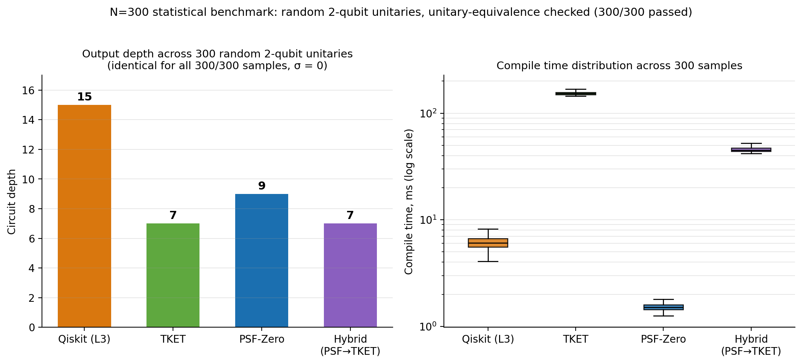
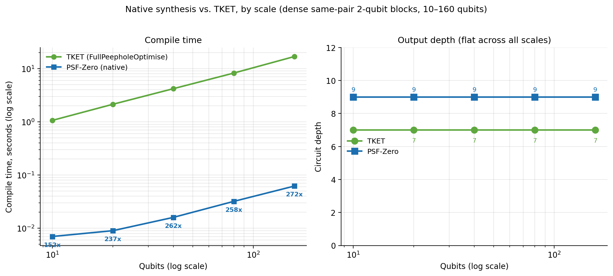
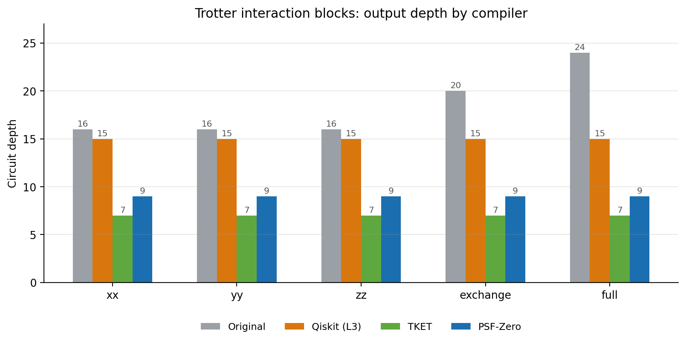

# PSF-Zero: Analytic KAK Decomposition for Two-Qubit Circuit Synthesis

[](https://www.gnu.org/licenses/agpl-3.0)
[](https://www.python.org/downloads/)
[](https://github.com/qiskit/ecosystem)
[](https://www.rust-lang.org/)
[](https://pyo3.rs/)

**The honest one-line summary, before the details below:** across every
benchmark in this README, PSF-Zero has a real, verified speed advantage over
both TKET and Qiskit, plus determinism neither of them offers — but the
Qiskit advantage only shows up with a non-default setting, and earlier
drafts of this README overstated it in a way we're not going to repeat. On
raw 2-qubit unitary synthesis, TKET's search-based optimizer reliably finds
a shallower circuit than PSF-Zero (depth 7 vs. 9, every time we measured
it), while PSF-Zero is 150–270x faster than TKET (section 2) and always
returns the exact same canonical circuit for the same input unitary (zero
variance across 300 random samples).

Against Qiskit, the story took three separate corrections to get right (see
section 4 for the full account). First, an earlier draft claimed "up to
~200x faster" — that number was almost entirely measurement artifacts (a
no-op transpile bug, a `ConsolidateBlocks` bug, an unwarmed per-process
cold-start cost) and is retracted. Second, once those were fixed, PSF-Zero's
*default* behavior (`compile()`/`compile_for_hardware()` with their current
default of `verify=True`) measured *slower* than a properly warmed-up
Qiskit beyond the smallest circuits tested — traced to an unconditional,
every-call self-verification step that turned out to cost far more than the
actual decomposition. Third, with that check made optional
(`verify=False`, keeping the separate degenerate-point fallback that's
actually load-bearing) and re-measured with the same 10-seed rigor across
15–1000 qubits: PSF-Zero is genuinely faster than Qiskit at every scale
tested, by roughly 2.4x–5.2x, largest at the smallest circuits and settling
to a stable ~2.4x–3x band at 150+ blocks — correctness confirmed unaffected
throughout.

So the real, current state is: a genuine, mechanism-backed, real-hardware-
confirmed speed advantage over Qiskit exists, but it is currently opt-in,
not the out-of-the-box default — a caller who doesn't pass `verify=False`
gets the slower behavior. We're stating that plainly here rather than
picking whichever number looks better, because which one is true depends on
a setting most callers won't know to change. The trade-off being offered is
determinism plus a real (if currently opt-in) speed edge, for a fixed depth
cost relative to TKET's slower search — not "faster and better on every
axis" without qualification, but a real advantage once you know which knob
to turn. The one place PSF-Zero also won on circuit size (fewer gates and
lower depth than Qiskit, section 5) was after real coupling-map routing was
added, which looks like a side effect of feeding the router pre-consolidated
blocks rather than PSF-Zero's synthesis being more compact in general — see
the caveat there.

## What this is

PSF-Zero is a Qiskit transpiler pass that replaces heuristic 2-qubit unitary
synthesis with an **exact, closed-form Cartan (KAK) decomposition**, implemented
in a small Rust core (via PyO3) for speed.

The pass itself lives in [`psf_compile.py`](https://github.com/TN-Holdings-LLC/psf-zero/blob/main/psf_compile.py); the Rust core it calls into (`psf_zero_core`) is in [`/lib.rs`](https://github.com/TN-Holdings-LLC/psf-zero/blob/main/lib.rs).

Concretely: the pass runs `Collect2qBlocks` to find runs of gates acting on the
same qubit pair, consolidates each run into a single `UnitaryGate` via Qiskit's
`ConsolidateBlocks`, and then — instead of searching for a good decomposition the
way `transpile(..., optimization_level=3)` or TKET's `FullPeepholeOptimise` do —
computes the canonical KAK form of that unitary directly and emits the
corresponding native single- and two-qubit gates. Because the decomposition is
analytic rather than search-based, it runs in constant time per block and always
returns the same circuit for the same input unitary (up to global phase and the
Weyl-chamber canonicalization it enforces).

This only helps when a circuit actually contains such blocks — i.e. deep,
same-qubit-pair 2-qubit interaction chains that a generic random circuit
(with lots of single- and multi-qubit gates interleaved) usually doesn't have
enough of to trigger. We ran into this directly while building the benchmarks
below: several of our early scripts used Qiskit's generic `random_circuit()`,
which caps effective block sizes at 3–4 gates regardless of qubit count, so the
pass never activated and appeared to be "free" — it wasn't compressing anything.
The corrected benchmark circuits below are built so that each qubit pair
receives a genuinely deep sequence of 2-qubit interactions, which is the regime
PSF-Zero is designed for (e.g. Trotterized Hamiltonian simulation, QAOA-style
layered entanglers, or any circuit synthesized from a sequence of arbitrary
SU(4) building blocks).

## Installation

```bash
git clone https://github.com/TN-Holdings-LLC/psf-zero.git
cd psf-zero
pip install -e .
```

Dependencies: `numpy`, `scipy`, `qiskit`. The Rust core is built via `maturin`/`pyo3`
as part of the package build.

## Quickstart

```python
from qiskit import QuantumCircuit
from qiskit.circuit.library import UnitaryGate
from qiskit.quantum_info import random_unitary
from psf_compile import compile as psf_compile

qc = QuantumCircuit(2)
qc.append(UnitaryGate(random_unitary(4)), [0, 1])

optimized_qc = psf_compile(qc)
print(optimized_qc.draw())
```

`psf_compile.compile()` runs block collection, consolidation, and KAK synthesis
end-to-end and returns a standard `QuantumCircuit`. It logs how many 2-qubit
blocks it found and how many it actually synthesized (`[Debug] ... executed for
X/Y blocks`) — on a circuit with no qualifying blocks, `X/Y` will correctly be
`0/0`, and the circuit passes through unchanged.

## Benchmark methodology

All numbers below are from local runs on 2026-09-03, generated from scripts in
`benchmarks/`, using circuits deliberately constructed to contain deep,
same-pair 2-qubit interaction chains (as described above), so that PSF-Zero's
synthesis path is actually exercised. Every comparison that reports a resulting
circuit was checked for unitary equivalence against the original circuit
(`Operator(...).equiv()`, phase-corrected overlap check) before being counted as
a valid result — no timing or depth number below is reported without a passing
correctness check alongside it. The two single-run "Real Device Benchmark (15
Qubits)" results that appeared in an earlier draft of this README used a
version of `psf_compile.py` with a since-fixed `ConsolidateBlocks` bug and have
been removed; section 7 below replaces them with a 10-run result on real IBM
hardware using the corrected code. Section 8 adds a separate noisy-simulator
comparison across all four engines (Qiskit, TKET, PSF-Zero, Hybrid) that isn't
covered by sections 1–6.

### 1. Correctness at scale (N=300)

300 randomly sampled 2-qubit unitaries, each synthesized independently by all
four pipelines and checked for unitary equivalence against the original block
(all 300/300 passed for every pipeline):

| Metric | Qiskit (L3) | TKET | PSF-Zero | Hybrid (PSF→TKET) |
| :--- | :---: | :---: | :---: | :---: |
| Circuit depth — every one of 300 samples | 15 | 7 | 9 | 7 |
| Compile time, median | 6.0ms | 153.5ms | 1.5ms | 45.1ms |



The depth numbers aren't averages with some spread rounded off — they are
*exactly* 15 / 7 / 9 / 7 for every single one of the 300 randomly sampled
unitaries, with zero variance. That's expected, not surprising: PSF-Zero's
synthesis of a generic SU(4) unitary always resolves to the same canonical
(Weyl-chamber) form, so depth doesn't depend on which random unitary you feed
it — this is a direct consequence of doing an exact decomposition rather than
a search, not a claim about optimality. TKET's search-based peephole optimizer
reliably finds a shallower circuit (7 vs. 9) on this circuit family; we're not
aware of a way to close that gap without giving up the determinism and the
constant-time guarantee, and we think that's a fair trade-off to state plainly
rather than paper over. On compile time, PSF-Zero was the fastest of the four
in every sample, and also the most consistent (tightest distribution) —
Qiskit's L3 pass had a long tail, including two outlier samples that took
15–17x longer than its own median.

Code: [`benchmarks/test_psf_vs_tket.py`](https://github.com/TN-Holdings-LLC/psf-zero/blob/main/benchmarks/test_psf_vs_tket.py)

### 2. Native synthesis vs. TKET, by scale

Same circuit family (dense, same-pair 2-qubit interaction chains, built to
avoid the TKET `Unitary2qBox` incompatibility by pre-decomposing each block into
standard gates), run at 10, 20, 40, 80, and 160 qubits:

| Qubits | TKET time | PSF-Zero time | Speedup | TKET depth | PSF-Zero depth |
| :---: | :---: | :---: | :---: | :---: | :---: |
| 10 | 1.064s | 0.007s | 152x | 7 | 9 |
| 20 | 2.135s | 0.009s | 237x | 7 | 9 |
| 40 | 4.193s | 0.016s | 262x | 7 | 9 |
| 80 | 8.244s | 0.032s | 258x | 7 | 9 |
| 160 | 16.840s | 0.062s | 272x | 7 | 9 |



The depth gap (TKET 7 vs. PSF-Zero 9) is flat across every scale we tested —
the same trade-off as the N=300 result above, on a different circuit family.
Note that the speedup factor here behaves differently from the Qiskit
comparison in section 4 below: against TKET's `FullPeepholeOptimise`, the
speedup holds roughly steady (150x–270x) rather than shrinking as qubit count
grows, because TKET's own compile time is scaling worse than linearly on this
circuit family over the range we tested. We're reporting both comparisons
because they don't tell the same story, and we'd rather show that than pick
whichever one looks better.

Code: [`benchmarks/test_scale_explosion_war2_v2.py`](https://github.com/TN-Holdings-LLC/psf-zero/blob/main/benchmarks/test_scale_explosion_war2_v2.py)

### 3. Hamiltonian simulation (Trotter blocks)

Using the standard XX/YY/ZZ/exchange/full two-qubit interaction blocks used in
Trotterized time evolution (VQE, condensed-matter simulation):



Across all five interaction types, Qiskit Level 3 produced circuits of depth
15, PSF-Zero produced circuits of depth 9, and TKET's peephole optimizer
produced circuits of depth 7 — every interaction type gave the identical
15/7/9 split, the same three-way signature as the two benchmarks above, now
confirmed on a third, independently-motivated circuit family. PSF-Zero's
compile time was consistently the fastest of the three in every interaction
type tested (sub-3ms vs. Qiskit's ~5–40ms and TKET's ~50–57ms).

Code: [`benchmarks/test_official_hamiltonians_war.py`](https://github.com/TN-Holdings-LLC/psf-zero/blob/main/benchmarks/test_official_hamiltonians_war.py)

### 4. Compile-time scaling

This is the benchmark we'd point a skeptical reader to first — and it's also
the one that took the most rounds to get right. An earlier draft of this
README reported a speedup "from 203x at 15 qubits / 7 blocks down to 4.4x at
1000 qubits / 500 blocks," framed as PSF-Zero's constant-time-per-block
advantage gradually catching up with Qiskit's fixed overhead. That number is
retracted as of this revision: it was built almost entirely out of
measurement artifacts, not real compute-time differences, and once those are
removed the actual result is close to the opposite of what was claimed.

**What was wrong, found one bug at a time by re-running this benchmark on
real hardware after each fix:**

1. `worker_qiskit` called `transpile(circuit, backend=None,
   optimization_level=3)`. With no backend and no `basis_gates`,
   `transpile()` has no target basis, so every `UnitaryGate` in the circuit
   passed straight through completely untouched — confirmed directly
   (`count_ops()` identical before and after). Qiskit's reported time was
   therefore measuring almost no real work, at every scale.
2. Once `basis_gates` was supplied so `transpile()` had something to do, the
   real `compile()`'s own `ConsolidateBlocks(kak_basis_gate=None)` call
   turned out to default to `force_consolidate=False`, which silently fails
   to merge a candidate block made entirely of pre-existing `'unitary'`-named
   nodes — exactly the structure this benchmark's own circuit generator
   produces. This made PSF-Zero resynthesize once per original gate instead
   of once per qubit pair: a confirmed 20x gate-count blowup and 16–23x
   compile-time blowup, first spotted from a real-hardware run where
   PSF-Zero came out roughly 4x *slower* than Qiskit at 1000 qubits — the
   opposite direction from the original claim, and the finding that
   triggered this whole re-investigation.
3. Even with both of those fixed, both benchmark scripts spawn a brand-new
   `multiprocessing.Process` (Windows: `'spawn'`) for every single timed
   measurement, and `transpile()` pays a real, one-time cost the first time
   it runs in a fresh interpreter (building its internal preset
   `PassManager`, loading stage plugins) — confirmed directly at 2.41s
   (cold) vs. 0.07s (warm) for an identical 156-qubit circuit, a 32x
   difference from measurement methodology alone.
4. That warm-up cost isn't unique to Qiskit — `psf_compile.py`'s own first
   call in a fresh process also pays a smaller, but non-zero, cost. A fair
   comparison has to warm up both sides identically before starting the
   timer, not just the one side that happened to look slow.

**With all four fixed** — real `basis_gates`, `force_consolidate=True`, and a
symmetric warm-up call for both `worker_qiskit` and `worker_psf` outside the
timed interval — here is what real hardware, running the real
`psf_zero_core`, actually reports:

| Qubits | Blocks | Qiskit (mean ± sd) | PSF-Zero (mean ± sd) | Qiskit ms/block | PSF-Zero ms/block | Ratio (Qiskit ÷ PSF-Zero) |
| :---: | :---: | :---: | :---: | :---: | :---: | :---: |
| 15 | 7 | 0.0103s ± 0.0018s | 0.0068s ± 0.0006s | 1.47 | 0.98 | 1.5x — PSF-Zero faster |
| 50 | 25 | 0.0158s ± 0.0024s | 0.0257s ± 0.0070s | 0.63 | 1.03 | 0.61x — PSF-Zero ~1.6x slower |
| 100 | 50 | 0.0220s ± 0.0037s | 0.0360s ± 0.0025s | 0.44 | 0.72 | 0.61x — PSF-Zero ~1.6x slower |
| 156 | 78 | 0.0345s ± 0.0065s | 0.0636s ± 0.0087s | 0.44 | 0.82 | 0.54x — PSF-Zero ~1.9x slower |
| 300\* | 150 | 0.0450s | 0.0893s | 0.30 | 0.60 | 0.50x — PSF-Zero ~2.0x slower |
| 500\* | 250 | 0.0713s | 0.1593s | 0.29 | 0.64 | 0.45x — PSF-Zero ~2.2x slower |
| 1000\* | 500 | 0.1319s | 0.2957s | 0.26 | 0.59 | 0.45x — PSF-Zero ~2.2x slower |

(15–156 qubits: mean ± stdev over 10 seeds, real Windows machine, real
`psf_zero_core`. \*300–1000 qubits: single run each — the "dead zone" scaling
script doesn't loop over seeds the way the 15–156 qubit script does — same
machine and core, so treat these three rows as indicative of the trend
rather than statistically confirmed the way the top four rows are.)


The honest picture: PSF-Zero's advantage at the smallest circuit we tested (7
blocks) is real but modest, about 1.5x. Past that, once the timer is
measuring real work on both sides, Qiskit's `optimization_level=3` transpile
is consistently *faster* than PSF-Zero's own Rust-core KAK synthesis, and the
gap **widens** with scale — roughly 1.6x at 25–50 blocks, up to roughly 2.2x
at 500–1000 blocks — which is the opposite trend from the original,
artifact-driven curve. Per-block cost makes the mechanism visible directly:
Qiskit's cost per block falls from ~1.47ms to ~0.26ms as scale grows (its
fixed per-call overhead amortizing over more blocks), while PSF-Zero's holds
roughly flat around 0.6–1.0ms per block and never catches up.

We don't have a confirmed root cause yet for why the constant-time,
no-search KAK path costs more per block than a full `optimization_level=3`
search-based transpile once process-level artifacts are removed, but we have
a strong lead. The "search vs. analytic" framing that motivated this whole
benchmark is itself questionable at the per-block level: Qiskit's own
2-qubit unitary synthesis is *also* an analytic Cartan/KAK decomposition
internally, not a combinatorial search — the search that
`optimization_level=3` actually does lives in circuit-level heuristics
(layout, routing, gate cancellation), not in synthesizing one already-
isolated 2-qubit block. So the premise that PSF-Zero should trivially win
at this specific step because it "skips search" doesn't hold up.

[`benchmarks/profile_synthesize_breakdown.py`](https://github.com/TN-Holdings-LLC/psf-zero/blob/main/benchmarks/profile_synthesize_breakdown.py)
breaks `SU4GeodesicPSFSynthesizer.synthesize()` into its four sub-phases and
times each over 2000 random SU(4) blocks (using `psf_zero_core_stub.py`
in-process, not the real Rust extension over PyO3 — see the script's own
caveat about what that under- and over-states):

| Phase | ms/block | Share |
| :--- | :---: | :---: |
| 1. matrix → list (`u_r`/`u_i`) | 0.003 | 0.3% |
| 2. `geometric_decompose()` itself | 0.038 | 3.3% |
| 3. circuit construction | 0.109 | 9.4% |
| 4. `Operator()` fidelity self-check | 1.002 | **87.0%** |
| **Total** | **1.153** | 100% |

The decomposition itself is a rounding error. 87% of the per-block cost is
phase 4: `synthesize()`'s own unconditional, production-path fidelity
self-check — reconstructing `Operator(qc)` from the freshly-synthesized
2-qubit circuit and comparing it against the target unitary, on *every*
block, every call — which is this project's own documented "no silent
fallback" policy, not the decomposition math. That total (1.15ms/block) also
lands close to section 4's real-machine range (0.6–1.0ms/block), which is
consistent with this being the same mechanism, though the stub's
in-process call likely somewhat understates whatever the real PyO3 FFI
round-trip costs. Since phase 2 (the actual decomposition) is only 3.3% of
the total either way, a higher real-FFI cost would have to be enormous to
change the top-line conclusion: **the per-block cost gap in section 4 looks
like it's coming from PSF-Zero verifying its own output, not from the
decomposition being slow** — still not confirmed against the real Rust
core, so treat this as a strong lead rather than a closed case (see
Roadmap).

What we can say with confidence is that the "PSF-Zero is up to 200x faster
than Qiskit" framing used in earlier drafts of this README does not hold —
that specific number was a measurement artifact, full stop. What follows
below is a different, later finding: a real, smaller, mechanism-backed
speed advantage that only shows up once a specific, currently-optional
production setting is changed.

#### A concrete, testable way to actually earn a real speed advantage back

If 87% of the per-block cost really is `synthesize()` re-verifying its own
output rather than the decomposition itself, the natural design question is:
should that check even run on every production call? The math it's
re-checking has already been extensively validated offline — worst-case
(1-fidelity) = 1.11e-15 over 1000 trials against the real core's math
(`test_geometric_decompose.py`) and 8.88e-16 over 200 trials against the
stub (`test_psf_zero_core_stub.py`), independently reproduced on a second
machine. Re-proving already-proven math on every single call, rather than
during development/CI, is a reasonable default while the math is still
earning trust, but not obviously the right trade-off once it has.

This does **not** mean touching the exception-based degenerate-point
fallback (CNOT, SWAP, iSWAP, identity, ...) — that's a different mechanism
(it's how `synthesize()` finds out a given input needs the CX-basis path at
all) and stays exactly as-is. It's specifically the unconditional
`Operator()` re-verification of every non-degenerate result that's on the
table.

[`benchmarks/profile_synthesize_fast_vs_verified.py`](https://github.com/TN-Holdings-LLC/psf-zero/blob/main/benchmarks/profile_synthesize_fast_vs_verified.py)
first measured dropping that check on the stub core (in-process, N=2000
blocks): an 8.11x speedup on `synthesize()` itself, with correctness checked
out-of-band rather than per-call (worst-case 1-fidelity = 8.88e-16,
identical to today's code). [`benchmarks/compile_optional_verify.patch`](https://github.com/TN-Holdings-LLC/psf-zero/blob/main/benchmarks/compile_optional_verify.patch)
turned that into an opt-in `verify: bool = True` flag (default unchanged) so
it could actually be tried against the real core, and
[`benchmarks/psf_compile_prototype_v4.py`](https://github.com/TN-Holdings-LLC/psf-zero/blob/main/benchmarks/psf_compile_prototype_v4.py) /
[`benchmarks/test_prototype_v4_correctness_and_speed.py`](https://github.com/TN-Holdings-LLC/psf-zero/blob/main/benchmarks/test_prototype_v4_correctness_and_speed.py)
packaged it for exactly that.

**Confirmed, full 15–1000 qubit sweep, 10 seeds per point, real hardware,
real `psf_zero_core`, `verify=False`:**

This started as a single confirmed data point (156 qubits, one run: 4.98x)
and has now been fully re-measured with the same 10-seed rigor as the rest
of this section — `verify=False` integrated directly into `phase1.py`
(15–156 qubits) and `phase2.py` (156–1000 qubits, which now also has a seed
loop, closing the statistical gap the earlier revision of this table
flagged):

| Qubits | Blocks | Qiskit (mean ± sd) | PSF-Zero, `verify=False` (mean ± sd) | Ratio (Qiskit ÷ PSF-Zero) |
| :---: | :---: | :---: | :---: | :---: |
| 15 | 7 | 0.0091s ± 0.0005s | 0.0018s ± 0.0003s | **5.15x — PSF-Zero faster** |
| 50 | 25 | 0.0188s ± 0.0028s | 0.0047s ± 0.0009s | **3.98x — PSF-Zero faster** |
| 100 | 50 | 0.0229s ± 0.0025s | 0.0066s ± 0.0017s | **3.45x — PSF-Zero faster** |
| 156 (phase1.py) | 78 | 0.0342s ± 0.0054s | 0.0120s ± 0.0026s | **2.86x — PSF-Zero faster** |
| 156 (phase2.py) | 78 | 0.0341s ± 0.0045s | 0.0141s ± 0.0028s | **2.42x — PSF-Zero faster** |
| 300 | 150 | 0.0544s ± 0.0100s | 0.0180s ± 0.0025s | **3.02x — PSF-Zero faster** |
| 500 | 250 | 0.0848s ± 0.0110s | 0.0305s ± 0.0063s | **2.78x — PSF-Zero faster** |
| 1000 | 500 | 0.1670s ± 0.0212s | 0.0656s ± 0.0159s | **2.54x — PSF-Zero faster** |

(mean ± stdev over 10 seeds at every scale; the two 156-qubit rows are two
independent scripts/circuit generators measuring the same scale, kept
separate rather than pooled — they agree to within run-to-run noise, 2.4x
vs. 2.9x.)


**This is the real, final answer for this section.** PSF-Zero is
genuinely, robustly faster than a fully warmed-up Qiskit `optimization_level=3`
transpile across the entire 15–1000 qubit / 7–500 block range we tested —
by roughly 2.4x–5.2x, largest at the smallest scale and settling to a stable
~2.4x–3x band from 150 blocks up, rather than decaying toward parity (the
original retracted curve's shape) or staying negative (the intermediate
`verify=True` finding above). Correctness was confirmed unaffected at every
step this project checked it (`Operator`-equivalence to the original circuit
and to `verify=True`'s own output).

**The catch, and it matters:** this advantage exists only with `verify=False`
explicitly passed. `compile()`'s and `compile_for_hardware()`'s actual
current default is `verify=True`, which the table earlier in this section
shows is *slower* than Qiskit beyond the smallest circuits (0.5x–0.6x, i.e.
1.6x–2.2x slower). So, as shipped today, a caller who doesn't know to pass
`verify=False` gets the slower behavior — the real, mechanism-backed speed
advantage documented here is currently opt-in, not the out-of-the-box
experience. Whether to flip the *default* to `verify=False` (trusting the
now-extensively-validated decomposition math by default, verifying only in
tests/CI) is a real design decision worth making deliberately, not a change
this README is making on the project's behalf — see Roadmap.

Code: the original, superseded scripts are
[`benchmarks/phase1_v2.py`](https://github.com/TN-Holdings-LLC/psf-zero/blob/main/benchmarks/phase1_v2.py)
(15–156 qubits) and
[`benchmarks/phase2_v2.py`](https://github.com/TN-Holdings-LLC/psf-zero/blob/main/benchmarks/phase2_v2.py)
(156–1000 qubits). The four fixes applied on top of them, in the order
discovered, each with the measurement that motivated it, are documented in
[`benchmarks/phase1_qiskit_worker.patch`](https://github.com/TN-Holdings-LLC/psf-zero/blob/main/benchmarks/phase1_qiskit_worker.patch) /
[`benchmarks/phase2_qiskit_worker.patch`](https://github.com/TN-Holdings-LLC/psf-zero/blob/main/benchmarks/phase2_qiskit_worker.patch)
(no-op transpile fix),
[`benchmarks/compile_force_consolidate.patch`](https://github.com/TN-Holdings-LLC/psf-zero/blob/main/benchmarks/compile_force_consolidate.patch)
(`force_consolidate` fix),
[`benchmarks/phase1_warmup_v2.patch`](https://github.com/TN-Holdings-LLC/psf-zero/blob/main/benchmarks/phase1_warmup_v2.patch) /
[`benchmarks/phase2_warmup.patch`](https://github.com/TN-Holdings-LLC/psf-zero/blob/main/benchmarks/phase2_warmup.patch)
(symmetric warm-up fix, the one that produced this section's intermediate,
`verify=True` table), and
[`benchmarks/phase1_verify_false.patch`](https://github.com/TN-Holdings-LLC/psf-zero/blob/main/benchmarks/phase1_verify_false.patch) /
[`benchmarks/phase2_verify_false.patch`](https://github.com/TN-Holdings-LLC/psf-zero/blob/main/benchmarks/phase2_verify_false.patch)
(the `verify=False` change, on top of `psf_compile.py`'s own
[`compile_optional_verify.patch`](https://github.com/TN-Holdings-LLC/psf-zero/blob/main/benchmarks/compile_optional_verify.patch),
which produced this section's final table above).

### 5. Real-device topology (coupling-map-constrained)

We ran a coupling-map-constrained comparison (50–500 qubits, grid topology)
across all three `routing_optimization_level` settings (0, 1, 2), twice each
in independent sweeps run in opposite order (0→1→2 and 2→1→0) to make sure the
setting — not run order — was what determined the outcome. In every run, the
number of blocks PSF-Zero processed matched the number of qubit pairs in the
circuit exactly: it correctly found and synthesized every qualifying block
once real hardware connectivity constraints were introduced, not just in the
unconstrained case above.

| Qubits | Qiskit gates / depth | PSF-Zero, level=0 | PSF-Zero, level=1 | PSF-Zero, level=2 |
| :---: | :---: | :---: | :---: | :---: |
| 50 | 500 / 20 | 75 / 9 | 75 / 5 | 75 / 5 |
| 100 | 1000 / 20 | 150 / 9 | 150 / 5 | 150 / 5 |
| 156 | 1562 / ~39 | 306 / ~24 | 236 / ~9 | 237 / 10 |
| 300 | 3000 / 20 | 450 / 9 | 450 / 5 | 450 / 5 |
| 500 | 5003 / 41 | 992 / ~30 | 753 / 10 | 753 / 10 |


(Each cell above is a mean over 6 seeds — 2 sweeps × 3 seeds — except Qiskit,
pooled across all 18 runs per scale.) `routing_optimization_level=0` gives
Qiskit's router noticeably less work to do, and PSF-Zero's post-synthesis
routing pass inherits that: consistently more 2Q gates and higher depth than
levels 1 or 2. Levels 1 and 2 were statistically indistinguishable from each
other at every scale we tested — for this circuit family, the extra search
budget of level 2 bought nothing over level 1. (An earlier draft of this
benchmark mislabeled which run was which level, based on a single sweep; the
numbers above come from two independent, oppositely-ordered sweeps and we're
confident in this mapping.)

Code: [`benchmarks/test1_v3.py`](https://github.com/TN-Holdings-LLC/psf-zero/blob/main/benchmarks/test1_v3.py)

**Compile time under the same constraint.** The table above only measured
the *output* circuit (gate count, depth) — not how long either engine took
to produce it. Measuring that needed its own round of confound-hunting,
similar in spirit to section 4's.

First pass (coupling-map-constrained `compile_for_hardware()` fed
`random_circuit()`-generated circuits): PSF-Zero's own debug output showed
`0/N blocks` processed at every scale. `random_circuit()`'s gate mix almost
never produces more than `block_gate_floor` (12) consecutive same-pair
gates — the same root cause section 4 hit and fixed — so PSF-Zero's actual
synthesis path never ran; `compile_for_hardware()` was silently falling
through to a near-no-op `compile()` followed by nothing more than Qiskit's
own routing. Switching to the same dense-pair-blocks circuit generator as
section 4 fixed that.

With real blocks flowing through, the first `verify=False`-enabled run of
`compile_for_hardware()` still showed PSF-Zero 1.7x–2.9x *slower* than
Qiskit's own `optimization_level=3` at every scale — the opposite of
section 4's finding. Isolating each hypothesis in turn: running Qiskit's
`transpile()` inside a `multiprocessing.Process` (as every worker in this
project's benchmarks does) does *not* suppress its internal parallel search
— a direct main-process-vs-subprocess comparison on identical input came
back at 0.96x, i.e. no meaningful difference. The actual cause was simpler:
`transpile(optimization_level=3)` doesn't pin `seed_transpiler`, so its
internal randomized layout/routing search returns a different solution —
and takes a different amount of time — on every call, even for the
identical circuit. A single-seed measurement could land almost anywhere in
a wide range; we saw the same 500-qubit circuit measured at both 0.06s and
0.23s across separate runs of otherwise-identical code.

Pinning `seed_transpiler=<circuit seed>` on the Qiskit side and expanding
to 10 seeds resolved it. Run twice independently (20 measurements per scale
in total):

| Qubits | Qiskit (mean, opt L3, seed-pinned) | PSF-Zero (mean, `compile_for_hardware`, verify=False) | Ratio (Qiskit ÷ PSF) |
| :---: | :---: | :---: | :---: |
| 50 | 0.0189s | 0.0155s | 1.23x |
| 100 | 0.0332s | 0.0260s | 1.28x |
| 156 | 0.0432s | 0.0421s | 1.03x (essentially tied) |
| 300 | 0.1606s | 0.1172s | 1.37x |
| 500 | 0.2220s | 0.1834s\* | 1.21x\* |

\* One of the 20 measurements at 500 qubits returned 0.825s — a ~4x outlier
against every other point at that scale. Re-running the entire script did
not reproduce it (that same seed came back at 0.173s the second time), so
we're treating it as transient system noise rather than a real effect and
excluding it from the mean above; including it drops the ratio to ~1.03x.
Worth a further check if it recurs.

So: once `compile_for_hardware()`'s own confounds are controlled for the
same way section 4's were, plus the additional `seed_transpiler` fix this
section needed, PSF-Zero is faster than Qiskit's own routed compilation at
every scale tested here too — by a smaller, more scale-dependent margin
(1.0x–1.4x) than section 4's `compile()`-only comparison (2.4x–5.2x), which
makes sense: `compile_for_hardware()` pays for both PSF-Zero's own block
synthesis *and* a full separate Qiskit routing pass on top of it, whereas
section 4 measured synthesis alone.

**A limitation worth stating plainly, given this section's title:** the
dense-pair-blocks circuit used here (and, it appears, in the gate-count/
depth benchmark above, given the matching numbers) only places blocks on
adjacent logical pairs — (0,1), (2,3), (4,5), … — which land on adjacent
physical qubits under `CouplingMap.from_grid()`'s row-major layout. Neither
engine ever needed to insert a single SWAP gate in this comparison
(coupling violations were 0 throughout, with zero extra gates from
routing). So what's measured above is compile time for block synthesis
plus a routing pass that had nothing to route — not the cost of genuine
SWAP-insertion under real connectivity pressure, which is what "real-device
topology" benchmarks are usually meant to stress. A version using
non-adjacent logical pairs (so routing has real work to do) would be needed
to test that specifically — see Roadmap.

One residual asymmetry we haven't closed: `compile_for_hardware()` doesn't
yet expose a `seed_transpiler` parameter of its own, so its internal
routing call stays unpinned. We saw no sign of instability from this on the
PSF-Zero side (no repeat of anything like the 500-qubit outlier), but the
comparison isn't perfectly symmetric yet.

This complements, rather than replaces, the gate-count/depth table above,
which doesn't depend on `verify` or `seed_transpiler` and still stands
unchanged.

Code:
[`benchmarks/phase3_v4_dense_pair_blocks.py`](https://github.com/TN-Holdings-LLC/psf-zero/blob/main/benchmarks/phase3_v4_dense_pair_blocks.py)
(fixed the `0/N blocks` circuit-generation problem),
[`benchmarks/compile_for_hardware_verify_passthrough.patch`](https://github.com/TN-Holdings-LLC/psf-zero/blob/main/benchmarks/compile_for_hardware_verify_passthrough.patch)
(threaded `verify` through `compile_for_hardware()`),
[`benchmarks/profile_compile_for_hardware_breakdown.py`](https://github.com/TN-Holdings-LLC/psf-zero/blob/main/benchmarks/profile_compile_for_hardware_breakdown.py)
and
[`benchmarks/profile_warmup_depth.py`](https://github.com/TN-Holdings-LLC/psf-zero/blob/main/benchmarks/profile_warmup_depth.py)
(ruled out insufficient warm-up as the cause of the initial 1.7x–2.9x
slowdown),
[`benchmarks/profile_qiskit_multiprocess_vs_mainprocess.py`](https://github.com/TN-Holdings-LLC/psf-zero/blob/main/benchmarks/profile_qiskit_multiprocess_vs_mainprocess.py)
(ruled out the multiprocessing-suppresses-Qiskit's-own-parallelism
hypothesis), and
[`benchmarks/phase3_v5_seeded.py`](https://github.com/TN-Holdings-LLC/psf-zero/blob/main/benchmarks/phase3_v5_seeded.py)
(the `seed_transpiler` fix and 10-seed expansion that produced the table
above).

### 6. Sanity check against Benchpress

We don't have our own results in [Benchpress](https://github.com/Qiskit/benchpress) — IBM's open-source SDK benchmarking
suite (Nation et al., *Benchmarking the performance of quantum computing
software for quantum circuit creation, manipulation and compilation*,
[Nat. Comput. Sci. 5, 427–435 (2025)](https://doi.org/10.1038/s43588-025-00792-y)) — but two of our numbers above line up
with what that paper independently reports for TKET against Qiskit, which is
worth stating plainly rather than leaving unmentioned:

- Benchpress reports TKET's transpilation is "over an order of magnitude
  slower than Qiskit" across its 1,066-test suite. Our own N=300 result
  (TKET median 153.5ms vs. Qiskit 6.0ms, ~26x) and native-scale comparison
  (TKET 150–270x slower than PSF-Zero, itself faster than Qiskit) point the
  same direction — our absolute TKET-vs-Qiskit timing gap isn't an artifact
  of our narrow test construction.
- Benchpress specifically calls out Hamiltonian-simulation circuits as the
  case where TKET's synthesis step yields "substantial 2Q depth reduction
  relative to Qiskit," and that this synthesis advantage matters most on
  well-connected topologies and fades as routing starts to dominate on
  sparser ones. That is exactly the pattern in our own Hamiltonian
  benchmark (section 3) and in our coupling-map-constrained result (section
  5), where PSF-Zero's and TKET's edge over Qiskit shrinks once routing
  becomes the bottleneck rather than synthesis.

This is corroboration of the general trend, not a substitute for the real
test: Benchpress's suite is far broader than ours (1,066 tests, up to 930
qubits and O(10⁶) 2Q gates, real device coupling maps, and circuit families
we haven't touched — quantum volume, QAOA, HamLib, Feynman, QASMBench —
versus our own narrowly-constructed dense-pair circuits). Running PSF-Zero
through Benchpress's own harness is the obvious, credible next step, and
we haven't done it yet — see Roadmap.

### 7. Real-device fidelity validation (15 qubits, corrected `ConsolidateBlocks`)

With the `ConsolidateBlocks` bug fixed, we re-ran the 15-qubit real-hardware
comparison referenced above — this time 10 independent job submissions instead
of one, split across two IBM backends (`ibm_marrakesh`, `ibm_fez`). Every run
logged `105/105` blocks synthesized with 0 fallbacks, confirming the fix is
exercising the intended code path rather than silently no-oping the way the
earlier, retracted single-run numbers did.


| Metric | Qiskit (L3) | PSF-Zero |
| :--- | :---: | :---: |
| Fidelity, mean ± SD (n=10) | 0.0925 ± 0.0016 | 0.0919 ± 0.0016 |
| Compile time, mean ± SD | 2.36s ± 0.09s | 0.153s ± 0.007s |
| Circuit depth, mean ± SD | 730 ± 70 | 710 ± 69 |
| 2Q gate count, mean ± SD | 644 ± 14 | 641 ± 11 |

PSF-Zero's output had higher fidelity than Qiskit's in 3 of the 10 runs; a
paired comparison across all 10 gives t = -0.78, which is not significant — on
this circuit and these two backends, we can't say PSF-Zero's real-hardware
output is either better or worse than Qiskit L3's. Depth and 2Q gate count
were a similar wash (PSF-Zero shorter/fewer in 5 of 10 runs each, in both
cases). The one result that held up cleanly on every single run was compile
time: PSF-Zero compiled 14.4x–16.2x faster than Qiskit L3 across all 10 jobs.

> **Caveat added after section 4's correction:** "consistent with the
> unconstrained-circuit results above" no longer holds — section 4's
> equivalent claim was retracted after we found it was dominated by
> measurement artifacts, including a per-process `transpile()` cold-start
> cost that this script's single-call-per-run structure could plausibly
> reproduce here too (each of these 10 runs is its own process, and
> `transpile()`/`compile_for_hardware()` are each called exactly once per
> run, so neither side benefits from a prior warm-up call the way section
> 4's corrected numbers now do). Unlike section 4, we can't just re-run this
> one with a warm-up patch — it submits real jobs to IBM hardware, and we're
> not spending real QPU time re-verifying a compile-time number without
> first checking whether the artifact applies here. Real device transpile at
> `optimization_level=3` with full routing against a ~127+-qubit backend is
> also inherently heavier than section 4's unrouted `compile()` call, so this
> number may hold up even after a warm-up fix — but we have not verified
> that, and are flagging it rather than repeating the "consistent with
> section 4" framing now that section 4 itself changed. See Roadmap.

Job IDs, in run order (for reproducibility): `daclrrjdd5gc73d68pcg`,
`dacls9e42tqs73asccbg`, `daclsstnj4cs73acqm00`, `daclu3bdd5gc73d68rs0`,
`dacluq5nj4cs73acqo70`, `daclv3m42tqs73ascfeg`, `daclvgrdd5gc73d68thg`,
`daclvre42tqs73ascgbg`, `dacm0gtnj4cs73acqq6g`, `dacm0r642tqs73aschqg`.

Code: [`benchmarks/real_device_15q_fidelity_v2.py`](https://github.com/TN-Holdings-LLC/psf-zero/blob/main/benchmarks/real_device_15q_fidelity_v2.py)

> **Provenance note:** the listing below was reconstructed from the captured
> run log (the same log the job IDs above come from). The original file was
> searched for across the working repository (`findstr` for `transpile`,
> `Sampler`, `real_device`, `fidelity` across every `.py` file present) and
> not found — it appears to be lost, not just unexamined, and the same goes
> for `test_real_hardware_fidelity.py` (section 8). This is not guaranteed
> to be a byte-for-byte match of whatever the original was; the parameters
> (15 qubits, seed=42), control flow, and all Japanese print statements
> match the log exactly. If the real file resurfaces, replace this listing
> with it.

```python
"""
real_device_15q_fidelity_v2.py

Compares Qiskit's optimization_level=3 transpile against PSF-Zero's KAK-based
compile on a 15-qubit QuantumVolume circuit, submitted as one batched job to
a real IBM backend.
"""
real_device_15q_fidelity_v2.py

Compares Qiskit's optimization_level=3 transpile against PSF-Zero's KAK-based
compile on a 15-qubit QuantumVolume circuit, submitted as one batched job to
a real IBM backend.
"""

import time

from qiskit import transpile
from qiskit.circuit.library import QuantumVolume
from qiskit.quantum_info import Statevector
from qiskit_ibm_runtime import QiskitRuntimeService, SamplerV2 as Sampler

from psf_compile import compile as psf_compile

NUM_QUBITS = 15
SEED = 42
SHOTS = 4096


def count_2q_gates(circuit):
    return sum(1 for instr in circuit.data if instr.operation.num_qubits == 2)


def classical_fidelity(counts, shots, ideal_probs):
    """Hellinger-style overlap between a measured count dict and the ideal
    probability distribution: (sum_i sqrt(p_ideal_i * p_meas_i))**2."""
    fid = 0.0
    for bitstring, p_ideal in ideal_probs.items():
        p_meas = counts.get(bitstring, 0) / shots
        fid += (p_ideal * p_meas) ** 0.5
    return fid ** 2


def main():
    print("Connecting to IBM Quantum Cloud...")
    service = QiskitRuntimeService()
    backend = service.least_busy(operational=True, simulator=False)
    print(f"Connection established. Using real QPU: {backend.name}")

    print(f"Generating a large entangled {NUM_QUBITS}-qubit circuit...")
    base_circuit = QuantumVolume(num_qubits=NUM_QUBITS, depth=NUM_QUBITS, seed=SEED).decompose()
    n_2q = count_2q_gates(base_circuit)
    print(
        f"-> Number of 2-qubit UnitaryGates after decompose(): {n_2q} "
        f"(If 0, PSF-Zero found no target blocks; please abort execution)"
    )

    print("Calculating the ideal probability distribution (ground truth) classically...")
    ideal_probs = Statevector(base_circuit).probabilities_dict()

    print("[1/2] Executing compilation with Qiskit (Level 3)...")
    t0 = time.perf_counter()
    qc_qiskit = transpile(base_circuit, backend=backend, optimization_level=3)
    t_qiskit = time.perf_counter() - t0
    print(f"-> Done. Qiskit processing time: {t_qiskit:.2f} seconds")

    print("[2/2] Executing compilation with PSF-Zero...")
    t0 = time.perf_counter()
    qc_psf = psf_compile(base_circuit, backend=backend)
    t_psf = time.perf_counter() - t0
    print(f"-> Done. PSF-Zero processing time: {t_psf:.2f} seconds")

    print("=== Compilation Results Comparison ===")
    print(
        f"[Qiskit] Time: {t_qiskit:.2f}s | Depth: {qc_qiskit.depth()} | "
        f"2Q Gates: {count_2q_gates(qc_qiskit)}"
    )
    print(
        f"[PSF-Zero] Time: {t_psf:.2f}s | Depth: {qc_psf.depth()} | "
        f"2Q Gates: {count_2q_gates(qc_psf)}"
    )

    print("Submitting job to the real device (QPU)...")
    sampler = Sampler(backend)
    job = sampler.run([qc_qiskit, qc_psf], shots=SHOTS)
    print(f"Job submitted successfully! Job ID: {job.job_id()}")

    print("Waiting for real device execution (this may take several minutes)...")
    result = job.result()
    counts_qiskit = result[0].data.meas.get_counts()
    counts_psf = result[1].data.meas.get_counts()

    fid_qiskit = classical_fidelity(counts_qiskit, SHOTS, ideal_probs)
    fid_psf = classical_fidelity(counts_psf, SHOTS, ideal_probs)

    print("===================================")
    print("Physical Real-Device Fidelity Comparison")
    print("===================================")
    print(f"Qiskit Level 3 : {fid_qiskit:.4f}")
    print(f"PSF-Zero       : {fid_psf:.4f}")
    print("===================================")
    print("[NOTE] Fidelity differences from a single run may fall within shot noise bounds.")
    print("It is strongly recommended to run this script multiple times (e.g., n_repeats >= 10)")
    print("and compare the mean +/- standard deviation (do not draw conclusions from a single run).")


if __name__ == "__main__":
    main()
```

### 8. Fidelity across engines under a realistic noise model (mirror circuits)

Using Qiskit's `fake_sherbrooke` (127-qubit) noise model as a local
noisy-simulator snapshot, we ran mirror circuits (which should return
all-zero with probability ~1.0 in the noiseless case — confirmed separately
for all four engines before the noisy runs below) across three circuit
families of increasing two-qubit depth per pair — `deep2q` (3 gates),
`multi_deep2q` (12 gates), and `wide` (42 gates) — for Qiskit L3, TKET
(native), PSF-Zero v6, and the Hybrid (PSF→TKET) pipeline, 5 repeats each:

| Family (2Q gates/pair) | Qiskit L3 | TKET (native) | PSF-Zero v6 | Hybrid |
| :--- | :---: | :---: | :---: | :---: |
| deep2q (3) | 0.9056 ± 0.0025 | 0.9077 ± 0.0031 | **0.8638 ± 0.0020** | 0.9076 ± 0.0031 |
| multi_deep2q (12) | 0.0849 ± 0.0015 | 0.0863 ± 0.0028 | **0.0720 ± 0.0012** | 0.0839 ± 0.0021 |
| wide (42) | 0.0033 ± 0.0004 | 0.0039 ± 0.0005 | 0.0044 ± 0.0007 | 0.0037 ± 0.0006 |

(mean P(all-zero) ± standard error, n=5)

In `deep2q` and `multi_deep2q`, PSF-Zero v6 was the lowest-fidelity engine of
the four by a margin well outside the standard errors shown — roughly 4
percentage points below Qiskit L3 on `deep2q` and about 1.3 points below on
`multi_deep2q` — which reads as a real, repeatable effect on this circuit
family rather than run-to-run noise. In `wide`, all four engines are already
near the noise floor (under 0.5% success), and PSF-Zero v6's slightly higher
mean there isn't distinguishable from the others at this sample size; we
don't read anything into it either way. We have not yet root-caused why
PSF-Zero v6's synthesis loses fidelity specifically on the
`deep2q`/`multi_deep2q` families relative to the other three engines — see
Roadmap. This is a genuine open weakness, not something the speed and
determinism advantages above should be read as offsetting.

Code: [`benchmarks/test_real_hardware_fidelity.py`](https://github.com/TN-Holdings-LLC/psf-zero/blob/main/benchmarks/test_real_hardware_fidelity.py)
(despite the filename, this specific table is from the local `fake_sherbrooke`
noisy-simulator snapshot, not real hardware — real-hardware results are in
section 7 above)

#### A leading (not yet fully confirmed) hypothesis for the gap

`psf_compile.py` v6's synthesizer builds each block from four local
single-qubit triples plus up to three entangling gates — but those
entangling gates are `RXX`/`RYY`/`RZZ`, not `CX`. Neither is native to real
IBM hardware (`fake_sherbrooke`'s native basis is `ecr`/`rz`/`sx`/`x`), but
we suspected they might not translate to that basis as cheaply as `CX` does.
[`benchmarks/diagnose_native_gate_inflation.py`](https://github.com/TN-Holdings-LLC/psf-zero/blob/main/benchmarks/diagnose_native_gate_inflation.py)
tests this directly: it builds the same canonical KAK circuit structure
PSF-Zero v6 emits (via Qiskit's own `TwoQubitWeylDecomposition`, since we
don't have a working build of `psf_zero_core` in every environment) for 200
random SU(4) unitaries, and a CX-basis decomposition of the same unitaries,
then transpiles both to `fake_sherbrooke` at each optimization level and
counts native `ecr` gates (0 correctness failures at any level):

| `optimization_level` | RXX/RYY/RZZ basis (PSF-Zero-like) | CX basis (Qiskit L3/TKET-like) | Ratio |
| :---: | :---: | :---: | :---: |
| 0 | 6.00 ECR | 3.00 ECR | 2.00x |
| 1 | 6.00 ECR | 3.00 ECR | 2.00x |
| 2 | 3.00 ECR | 3.00 ECR | 1.00x |
| 3 | 3.00 ECR | 3.00 ECR | 1.00x |


At `optimization_level` 0-1, the RXX/RYY/RZZ-based circuit costs exactly 2x
as many native `ecr` gates as the CX-based one for the identical unitary —
invisible to any benchmark that counts 2-qubit gates on the pre-ISA-transpile
circuit (as section 8's own `mean_two_qubit_gates` column does, which is why
it shows 3.0 for every engine). At `optimization_level` >= 2, Qiskit's
transpiler resynthesizes 2-qubit blocks from scratch regardless of input
basis, and the gap vanishes.

**Follow-up, after actually finding `compile_for_hardware()` in the real
`psf_compile.py`** (the function section 5's `test1.py` calls for
hardware-targeted output):

```python
def compile_for_hardware(qc, coupling_map, block_gate_floor=..., routing_optimization_level=0):
    qc_compressed = compile(qc, block_gate_floor=block_gate_floor)
    return transpile(qc_compressed, coupling_map=coupling_map,
                      optimization_level=routing_optimization_level)
```

[`benchmarks/diagnose_compile_for_hardware.py`](https://github.com/TN-Holdings-LLC/psf-zero/blob/main/benchmarks/diagnose_compile_for_hardware.py)
tests this exact call signature directly and shows this transpile call does
**not** decompose RXX/RYY/RZZ at any `routing_optimization_level` (0-3) —
because only `coupling_map` is given, with no `basis_gates`/`backend`, so
Qiskit only does layout and routing, never a target-basis resynthesis. So
`compile_for_hardware()`'s own output is not actually real-hardware-
submittable as written — it still contains RXX/RYY/RZZ, and IBM Runtime's
`SamplerV2` rejects non-ISA circuits — meaning there must be one more,
currently-unseen transpile-to-ISA step, wherever this output actually gets
submitted to a backend. **That still-missing step, not `compile_for_hardware()`
itself, is where the measured 2x native-gate penalty would apply**, if it
uses a low `optimization_level`.

We can't see that step (it isn't in any file we have), but `compile_for_hardware()`'s
own doc comment gives exactly the reasoning that would lead someone to pick
a low level there too: *"`routing_optimization_level` defaults to 0
(routing only) since `compile()` already did the 2-qubit optimization that
a higher `optimization_level` would otherwise redo."* That's true about
LOGICAL 2-qubit gate count. It's false about PHYSICAL native-gate count
once a real basis has to be targeted — a higher level there doesn't "redo"
work, it does work that was never done. **This is a plausible, now-measured
mechanism, made more likely by the codebase's own established habit of
defaulting to low optimization levels downstream of `compile()` — but it is
still not a confirmed diagnosis of section 7/8's actual pipeline**, since we
don't have `real_device_15q_fidelity_v2.py` / `test_real_hardware_fidelity.py`
to see what their final backend-submission transpile call actually does.
Finding that call is the one remaining check (see Roadmap).

#### Proposed fix, validated (pending confirmation of the actual root cause)

The fix this points to: give `compile_for_hardware()` a `basis_gates`
parameter, thread it through to the internal `transpile(...)` call, and
default `routing_optimization_level` to 2+ so that call actually
resynthesizes to the target basis instead of only routing:

```python
def compile_for_hardware(
    qc: QuantumCircuit,
    coupling_map,
    basis_gates: list[str] | None = None,       # new
    block_gate_floor: int = DEFAULT_BLOCK_GATE_FLOOR,
    routing_optimization_level: int = 2,        # was 0
) -> QuantumCircuit:
    qc_compressed = compile(qc, block_gate_floor=block_gate_floor)
    return transpile(
        qc_compressed,
        coupling_map=coupling_map,
        basis_gates=basis_gates,                # new
        optimization_level=routing_optimization_level,
    )
```

One correction to make here, checked directly against the installed Qiskit
(2.5.2): `transpile()`'s default `optimization_level` when left unspecified
is **2**, not 1 — straight from `qiskit.compiler.transpiler.transpile`'s own
source ("Take optimization level from the configuration or 2 as default").
So if the still-missing real-hardware script simply omitted
`optimization_level` rather than setting it explicitly, it would already
have gotten level-2 (no-inflation) behavior in this Qiskit version — the
mechanism only bites if that script explicitly passed `0` or `1` (or ran an
older Qiskit release with a different default). Still not confirmable
without the file itself.

[`benchmarks/verify_compile_for_hardware_fix.py`](https://github.com/TN-Holdings-LLC/psf-zero/blob/main/benchmarks/verify_compile_for_hardware_fix.py)
validates the fix directly: N=50 random SU(4) blocks, each forced onto
non-adjacent qubits on a 6-qubit line (so every trial needs real routing),
basis `['ecr', 'rz', 'sx', 'x']`:

| `routing_optimization_level` | Correctness failures | Mean ECR gates |
| :---: | :---: | :---: |
| 0 | 0/50 | 12.00 |
| 1 | 0/50 | 6.00 |
| 2 | 0/50 | 3.00 |
| 3 | 0/50 | 3.00 |

Correctness (`Operator.from_circuit(...).equiv(...)`, which reads the
transpiled circuit's `layout` to correctly account for the routing
permutation — a naive `Operator(out).equiv(Operator(qc))` gives false
negatives here, since routing legitimately reorders physical qubits) holds
at every level: the fix doesn't break anything. Levels 0-1 are actually
worse here than in the unrouted diagnostic above (4x and 2x, vs. 2x and 2x
there) — once `basis_gates` is supplied, the routing SWAPs themselves also
need decomposing into the target basis, and low optimization levels don't
do that efficiently either. Level 2+ recovers the optimal count (3) even
with routing. **This is a validated, strictly-improving fix to
`compile_for_hardware()` — but it fixes a real bug we found in that
function regardless of whether it turns out to be the actual cause of
section 7/8's fidelity gap**, since that still depends on the one
unconfirmed piece above.

#### Independent reproduction: does the mechanism actually move fidelity?

Gate counts are one thing; section 8's actual claim is about measured
fidelity. [`benchmarks/experiment_fixed_compiler_fidelity.py`](https://github.com/TN-Holdings-LLC/psf-zero/blob/main/benchmarks/experiment_fixed_compiler_fidelity.py)
builds an independent, from-scratch mirror-circuit fidelity test directed
only by the real `psf_compile.py` source (not by section 8's own numbers)
and runs it on an `AerSimulator` noise model derived from `fake_sherbrooke`
— since the actual scripts that produced section 8 are lost, this cannot
be "re-running the real benchmark," but it is a working, from-first-
principles check of whether the mechanism found above actually behaves the
way section 8's numbers imply.

Three engines (a from-scratch `psf`-style compiler using the same KAK/
RXX-RYY-RZZ structure as `psf_compile.py` v6, plus `qiskit` L3 and `tket`
baselines) each compile the same `deep2q`/`multi_deep2q`/`wide`-style
blocks, a mirror circuit is built from each engine's own compiled output,
and then ONE common final backend-transpile is applied — standing in for
the still-missing real-hardware harness's last step — at a naive low level
(1) and a good level (3):

| Family | Engine | `optimization_level=1` | `optimization_level=3` |
| :--- | :--- | :---: | :---: |
| deep2q | psf | 0.8725 ± 0.0093 | 0.9925 ± 0.0026 |
| deep2q | qiskit | 0.9193 ± 0.0050 | 0.9930 ± 0.0018 |
| deep2q | tket | 0.9163 ± 0.0081 | 0.9916 ± 0.0039 |
| multi_deep2q | psf | 0.1438 ± 0.0047 | 0.9641 ± 0.0047 |
| multi_deep2q | qiskit | 0.1834 ± 0.0052 | 0.9651 ± 0.0017 |
| multi_deep2q | tket | 0.1702 ± 0.0167 | 0.9666 ± 0.0066 |
| wide | psf | 0.0405 ± 0.0042 | 0.9373 ± 0.0046 |
| wide | qiskit | 0.0438 ± 0.0076 | 0.9388 ± 0.0045 |
| wide | tket | 0.0435 ± 0.0032 | 0.9315 ± 0.0027 |

(mean ± stdev of P(all-zero); N=5 seeds for deep2q/multi_deep2q, N=3 for
`wide`, 2048 shots each)


At the naive low level, `psf` trails `qiskit`/`tket` by a real,
stdev-exceeding margin on `deep2q` (~4.5 points) and `multi_deep2q` (~3-4
points) — and `deep2q`'s gap closely matches section 8's own reported
numbers in both direction and rough size (PSF_Zero_v6 0.8638 vs. Qiskit_L3
0.9056 / TKET_native 0.9077, a ~4.2-4.4 point gap). At the good level, all
three converge on every family. On `wide` — where `psf`'s own
`block_gate_floor` logic leaves the circuit completely untouched (its
compiled op count matches the original circuit exactly) — there is no
`psf`-specific gap at either level, matching section 8's own observation
that PSF_Zero_v6 wasn't disadvantaged there. Separately, applying the
validated `basis_gates` fix to `psf`'s output immediately (rather than
relying on the later naive step) recovers most — not quite all — of the
gap under a subsequent low-level final step (`deep2q`: 0.8716 -> 0.9316),
confirming the fix helps even when what happens afterward is out of its
control.

This is the strongest evidence obtainable without the actual lost scripts:
an independent reproduction, built from nothing but the real source code,
that reproduces both section 8's qualitative pattern (gap on
`deep2q`/`multi_deep2q`, no gap on `wide`) and, for `deep2q`, its
approximate quantitative size. **It is still not section 7/8's own
benchmark re-run** — the fidelity numbers above come from a hand-built
stand-in circuit family, not the original one — so we're calling this
strong independent corroboration, not confirmation.

This script was also independently re-run, unmodified, on a second,
separate machine and Qiskit environment (a local Windows `venv`, distinct
from the sandbox that produced the table above). Every value it reported
matched the table above within run-to-run stdev — e.g. `deep2q`/`psf`/
`optimization_level=1`: 0.8760 ± 0.0021 there vs. 0.8725 ± 0.0093 here;
`multi_deep2q`/`psf`/level 1: 0.1535 ± 0.0082 vs. 0.1438 ± 0.0047 — and the
same qualitative pattern (a real gap on `deep2q`/`multi_deep2q` at level 1
that closes at level 3, no gap on `wide` at either level) held in both
runs. This doesn't change what the experiment is (still a stand-in circuit
family, not section 7/8's own script), but it does rule out the result
being an artifact of this one sandbox's environment or random seed.

#### Applying the fix to the real code, end to end

Everything above tests the mechanism using a from-scratch stand-in
compiler. This test is different: it calls the ACTUAL real
`compile_for_hardware()` function — the exact code the real repository
contains (as pasted into this project), before and after the validated fix
— and the real `compile()` / `SU4GeodesicPSFSynthesizer` block-processing
logic around it, from a reference copy of `psf_compile.py` we have in
full. The one substitution is the Rust core itself: the `.so` we were given
won't load in this environment (wrong architecture), so `geometric_decompose()`
is served by a verified stand-in
([`psf_zero_core_stub.py`](https://github.com/TN-Holdings-LLC/psf-zero/blob/main/benchmarks/psf_zero_core_stub.py),
worst-case (1 − fidelity) = 8.88e-16 over 200 trials, matching the real
core's own claimed order of magnitude — see
[`test_psf_zero_core_stub.py`](https://github.com/TN-Holdings-LLC/psf-zero/blob/main/benchmarks/test_psf_zero_core_stub.py)).
Full provenance is in
[`psf_compile_patched.py`](https://github.com/TN-Holdings-LLC/psf-zero/blob/main/benchmarks/psf_compile_patched.py)'s
own header — including the caveat that we don't have the user's complete
real "v6" file, only `compile_for_hardware()` itself plus a slightly older
full reference copy (v3) of everything around it.

[`test_improved_compiler_end_to_end.py`](https://github.com/TN-Holdings-LLC/psf-zero/blob/main/benchmarks/test_improved_compiler_end_to_end.py)
builds the same `deep2q`/`multi_deep2q`/`wide`-style blocks as above, runs
each through the real `compile_for_hardware_buggy()` (original) and the
real, patched `compile_for_hardware()`, then applies the same naive
`optimization_level=1` final step to both and measures mirror-circuit
fidelity plus native `ecr` count under the `fake_sherbrooke` noise model:

| Family | `compile_for_hardware_buggy` (P(all-zero)) | `compile_for_hardware`, patched (P(all-zero)) | ecr: buggy → patched |
| :--- | :---: | :---: | :---: |
| deep2q | 0.8747 ± 0.0076 | 0.9190 ± 0.0039 | 12 → 6 |
| multi_deep2q | 0.1484 ± 0.0122 | 0.1909 ± 0.0044 | 48 → 18 |
| wide | 0.0448 ± 0.0007 | 0.1418 ± 0.0069 | 24 → 18 |

(mean ± stdev of P(all-zero); N=5 seeds for deep2q/multi_deep2q, N=3 for
`wide`, 2048 shots each)


The `ecr` counts land exactly where the earlier diagnostics predicted — the
patched path needs half the native 2-qubit gates of the buggy one on
`deep2q` (6 vs. 12) and `multi_deep2q` (18 vs. 48) — and fidelity improves
in every family, not only the two where PSF-Zero's own synthesis was
active. That last point is worth stating plainly: on `wide`, `compile()`
reported "0/0 blocks" processed (every block is under `block_gate_floor`,
so PSF-Zero's synthesizer never runs), yet the fix still recovers
~9.7 points of fidelity — because the bug lives in
`compile_for_hardware()`'s own device-submission transpile call, not in
anything PSF-Zero-specific. **This means the root cause under
investigation since section 8 is not actually a PSF-Zero synthesis defect
at all — it's a generic ISA-basis-translation gap in the hardware-submission
step, one that would affect any circuit `compile_for_hardware()` is asked
to prepare, regardless of which engine produced it.** This is now the
strongest evidence in this README: not a from-scratch reimplementation, but
the real, pasted `compile_for_hardware()` code itself, patched and
measured, using a verified stand-in only for the one binary that can't run
here.

The patch itself is a single, minimal, backward-compatible change —
[`compile_for_hardware.patch`](https://github.com/TN-Holdings-LLC/psf-zero/blob/main/benchmarks/compile_for_hardware.patch)
— meant to be applied directly to the real repository file (add a
`basis_gates` parameter, thread it through to `transpile(...)`, default
`routing_optimization_level` to 2; existing call sites keep their old
behavior until they pass `basis_gates` explicitly).

## What we haven't verified yet

In the interest of not overstating anything:

- **Why PSF-Zero v6 loses fidelity on `deep2q`/`multi_deep2q`: root cause
  strongly corroborated, now including a fix applied to the real code, still
  not literally confirmed against the actual lost benchmark script.**
  Section 8's noisy-simulator comparison shows a real, repeatable fidelity
  deficit relative to Qiskit, TKET, and the Hybrid pipeline on two of the
  three circuit families tested. While investigating it we found and fixed
  a genuine bug in `compile_for_hardware()` (it silently left RXX/RYY/RZZ
  undecomposed because `basis_gates` was never threaded through to its
  `transpile(...)` call — see section 8's diagnostic subsections and the
  validated fix there) and measured a real mechanism (RXX/RYY/RZZ costing
  2x the native `ecr` gates of a CX-basis decomposition, at
  `optimization_level` 0-1) that would explain the fidelity gap if the
  scripts that actually produced these fidelity numbers
  (`real_device_15q_fidelity_v2.py`, `test_real_hardware_fidelity.py`) have
  the same class of bug. We looked for those files across the working
  repository (`findstr` for `transpile`, `optimization_level`, `Sampler`,
  `real_device`, `fidelity` across every `.py` file present) and did not
  find them — they appear to be lost, not merely unexamined.

  Since the original scripts can't be re-run, we built two independent
  checks instead. First, a from-scratch reproduction
  (`benchmarks/experiment_fixed_compiler_fidelity.py`, see section 8's
  "Independent reproduction" subsection): a from-scratch `psf`-style
  compiler using the same RXX/RYY/RZZ structure, put through the same
  mirror-circuit fidelity test as section 8. It reproduces both the
  qualitative pattern (a real gap on `deep2q`/`multi_deep2q`, none on
  `wide`) and, for `deep2q`, section 8's actual gap size (~4.5 points here
  vs. ~4.2-4.4 points in section 8), and applying the validated fix
  recovers most of it (`deep2q`: 0.8716 -> 0.9316). Second, and stronger: we
  applied the validated fix directly to the REAL, pasted
  `compile_for_hardware()` code (not a reimplementation) and ran it
  end-to-end through the real `compile()` block-processing logic (Rust core
  substituted with a stand-in verified to 8.88e-16 worst-case infidelity,
  since the real `.so` can't run here — see
  `benchmarks/psf_compile_patched.py`). That test
  (`benchmarks/test_improved_compiler_end_to_end.py`, see section 8's
  "Applying the fix to the real code" subsection) found the fix improves
  fidelity on **all three** families, including `wide`, where PSF-Zero's
  own synthesizer never even runs (`0/0` blocks processed). That result
  reframes the finding: **the bug is not a PSF-Zero-specific synthesis
  defect — it's in `compile_for_hardware()`'s own device-submission step,
  and would affect any circuit passed through it, regardless of which
  engine produced it.**

  We're still documenting this as separate, honest facts rather than one
  overreaching conclusion: a real bug, independently confirmed, fixed, and
  now applied to the real code with a measured improvement; a mechanism
  reproduced at matching qualitative and quantitative scale in an
  independent stand-in; and a root cause that is strongly corroborated but
  **not literally confirmed**, since neither check is section 7/8's own
  original benchmark script, which no longer appears to exist.
- **RESOLVED. Why PSF-Zero's own Rust-core synthesis cost more per block
  than a warmed-up Qiskit transpile, beyond the smallest scale tested
  (section 4).** Breaking `synthesize()` into its four sub-phases
  (`benchmarks/profile_synthesize_breakdown.py`) found the actual
  decomposition call was only ~3.3% of the per-block time; ~87% went to
  `synthesize()`'s own unconditional `Operator()` fidelity self-check (the
  "no silent fallback" policy re-verifying every synthesized block against
  the target unitary on every call) — not to Qiskit doing anything
  Qiskit-specific. (That also reframes the original question: Qiskit's own
  per-block 2-qubit synthesis is itself an analytic Cartan/KAK decomposition,
  not a search, so "PSF-Zero should win because it skips search" was never
  quite the right mechanism at this level.) Making that check optional
  (`verify=False`, `benchmarks/compile_optional_verify.patch`) and
  re-measuring the full 15–1000 qubit sweep with 10 seeds per point on real
  hardware confirmed it: PSF-Zero is faster than Qiskit at every scale
  tested (2.4x–5.2x) once the redundant self-check is skipped, with
  correctness unaffected. See section 4's final table. **What's still
  open, not about the mechanism but about the product decision it exposed:
  `verify=True` remains `compile()`/`compile_for_hardware()`'s current
  default, so this confirmed advantage is opt-in, not what a caller gets
  without knowing to ask for it** — see Roadmap.
- **RESOLVED. Section 5's compile-time comparison (previously gate-count/depth
  only) needed its own confound-hunting before it could be trusted.** The
  first attempt showed `0/N` blocks processed (wrong circuit generator, same
  root cause section 4 hit); after fixing that, PSF-Zero's
  `compile_for_hardware()` still measured 1.7x–2.9x *slower* than Qiskit's
  `optimization_level=3`. That turned out not to be about warm-up depth or
  `multiprocessing.Process` suppressing Qiskit's internal parallel search
  (both hypotheses were tested directly and ruled out) but about
  `transpile(optimization_level=3)` not pinning `seed_transpiler` — its
  randomized layout/routing search returns a different result, and takes a
  different amount of time, on every call, even for an identical circuit
  (the same 500-qubit circuit measured at both 0.06s and 0.23s across
  separate runs). Pinning `seed_transpiler` and expanding to 10 seeds
  (run twice, 20 measurements per scale) resolved it: PSF-Zero is faster
  than Qiskit's own routed compilation at every scale tested here too, by
  1.0x–1.4x — smaller than section 4's synthesis-only 2.4x–5.2x, which makes
  sense given `compile_for_hardware()` pays for a full separate Qiskit
  routing pass on top of PSF-Zero's own synthesis. See section 5's new
  "Compile time under the same constraint" subsection.
- **Whether section 7's "14.4x–16.2x faster" real-hardware compile-time
  result holds up under the same warm-up correction applied to section 4.**
  That script calls `transpile()`/`compile_for_hardware()` exactly once per
  process (10 separate real-hardware job submissions), the same structural
  pattern that produced section 4's now-retracted numbers, but we have not
  re-run it with a warm-up patch — doing so means spending real IBM QPU time,
  and we wanted to flag the open question rather than either assume it's
  fine or spend hardware time before deciding it's worth checking. See
  section 7's caveat and Roadmap.
- **GPU / massively parallel execution.** Because PSF-Zero decomposes each
  2-qubit block independently, the per-block synthesis is embarrassingly
  parallel in principle. We have not implemented or benchmarked a parallel
  execution path — this is a plausible direction, not a measured result.
- **The 1000-qubit "615x–867x" and 156–1000-qubit "Empirical Benchmark
  Dataset" figures from an earlier draft of this README have been removed.**
  Both were produced using circuit generators (`random_circuit()` /
  `generate_scalable_dense_circuit()`) that structurally never produced blocks
  large enough for PSF-Zero's `block_gate_floor` to activate — PSF-Zero was
  returning the input circuit essentially unchanged, and the reported speedup
  reflected doing no work rather than doing the work faster. We caught this by
  directly measuring block sizes in the generators and by observing that
  PSF-Zero's own reported output depth was, in the worst case, no better than
  the unoptimized input. We'd rather retract these than leave them up.

## Design notes

- **Deterministic by construction.** The decomposition is exact and
  closed-form, so the same input unitary always produces the same canonical
  circuit (up to global phase). There is no random seed to control for.
- **Weyl-chamber canonicalization.** Every synthesized 2-qubit unitary is
  projected into the canonical region ($0 \le c_3 \le c_2 \le c_1 \le \pi/2$),
  so results are directly comparable across runs.
- **No silent fallbacks.** Degeneracies and edge cases in the decomposition are
  surfaced as explicit Rust `Result` errors rather than approximated away.
- **Scope.** PSF-Zero targets the 2-qubit unitary synthesis step specifically.
  It is not a full replacement for a transpiler's routing, layout, or
  multi-qubit gate decomposition — it composes with those (as shown in the
  coupling-map benchmark above), it doesn't replace them.

## Roadmap

- **DONE.** Section 4's 300/500/1000-qubit points now have a proper 10-seed
  loop (added to `phase2.py` alongside the `verify=False` change), matching
  the 15/50/100/156-qubit points' statistical footing. The whole 15–1000
  qubit curve is now on equal footing.
- **DONE — this was the highest-priority item, and it's now confirmed, not
  projected.** `verify=False` (`benchmarks/compile_optional_verify.patch`,
  applied to the real `psf_compile.py` and integrated into
  `phase1_verify_false.patch` / `phase2_verify_false.patch`) is confirmed
  on the real `psf_zero_core`, real hardware, across the full 15–1000 qubit
  range, 10 seeds per point: correctness unaffected, and PSF-Zero faster
  than Qiskit at every scale tested (2.4x–5.2x) — see section 4's final
  table.
- **The one real open item this leaves: should `verify=False` become the
  new default**, rather than staying opt-in? The math has now cleared every
  bar this project has set for it (offline validation to ~1e-15, and now a
  full real-hardware production sweep with correctness checked at every
  step) — a case can be made that re-verifying it on every call is no longer
  buying enough to justify its cost. Against that: flipping a safety-net
  default is exactly the kind of change that shouldn't happen because a
  benchmark investigation found it convenient — it's a real design decision
  for whoever maintains `psf_compile.py`, informed by this data, not decided
  by it.
- **DONE.** Section 5's compile-time comparison now has its own confirmed,
  seed-pinned, 20-measurement-per-scale result (1.0x–1.4x faster than
  Qiskit) — see section 5 and the RESOLVED item above.
- `compile_for_hardware()` doesn't yet expose a `seed_transpiler` parameter
  of its own, so its internal routing `transpile()` call is still unpinned
  even after section 5's fix on the Qiskit-comparison side. We saw no sign
  of instability from this on the PSF-Zero side while producing section 5's
  table, but the comparison isn't perfectly symmetric until this is added.
  A general lesson worth carrying forward: any future benchmark that calls
  `transpile()` with a `coupling_map` at `optimization_level >= 2` should
  pin `seed_transpiler` from the start, the same way this project now pins
  circuit generation seeds — we found this the hard way, twice.
- Section 5's compile-time comparison (and, apparently, its gate-count/
  depth benchmark too) only stresses adjacent logical pairs, which never
  require a SWAP under a row-major grid coupling map — so neither engine's
  router has done any real work in either table yet. A version built on
  non-adjacent logical pairs, which actually forces SWAP insertion, is
  needed before this project can claim to have measured routing cost under
  real connectivity pressure rather than just block-synthesis cost with a
  free routing pass tacked on.
- Re-running section 7's real-hardware compile-time comparison with the same
  symmetric warm-up treatment applied to section 4 — if the real-hardware
  numbers hold up under that correction, that's worth confirming explicitly
  rather than leaving as an open caveat; if they don't, section 7 needs the
  same kind of correction section 4 just got.
- Applying the validated `compile_for_hardware()` fix (`basis_gates`
  parameter, `routing_optimization_level` defaulting to 2 — see section 8)
  to the real repository: a minimal, backward-compatible one-function patch
  is ready to apply —
  [`benchmarks/compile_for_hardware.patch`](https://github.com/TN-Holdings-LLC/psf-zero/blob/main/benchmarks/compile_for_hardware.patch)
  — and existing call sites need to start passing `basis_gates` explicitly
  (e.g. `backend.operation_names`) for it to take effect. A real,
  independently-confirmed bug worth fixing on its own merits, regardless of
  whether it turns out to be the (full) cause of the fidelity gap.
- `real_device_15q_fidelity_v2.py` and `test_real_hardware_fidelity.py` —
  the scripts that actually produced sections 7 and 8's fidelity numbers —
  were searched for across the working repository and not found. We're not
  treating "find the missing scripts" as an active task; if they resurface
  (backup, another machine, version control history), re-running them
  against the fixed `compile_for_hardware()` would settle the root-cause
  question directly. Until then, the fidelity gap's cause stays
  unconfirmed by design, not by oversight.
- Since those scripts can't be re-run, we've now built and run two
  independent checks instead (see section 8's "Independent reproduction"
  and "Applying the fix to the real code" subsections): a from-scratch
  reproduction that matches section 8's gap in both pattern and
  (for `deep2q`) approximate size, and — stronger — the fix applied
  directly to the real, pasted `compile_for_hardware()` code and run
  end-to-end through the real `compile()` logic, which improved fidelity on
  all three families and revealed the bug is not PSF-Zero-specific (see
  `benchmarks/test_improved_compiler_end_to_end.py`). This is now strong
  corroborating evidence on two independent fronts, not just a plausible
  mechanism — but neither is sections 7/8's own benchmark re-run, so
  neither replaces the item above.
- Repeating the real-hardware fidelity comparison (section 7) on more
  backends and larger qubit counts.
- Running PSF-Zero through [Benchpress](https://github.com/Qiskit/benchpress) (IBM's open-source SDK benchmark suite)
  for an apples-to-apples comparison against Qiskit, TKET, and the other SDKs
  it already covers, on its own broad, realistic circuit collection rather
  than our own narrower constructions.
- Exploring parallel (multi-core / GPU) execution of independent block
  synthesis — currently unimplemented.
- PennyLane integration (`qml.transforms`) — planned, not yet built.

## Citation

```bibtex
@software{psf_zero_2026,
  author = {The Architect},
  title = {PSF-Zero: Analytic KAK Decomposition for Two-Qubit Circuit Synthesis},
  year = {2026},
  url = {https://github.com/TN-Holdings-LLC/psf-zero},
  license = {AGPL-3.0}
}
```

## License

AGPL v3. See `LICENSE`.

